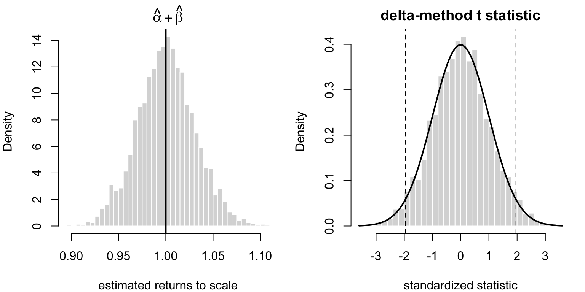
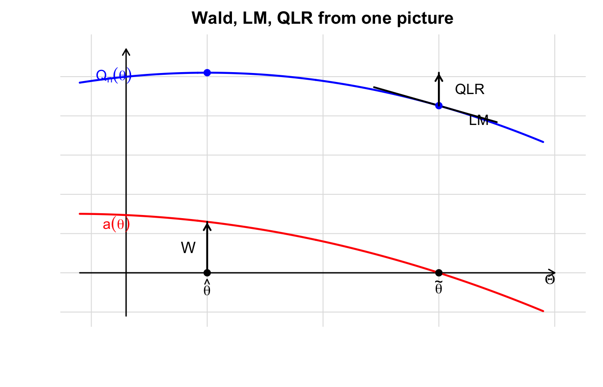
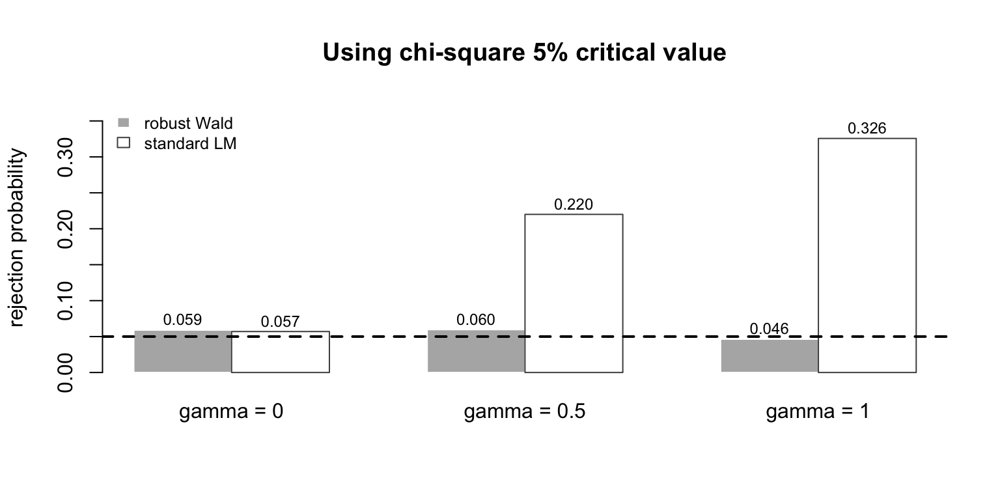
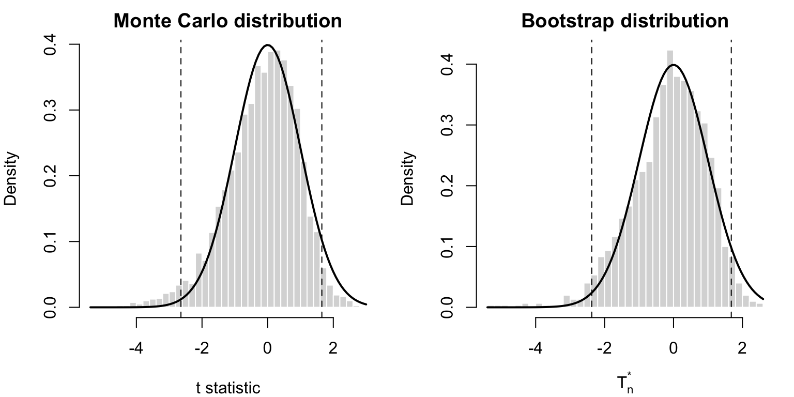
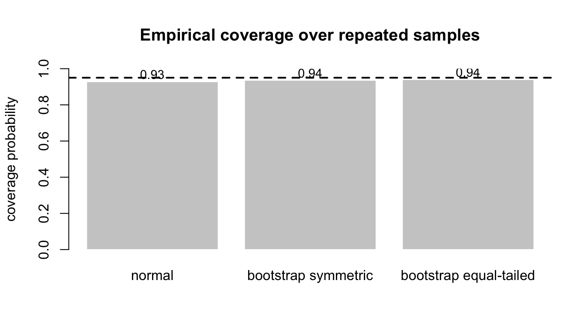
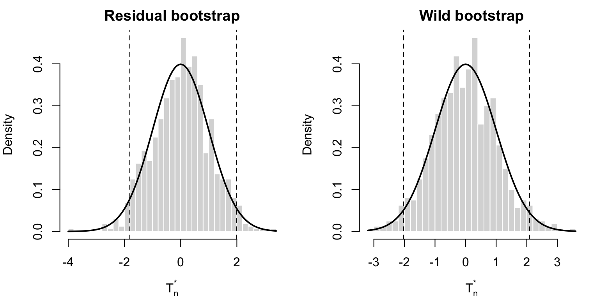
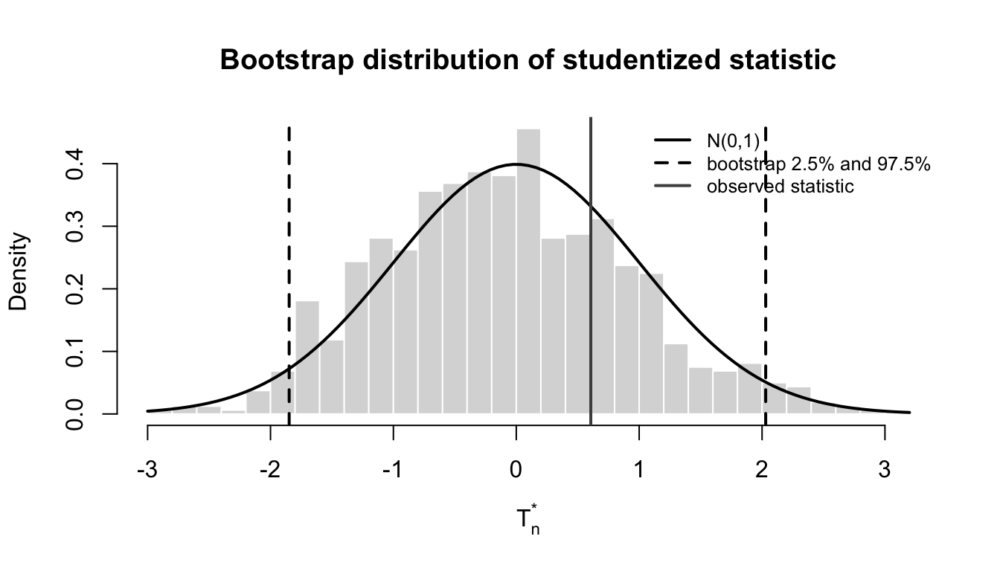
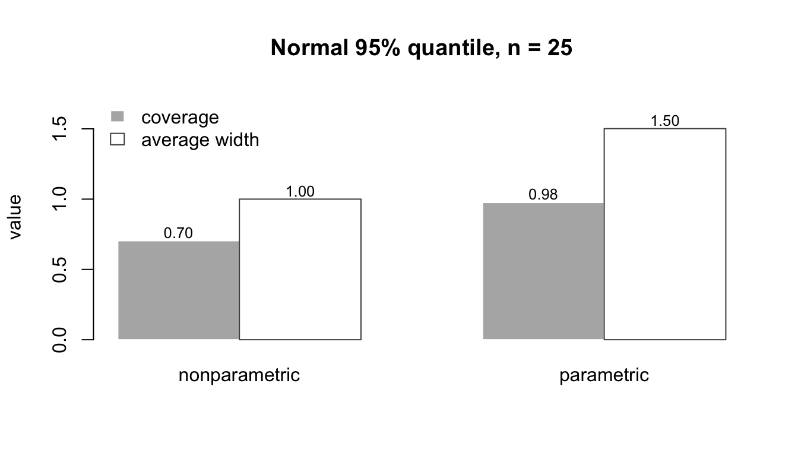

::: {.callout-note}
## この章の到達目標

この章の目的は次の 6 点である。

1.  推定量の漸近正規性から、単一パラメータや滑らかな関数の信頼区間・t 型検定を構成できるようにする。
2.  複数制約 $H_0:\ a(\theta_0)=0$ に対する Wald、LM、QLR 検定の定義と直観を理解する。
3.  **最適重み付け** の下では 3 つの検定が漸近的に等価で、$\chi^2_r$ 分布に従うことを理解する。
4.  最適重み付けでない場合、Wald はなお漸近ピボタルだが、LM・QLR は一般化カイ二乗分布になることを理解する。
5.  実務でどの検定を選ぶべきか、数値最適化との関係を含めて整理する。
6.  bootstrap を使って検定の臨界値、信頼区間、標準誤差を近似する考え方を理解する。
:::


::: {.callout-important}
## 記法の確認

前章までで、M 推定・GMM について $$
\sqrt n(\hat\theta-\theta_0)\overset{d}{\to}N(0,\Omega), \qquad \widehat\Omega\overset{p}{\to}\Omega
$$ が得られていた。

また、多くの場合 $$
\Omega=H^{-1}\Sigma H^{-1}
$$ と書ける。ここで

-   $H$：目的関数の局所曲率
-   $\Sigma$：一階条件のノイズ部分の漸近分散

である。

さらに、制約関数 $$
a:\mathbb R^p\to\mathbb R^r
$$ のヤコビアンを $$
A(\theta)=\frac{\partial a(\theta)}{\partial\theta'}
$$ と書く。
:::

# 導入

推定だけでなく **推論** をしたいなら、推定量がどのように揺らぐかを知るだけでなく、その揺らぎをどう検定統計量に変換するかを理解する必要がある。

この章の基本出発点は非常に単純である。すなわち、 $$
\sqrt n(\hat\theta-\theta_0)\overset{d}{\to}N(0,\Omega)
$$ と $$
\widehat\Omega\overset{p}{\to}\Omega
$$ があれば、あとは

-   単一の係数
-   パラメータの滑らかな関数
-   複数の制約

のどれを検定したいかに応じて、適切な二次形式を作ればよい。

# 単一パラメータと滑らかな関数の推論

## 個々の成分に対する t 型統計量

$\theta_0$ の第 $i$ 成分を $\theta_{0,i}$ とし、$\widehat\Omega_{ii}$ を $\widehat\Omega$ の第 $i$ 対角成分とする。このとき $$
\frac{\sqrt n(\hat\theta_i-\theta_{0,i})}{\sqrt{\widehat\Omega_{ii}}} \overset{d}{\to} N(0,1)
$$ である。

したがって、漸近的な $100(1-\alpha)\%$ 信頼区間は $$
\left[ \hat\theta_i-z_{1-\alpha/2}\sqrt{\frac{\widehat\Omega_{ii}}{n}}, \; \hat\theta_i+z_{1-\alpha/2}\sqrt{\frac{\widehat\Omega_{ii}}{n}} \right]
$$ で与えられる。


::: {.callout-note}
## なぜ $t$ 分布ではなく正規分布か

ここでの根拠は有限標本の exact theory ではなく **漸近理論** である。したがって、臨界値には Student の $t$ 分布ではなく標準正規分布の分位点 $z_{1-\alpha/2}$ を使う。
:::

## 滑らかな関数 $a(\theta_0)$ の推論

$a:\mathbb R^p\to\mathbb R$ が $\theta_0$ で連続微分可能なら、デルタ法により $$
\sqrt n\bigl(a(\hat\theta)-a(\theta_0)\bigr) \overset{d}{\to} N\bigl(0,A(\theta_0)\Omega A(\theta_0)'\bigr)
$$ である。したがって $$
\frac{ \sqrt n\bigl(a(\hat\theta)-a(\theta_0)\bigr) }{ \sqrt{A(\hat\theta)\widehat\Omega A(\hat\theta)'} } \overset{d}{\to} N(0,1)
$$ となる。

たとえば、パラメータ比率、弾力性、長期乗数など、構造モデルで興味がある量はしばしば $\theta$ の滑らかな関数として表されるので、この公式は非常に重要である。

## 例：Cobb-Douglas 生産関数の収穫一定性

経済学で古典的かつ分かりやすい例は Cobb and Douglas (1928) の生産関数である。産出 $Y_i$、資本 $K_i$、労働 $L_i$ について $$
Y_i=A K_i^\alpha L_i^\beta \exp(u_i)
$$ と書けるなら、対数を取ると $$
\log Y_i = \log A+\alpha\log K_i+\beta\log L_i+u_i
$$ である。

ここで $\alpha$ は資本弾力性、$\beta$ は労働弾力性である。資本と労働を同時に $c$ 倍したとき、産出は $$
F(cK,cL)=c^{\alpha+\beta}F(K,L)
$$ 倍になる。したがって

-   $\alpha+\beta=1$：収穫一定
-   $\alpha+\beta<1$：収穫逓減
-   $\alpha+\beta>1$：収穫逓増

である。

推定量を $$
\hat\theta=(\widehat{\log A},\hat\alpha,\hat\beta)'
$$ とすると、収穫一定性は $$
H_0:\ a(\theta_0)=\alpha+\beta-1=0
$$ という滑らかな関数に対する仮説である。このとき $$
A(\theta)= \frac{\partial a(\theta)}{\partial\theta'} = \begin{pmatrix} 0 & 1 & 1 \end{pmatrix}
$$ だから、デルタ法により $$
\frac{ \sqrt n\{(\hat\alpha+\hat\beta)-1\} }{ \sqrt{A(\hat\theta)\widehat\Omega A(\hat\theta)'} } \overset{d}{\to}N(0,1).
$$

次のシミュレーションでは、真の値を $\alpha=0.35,\ \beta=0.65$ とし、帰無仮説 $\alpha+\beta=1$ が正しい状況を作る。有限標本では推定された $\hat\alpha+\hat\beta$ は揺れるが、標準化すれば標準正規分布に近づく。

<figure class="quarto-float quarto-float-fig figure">
<div aria-describedby="fig-cobb-douglas-delta-caption-0ceaefa1-69ba-4598-a22c-09a6ac19f8ca">

</div>
<figcaption>図 1: Cobb-Douglas 生産関数における収穫一定性のデルタ法。左は推定された弾力性の和、右はデルタ法で標準化した統計量である。</figcaption>
</figure>

ここで大事なのは、$\hat\alpha+\hat\beta$ そのものの分布ではなく、**どの不確実性で割って標準化するか** である。$\hat\alpha$ と $\hat\beta$ は相関しているので、分散は単にそれぞれの分散の和ではない。デルタ法の式 $A\widehat\Omega A'$ は、その相関も含めて「弾力性の和」の不確実性を計算している。

# 複数制約の仮説検定

より一般に、複数の制約 $$
H_0:\ a(\theta_0)=0
$$ を考える。ここで $a:\mathbb R^p\to\mathbb R^r$ は連続微分可能で、$A(\theta_0)$ は full row rank $r$ をもつとする。これは「帰無仮説の中に冗長な制約が含まれていない」ことを意味する。

## なぜ複数制約を同時に検定したいのか

複数制約は「係数を 1 個ずつ見る」のではなく、理論が要求する構造をまとめて検定したいときに自然に出てくる。

第 1 の例は、資産価格モデルの **アルファの同時検定** である。これは少し記号が多いので、何をしている回帰なのかから見る。

いま、月次データで $N$ 個のポートフォリオを観測しているとする。たとえば、小型株ポートフォリオ、大型株ポートフォリオ、バリュー株ポートフォリオ、グロース株ポートフォリオのようなものを考えればよい。時点 $t$ におけるポートフォリオ $i$ のリターンを $R_{it}$、安全資産利子率を $R_{ft}$ と書く。このとき $$
R_{it}-R_{ft} = \alpha_i+\beta_i'f_t+u_{it}, \qquad i=1,\ldots,N
$$ という **ポートフォリオごとの時系列回帰** を考える。

左辺 $R_{it}-R_{ft}$ は、ポートフォリオ $i$ の超過リターンである。安全資産に投資する代わりにこのポートフォリオを持ったとき、どれだけ余分なリターンを得たかを表す。

右辺の $f_t$ は、時点 $t$ に観測されるリスクファクターのベクトルである。CAPM なら市場超過リターンだけ、Fama-French 型のモデルなら市場、サイズ、バリューなどの複数ファクターが入る。$\beta_i$ は、ポートフォリオ $i$ がそれらのファクターにどれくらい反応するかを表す係数ベクトルである。たとえば市場ベータが大きいポートフォリオは、市場全体が上がると大きく上がりやすい。

では $\alpha_i$ は何か。これは、ファクターで説明しきれなかった平均超過リターン、つまり **異常リターン** や **価格付け誤差** と呼ばれる量である。もし資産価格モデルが正しく、ポートフォリオの平均リターンがファクターへの exposure だけで説明できるなら、回帰の切片 $\alpha_i$ は 0 になるはずである。

したがって、モデルがすべてのポートフォリオを正しく価格付けしているかを調べるには $$
H_0:\ \alpha_1=\alpha_2=\cdots=\alpha_N=0
$$ を同時に検定する。これは Gibbons, Ross and Shanken (1989) の平均分散効率性検定として有名で、線形回帰の **複数の切片にまたがる仮説検定** である。

ここで「同時に」が重要である。個別に $\alpha_i=0$ を t 検定していくと、多数のポートフォリオの中で偶然に有意なものが出るかもしれない。また、ポートフォリオの誤差 $u_{it}$ は同じ月のマクロショックを共有するので、互いに相関しやすい。したがって、$\alpha_1,\ldots,\alpha_N$ をまとめて見て、「価格付け誤差ベクトル全体が 0 と言えるか」を検定する方が自然である。1 つの $\alpha_i$ だけを見ると偶然に見えるズレでも、複数のポートフォリオで体系的にズレていれば、資産価格モデル全体に問題があると解釈できる。

第 2 の例は、時系列モデルにおける **ARCH 効果の同時検定** である。これは、リターンやインフレ率のような時系列でよく出てくる「平均はそこまで予測できないが、変動の大きさは予測できる」という現象を検定するためのものである。

たとえば株式リターン $y_t$ を考える。まず平均方程式として $$
y_t=\mu+\varepsilon_t
$$ あるいは AR モデル $$
y_t=\mu+\rho y_{t-1}+\varepsilon_t
$$ を推定し、残差 $\hat\varepsilon_t$ を得る。もし誤差の分散が時間を通じて一定なら、大きなショックの翌月も小さなショックの翌月も、次のショックの大きさは同じように分布するはずである。

しかし金融時系列では、ボラティリティ・クラスタリングがよく観察される。つまり、大きなショックが起きた後には、符号は読めなくても、その後しばらく大きなショックが続きやすい。この場合、$\varepsilon_t$ 自体には自己相関がなくても、$\varepsilon_t^2$ には自己相関が残る。

Engle (1982) の ARCH モデルでは、この発想を条件付き分散 $$
\sigma_t^2 = \omega+\alpha_1\varepsilon_{t-1}^2+\cdots+\alpha_q\varepsilon_{t-q}^2
$$ として書く。ここで $\sigma_t^2=\mathrm{Var}(\varepsilon_t\mid\mathcal F_{t-1})$ は、過去の情報を見た上での時点 $t$ のショックの分散である。係数 $\alpha_j$ が正なら、$j$ 期前のショックが大きかったとき、今期の条件付き分散も大きくなりやすい。

条件付き分散が時間を通じて変動しないなら、過去の二乗ショックは今期の分散を説明しない。したがって $$
H_0:\ \alpha_1=\cdots=\alpha_q=0
$$ を同時に検定する。これは「1 期前だけを見る」のではなく、「過去 $q$ 期の二乗ショックがまとめて条件付き分散を予測しているか」を問う複数制約の検定である。

この検定は LM 検定として実装しやすい代表例である。帰無仮説の下では通常の分散一定モデルを推定すればよい。その残差を使って、補助回帰 $$
\hat\varepsilon_t^2 = c+\alpha_1\hat\varepsilon_{t-1}^2+\cdots+\alpha_q\hat\varepsilon_{t-q}^2+\text{error}_t
$$ を走らせ、ラグ付き残差二乗の係数がまとめて 0 かを検定する。直観的には、残差二乗が自分の過去で予測できるなら、分散一定という帰無仮説は怪しい、ということである。Engle の ARCH-LM 検定は、この「代替モデルを全部推定しなくても、帰無モデルの残差から分散の動学を検出する」という点で LM 検定らしい例である。

このように、複数制約の検定は「たくさんの係数を一気に見たい」というだけではない。資産価格モデルの価格付け誤差、時系列のボラティリティ構造、需要関数の同次性、費用関数の対称性のように、経済理論そのものが複数のパラメータ制約として現れる。

## 3 つの代表的検定

### Wald 検定

Wald 検定は **非制約推定量** $\hat\theta$ を使う。統計量は $$
\xi_W = n\,a(\hat\theta)' \bigl[A(\hat\theta)\widehat\Omega A(\hat\theta)'\bigr]^{-1} a(\hat\theta)
$$ {#eq-wald-stat} である。

Wald 検定が測っているのは、単なるユークリッド距離ではない。まず非制約推定量 $\hat\theta$ を計算し、その点で制約がどれだけ破れているか $$
a(\hat\theta)
$$ を見る。もし帰無仮説が正しければ、$a(\hat\theta)$ は標本誤差のために 0 から少しだけズレるが、そのズレは $n^{-1/2}$ オーダーにとどまるはずである。

ただし、制約のズレをそのまま見るだけでは不十分である。推定が不正確な方向では多少ズレても驚くべきではないし、精密に推定されている方向では小さなズレでも重要である。

ここで使う距離が **Mahalanobis 距離** である。平均 0、正定値の分散共分散行列 $V$ をもつベクトル $X\in\mathbb R^r$ について、0 からの二乗 Mahalanobis 距離は $$
D_M^2(X,0;V) = X'V^{-1}X
$$ で定義される。もし $V$ が対角行列なら、これは各成分を標準偏差で割って二乗和を取る操作である。$V$ に相関がある場合には、相関した方向をきちんと補正したうえで距離を測る。

Wald 検定では $$
\sqrt n\,a(\hat\theta) \overset{d}{\to} N\{0,\ A(\theta_0)\Omega A(\theta_0)'\}
$$ なので、$a(\hat\theta)$ の分散はおよそ $$
\frac1n A(\theta_0)\Omega A(\theta_0)'
$$ である。これを plug-in したものが $$
\frac1n A(\hat\theta)\widehat\Omega A(\hat\theta)'
$$ であるから、二乗 Mahalanobis 距離は $$
a(\hat\theta)' \left[ \frac1n A(\hat\theta)\widehat\Omega A(\hat\theta)' \right]^{-1} a(\hat\theta) = n\,a(\hat\theta)' \bigl[A(\hat\theta)\widehat\Omega A(\hat\theta)'\bigr]^{-1} a(\hat\theta)
$$ となる。これが Wald 統計量そのものである。つまり Wald 検定は、**非制約推定量で見た制約違反を、その推定不確実性で標準化した距離** を測っている。

このため Wald は実装しやすい。非制約推定量 $\hat\theta$ と分散推定量 $\widehat\Omega$ があれば、制約付き最適化を解かずに検定できる。一方で、非線形制約では「どのパラメータ表示で距離を測るか」に依存しやすく、有限標本で Wald がやや大きく出ることがある。

### LM 検定

LM（Lagrange Multiplier）検定は、帰無制約 $$
a(\tilde\theta)=0
$$ を満たす **制約付き推定量** $\tilde\theta$ を使う。統計量は $$
\xi_{LM} = n\left( \frac{\partial Q_n(\tilde\theta)}{\partial\theta} \right)' \widehat H^{-1} \left( \frac{\partial Q_n(\tilde\theta)}{\partial\theta} \right)
$$ {#eq-lm-stat} である。ここでは、正しく特定された尤度モデルや最適重み付けされた目的関数のように、score の分散と目的関数の曲率が一致する標準形をまず書いている。一般の M 推定で $\Sigma\ne H$ の場合には、この形のままでは分布に nuisance parameter が残るので、$\Sigma$ を含む sandwich 型の分散で標準化するか、後で述べる一般化カイ二乗近似や bootstrap を使う必要がある。

LM 検定の出発点は、制約付き最適化問題 $$
\max_{\theta} Q_n(\theta) \quad \text{subject to} \quad a(\theta)=0
$$ である。ラグランジアンを $$
\mathcal L_n(\theta,\lambda) = Q_n(\theta)-\lambda'a(\theta)
$$ と書けば、一階条件は $$
\frac{\partial Q_n(\tilde\theta)}{\partial\theta} - A(\tilde\theta)'\lambda =0, \qquad a(\tilde\theta)=0
$$ である。

もし帰無仮説が正しく、制約がデータと自然に整合していれば、制約付き推定量 $\tilde\theta$ は非制約最適点に近く、$Q_n$ の勾配はほとんど残らない。逆に、制約を課した点で目的関数がまだ強く上り坂なら、「この制約を少し緩めれば目的関数を大きく改善できる」という意味で、帰無仮説は疑わしい。

ラグランジュ乗数 $\lambda$ は、制約を 1 単位緩めたとき目的関数がどれだけ改善しそうかを表す影の価格である。したがって LM 検定は、**帰無仮説のもとで推定した点に残る傾き、あるいはそれを支えるラグランジュ乗数の大きさ** を測っている。

この「大きさ」が [式 2](#eq-lm-stat) になっていることを、もう少し丁寧に見る。制約付き推定量 $\tilde\theta$ では、制約集合の中では最適化が終わっている。しかし、制約を外した全空間で見ると、一般には勾配 $$
g_n(\tilde\theta) = \frac{\partial Q_n(\tilde\theta)}{\partial\theta}
$$ が 0 ではない。この勾配は、制約がなければどちらへ動けば目的関数を上げられるかを表す。

曲率行列を $H$ とすると、勾配ベクトル $g$ の自然な二乗長さは $$
\|g\|_{H^{-1}}^2 = g'H^{-1}g
$$ である。ここで $H$ は最大化問題でいえば、$-\partial^2 Q_n(\theta)/\partial\theta\partial\theta'$ の極限に対応する正定値の曲率行列である。したがって、同じ勾配でも曲率が大きい方向と小さい方向では意味が違う。そこで LM 統計量は、制約付き点に残った勾配の $H^{-1}$ ノルムを $$
n\,g_n(\tilde\theta)'\widehat H^{-1}g_n(\tilde\theta)
$$ として測る。

さらに一階条件から $$
g_n(\tilde\theta) = A(\tilde\theta)'\lambda
$$ である。したがって $$
\xi_{LM} = n\,g_n(\tilde\theta)'\widehat H^{-1}g_n(\tilde\theta) \approx n\,\lambda' A(\tilde\theta)\widehat H^{-1}A(\tilde\theta)' \lambda.
$$ つまり LM 統計量は、同じ量を「残った勾配の大きさ」と見てもよいし、「その勾配を支えるラグランジュ乗数の大きさ」と見てもよい。帰無仮説が自然なら $\lambda$ は小さい。制約がデータに無理をさせているなら、制約を保つために大きな $\lambda$ が必要になる。

### QLR 検定

QLR（quasi-likelihood ratio）検定は、非制約推定量 $\hat\theta$ と制約付き推定量 $\tilde\theta$ の両方を使う。統計量は $$
\xi_{QLR} = 2n\bigl[Q_n(\hat\theta)-Q_n(\tilde\theta)\bigr]
$$ {#eq-qlr-stat} である。

QLR 検定は、目的関数の高さそのものを比べる。非制約推定量 $\hat\theta$ は、制約を課さずに到達できる最も高い点である。一方、制約付き推定量 $\tilde\theta$ は、制約集合の中で到達できる最も高い点である。

帰無仮説が正しければ、制約集合は真のパラメータを含んでいるので、制約を課しても目的関数の最大値はあまり下がらないはずである。逆に $$
Q_n(\hat\theta)-Q_n(\tilde\theta)
$$ が大きいなら、制約を課したことでデータへの当てはまりが大きく悪化している。QLR 検定は、**制約によって失われた目的関数の高さ** を測る検定である。

正しく特定された尤度モデルで $Q_n$ が平均対数尤度なら、これは通常の likelihood ratio test と同じ発想である。一般の M 推定や GMM の目的関数に対して同じ形の統計量を使うので、ここでは quasi-likelihood ratio と呼んでいる。


3 つの検定の直観

-   **Wald**：推定値が制約集合からどれだけ離れているかを見る。
-   **LM**：帰無のもとで勾配がどれだけ残るかを見る。
-   **QLR**：制約により目的関数値がどれだけ悪化するかを見る。

3 つは同じ仮説を別々の角度から見ている。

## 1 枚の図で見る Wald・LM・QLR

Buse (1982) は、Wald・LM・LR 検定を簡単な図で比較すると直観がかなり明確になることを示している。1 次元の制約 $$
H_0:\ a(\theta)=0
$$ を考え、青い曲線で目的関数 $Q_n(\theta)$、赤い曲線で制約関数 $a(\theta)$ を描く。非制約推定量を $\hat\theta$、制約付き推定量を $\tilde\theta$ とする。$\tilde\theta$ は赤い曲線が 0 と交わる点、つまり $a(\tilde\theta)=0$ を満たす点である。

<figure class="quarto-float quarto-float-fig figure">
<div aria-describedby="fig-wald-lm-qlr-geometry-caption-0ceaefa1-69ba-4598-a22c-09a6ac19f8ca">

</div>
<figcaption>図 2: Wald・LM・QLR 検定の幾何学的直観。青は目的関数、赤は制約関数である。Wald は制約関数のズレ、LM は制約付き推定量での目的関数の傾き、QLR は目的関数の高さの差を見る。</figcaption>
</figure>

図では、Wald は非制約推定量 $\hat\theta$ を赤い制約関数に代入したときのズレ $a(\hat\theta)$ を見る。つまり、$\hat\theta$ が制約集合 $a(\theta)=0$ からどれだけ外れているかを、制約関数の単位で測る。

LM は、制約付き推定量 $\tilde\theta$ における目的関数 $Q_n$ の傾きを見る。$\tilde\theta$ は制約集合上では最適だが、制約を外した方向にはまだ上り坂が残っているかもしれない。その傾きが大きいほど、制約を緩めたとき目的関数を大きく改善できる。

QLR は、非制約最大値 $Q_n(\hat\theta)$ と制約付き最大値 $Q_n(\tilde\theta)$ の高さの差を見る。制約を課したことで、目的関数の高さがどれだけ失われたかを直接測っている。

目的関数が完全な二次関数で、曲率の推定も同じなら、3 つは同じ情報を別々の単位で測っているだけである。一般の非線形モデルでは、有限標本で 3 つの値は一致しない。Berndt and Savin (1977) が示したように、多変量線形回帰でも Wald、LR、LM の値に体系的な大小関係や衝突が生じうる。

# 最適重み付けと漸近分布

## 最適重み付けとは何か

ここでは、目的関数が **optimally weighted** であるとは $$
\Sigma=H
$$ すなわち $$
H^{-1}\Sigma H^{-1}=H^{-1}
$$ となる状況を指す。

ここまでに扱った推定法では、代表例は次の通りである。

-   正しく特定された最尤法では、情報行列等式により $\Sigma=H$。
-   効率的 GMM では $W\to S^{-1}$。

## 最適重み付けの下での結果

最適重み付けの下では $$
\xi_W=\xi_{LM}+o_p(1)=\xi_{QLR}+o_p(1)
$$ が成り立ち、いずれも帰無仮説の下で $$
\chi^2_r
$$ に収束する。

これは非常に重要である。なぜなら

1.  3 つの検定は、局所代替の下で同じ一階の局所漸近 power をもつ。
2.  検定統計量の極限分布が、制約の数 $r$ だけで決まり、局外母数に依存しない。
3.  臨界値として $\chi^2_r$ の分位点をそのまま使える。

からである。

**Nuisance parameter**、日本語では局外母数とは、研究者が直接検定したい対象ではないが、統計量の分布には影響する未知量である。たとえば誤差分散、ヘテロスケダスティシティの形、目的関数の曲率 $H$、score の分散 $\Sigma$ などがそうである。検定したいのは $a(\theta_0)=0$ かどうかであって、$H$ や $\Sigma$ そのものではない。しかし臨界値が $H$ や $\Sigma$ の値によって変わるなら、そのままでは検定を実行できない。

ここで使う言葉が **pivotal** である。統計量の帰無分布が未知の母数に依存しないとき、その統計量は pivotal であるという。有限標本で完全にそうなる必要はなく、極限分布が未知の局外母数に依存しなければ **漸近ピボタル** であるという。

たとえば帰無仮説の下で $$
T_n\overset{d}{\to}\chi^2_r
$$ なら、極限分布は $r$ だけで決まるので漸近ピボタルである。一方で $$
T_n\overset{d}{\to}\kappa\chi^2_1
$$ のように、未知の $\kappa$ に依存するなら非ピボタルである。問題は $\kappa$ が存在することではなく、**統計量の分布に $\kappa$ が残ってしまうこと** である。

したがって、最適重み付けの下で Wald・LM・QLR が $\chi^2_r$ に収束する、という結果は「3 つの検定統計量が漸近ピボタルになる」という意味でもある。


最適重み付け下では「どれを使っても同じ」

理論的には、最適重み付けの下では Wald・LM・QLR のどれを選んでも漸近的には同じである。したがって実務では、**どれが一番実装しやすいか** で選んでよい。

## 最適重み付けでない場合

最適重み付けでない場合でも、robust な分散推定量で標準化した Wald 統計量は $$
\xi_W\overset{d}{\to}\chi^2_r
$$ である。つまり Wald は依然として **漸近ピボタル** である。

一方、上で書いた標準形の LM と QLR はそうではない。極限分布は $$
A(\theta_0),\ H,\ \Sigma
$$ に依存する一般化カイ二乗分布になり、モデルごとに異なる。したがって

-   局外母数、ここでは $A,H,\Sigma$ などをさらに推定して近似分布を作る
-   あるいは bootstrap を使う

必要がある。

## 具体例：ヘテロスケダスティック回帰で pivotal かどうかを見る

抽象的な記号だけでは分かりにくいので、具体的な回帰で見る。単回帰 $$
Y_i=\beta_0X_i+U_i, \qquad E[U_i\mid X_i]=0
$$ を考え、帰無仮説 $$
H_0:\beta_0=0
$$ を検定したいとする。ただし、誤差分散は $$
E[U_i^2\mid X_i]=1+\gamma X_i^2
$$ であり、$\gamma$ は未知である。研究者が知りたいのは $\beta_0=0$ かどうかであって、$\gamma$ そのものではない。したがって $\gamma$ は nuisance parameter である。

最小二乗型の目的関数を $$
Q_n(\beta) = -\frac12\frac1n\sum_{i=1}^n(Y_i-\beta X_i)^2
$$ とする。このとき score は $$
g_n(\beta) = \frac1n\sum_{i=1}^n X_i(Y_i-\beta X_i)
$$ であり、曲率は $$
H_n=\frac1n\sum_{i=1}^nX_i^2
$$ である。帰無仮説の下では $$
\sqrt n\,g_n(0) = \frac1{\sqrt n}\sum_{i=1}^n X_iU_i \overset{d}{\to}N(0,\Sigma), \qquad \Sigma=E[X_i^2U_i^2].
$$

もし標準的な LM 統計量を $$
\xi_{LM}^{\mathrm{standard}} = n\,\frac{g_n(0)^2}{H_n}
$$ と作ると、極限分布は $$
\xi_{LM}^{\mathrm{standard}} \overset{d}{\to} \frac{\Sigma}{H}\chi^2_1, \qquad H=E[X_i^2].
$$ ここで $$
\kappa=\frac{\Sigma}{H}
$$ が帰無分布に残っている。これが非ピボタルである、という意味である。たとえば $X_i\sim N(0,1)$ なら $$
H=1, \qquad \Sigma=E[X_i^2(1+\gamma X_i^2)]=1+3\gamma,
$$ なので $\kappa=1+3\gamma$ である。$\gamma$ が変われば、同じ LM 統計量の帰無分布も変わってしまう。

一方、OLS 推定量 $$
\hat\beta=\frac{\sum_iX_iY_i}{\sum_iX_i^2}
$$ に対して robust variance を使えば、 $$
\widehat\Omega = \frac{\widehat\Sigma}{\widehat H^2}, \qquad \widehat H=\frac1n\sum_iX_i^2, \qquad \widehat\Sigma=\frac1n\sum_iX_i^2\hat U_i^2
$$ と書ける。ここで $\hat U_i=Y_i-\hat\beta X_i$ である。Wald 統計量は $$
\xi_W = n\,\frac{(\hat\beta-0)^2}{\widehat\Omega}
$$ であり、帰無仮説の下で $$
\xi_W\overset{d}{\to}\chi^2_1
$$ となる。$\gamma$ は存在しているが、robust variance による標準化で分布から消えている。したがってこの Wald 統計量は漸近ピボタルである。

同じ score を使う LM 型の検定でも、$\widehat\Sigma$ で標準化して $$
n\,\frac{g_n(0)^2}{\widehat\Sigma}
$$ と作れば漸近ピボタルにできる。つまり大事なのは、Wald か LM かという名前だけではなく、**局外母数が分布に残らないように標準化できているか** である。

<figure class="quarto-float quarto-float-fig figure">
<div aria-describedby="fig-nuisance-parameter-critical-values-caption-0ceaefa1-69ba-4598-a22c-09a6ac19f8ca">

</div>
<figcaption>図 3: ヘテロスケダスティック回帰での Wald と標準 LM。Robust Wald は gamma が変わっても 5% 付近に留まるが、標準 LM は局外母数が残るため過剰棄却する。</figcaption>
</figure>

図では、$\gamma=0$ のときには $\Sigma=H$ なので標準 LM もほぼ正しいサイズになる。ところが $\gamma$ が大きくなると $\Sigma/H$ が大きくなり、標準 LM は $\chi^2_1$ 臨界値を使うと過剰棄却する。一方、robust Wald は $\widehat\Sigma/\widehat H^2$ で標準化しているので、$\gamma$ が変わってもおおむね 5% 付近に留まる。

この例の教訓は単純である。局外母数は、存在するだけなら問題ではない。**検定統計量の帰無分布に残ると問題になる**。残らなければ pivotal であり、通常の $\chi^2$ 臨界値を使える。残るなら、その局外母数を推定して分布を補正するか、bootstrap で検定統計量の分布そのものを近似する必要がある。


Wald がよく使われる理由の一つ

制約付き最適化が難しい場面では Wald 検定が便利である。非制約推定量 $\hat\theta$ と分散推定量 $\widehat\Omega$ だけで作れるうえ、最適重み付けでなくても漸近カイ二乗になるからである。

# 漸近理論のスケッチ

ここでは 3 つの検定の背後にある理論を、必要最小限の形で見ておく。

## Wald 統計量

[**補題 1 (Wald 統計量の極限分布)**]{.theorem-title} 次を仮定する。

1.  $$
\sqrt n(\hat\theta-\theta_0)\overset{d}{\to}N(0,\Omega).
$$
2.  $$
\widehat\Omega\overset{p}{\to}\Omega
$$ であり、$\Omega$ は正定値である。
3.  $a:\mathbb R^p\to\mathbb R^r$ は連続微分可能で、$A(\theta_0)$ は full row rank $r$ をもつ。

このとき、帰無仮説 $H_0:a(\theta_0)=0$ の下で $$
\xi_W\overset{d}{\to}\chi^2_r
$$ が成り立つ。

[*証明*. ]{.proof-title}デルタ法により $$
\sqrt n\bigl(a(\hat\theta)-a(\theta_0)\bigr) \overset{d}{\to} N\bigl(0,A(\theta_0)\Omega A(\theta_0)'\bigr)
$$ である。さらに $$
A(\hat\theta)\widehat\Omega A(\hat\theta)' \overset{p}{\to} A(\theta_0)\Omega A(\theta_0)'
$$ だから、 $$
\xi_W = Y_n'Y_n+o_p(1)
$$ となるような $r$ 次元正規ベクトル $Y_n\overset{d}{\to}N(0,I_r)$ を作れる。よって $\chi^2_r$ 極限が得られる。

# 実務での選び方

理論上は最適重み付けの下で 3 つは同等だが、実装コストは異なる。

## Wald を選びやすい場面

-   制約付き最適化を避けたい
-   推定量と分散推定量はすでに手元にある
-   非線形制約 $a(\theta)=0$ でも、$a(\hat\theta)$ とヤコビアンが計算できる

## LM を選びやすい場面

-   帰無仮説の下での推定が簡単
-   代替仮説の下で高次元最適化をしたくない

たとえば、いくつかのパラメータを固定するだけの制約では、LM が実装しやすいことが多い。

## QLR を選びやすい場面

-   制約付き・非制約付きの両方の最適化が容易
-   目的関数の差そのものに興味がある
-   正しく特定された尤度モデルなど、カイ二乗近似が使いやすい


有名な経験則

有限標本では Wald 検定がやや over-reject しやすい、という経験則がよく語られる。ただし、これは一般則というよりモデル依存の経験則であり、どの検定が最もよいかは有限標本性能を見ないと分からない。

# Bootstrap

漸近理論は強力だが、有限標本でどれくらいよい近似になっているかは分からない。特に、標本サイズが小さい、誤差分布が歪んでいる、検定統計量の分布が nuisance parameter に強く依存する、といった場面では、$\chi^2$ や標準正規の近似が粗いことがある。

**Bootstrap** は、この問題に対する計算機的な解決法である。未知の母集団分布 $P_0$ を、データから推定した分布 $\widehat P$ で置き換え、その上で同じ推定・検定手続きを何度も実行し、統計量の分布を近似する。

## Nonparametric bootstrap の基本

この章では、まず最も基本的な **nonparametric bootstrap** の話をする。観測データを $$
X_1,\ldots,X_n\overset{i.i.d.}{\sim}P_0
$$ とする。母数を分布の関数 $$
\theta_0=\theta(P_0)
$$ と書き、推定量を $$
\hat\theta=\hat\theta(X_1,\ldots,X_n)
$$ と書く。

Nonparametric bootstrap の出発点は、未知の母集団分布 $P_0$ を、観測データから作った経験分布 $$
\widehat P_n(x) = \frac1n\sum_{i=1}^n\delta_{X_i}(x)
$$ で置き換えることである。これは「観測された各データ点に確率 $1/n$ ずつ置く分布」である。

実装上は非常に単純である。

1.  元データ $X_1,\ldots,X_n$ から $n$ 個を復元抽出して、bootstrap 標本 $$
X_1^*,\ldots,X_n^*
$$ を作る。
2.  その bootstrap 標本で、元データと同じ推定量 $\hat\theta^*$ や同じ統計量 $T_n^*$ を計算する。
3.  これを $B$ 回繰り返し、$\hat\theta_1^*,\ldots,\hat\theta_B^*$ や $T_{n1}^*,\ldots,T_{nB}^*$ の分布を見る。

ここで重要なのは、bootstrap が「推定量の公式だけ」を真似するのではなく、**推定手続き全体** を真似する点である。回帰なら回帰をやり直す。非線形推定なら非線形推定をやり直す。検定なら検定統計量を作り直す。

$B$ は大きいほど Monte Carlo 誤差が小さくなる。講義や小さな実験では $B=300$ から $500$ 程度でも形は見えるが、実証研究で最終的な臨界値や信頼区間を報告するなら、少なくとも $B=1000$ 以上を使うことが多い。

## シミュレーション：平均の bootstrap 分布を見る

まず $X_i\sim\mathrm{Exponential}(1)$ の平均を考える。母平均は 1 だが、分布は右に歪んでいる。ここでは、研究者が実際には見られない「真の標本分布」と、1 つの標本から作る nonparametric bootstrap 分布を並べる。

推定したい量は $$
\mu_0=E_{P_0}[X]
$$ であり、推定量は標本平均 $$
\bar X_n=\frac1n\sum_{i=1}^nX_i
$$ である。比較する統計量は studentized statistic $$
T_n(P_0) = \frac{\sqrt n(\bar X_n-\mu_0)}{s_X}
$$ である。

次のコードでやっていることは 2 つである。第 1 に、真の DGP から何度も標本を発生させて、答え合わせ用の Monte Carlo 分布を作る。第 2 に、1 つの観測標本 `x0` を固定し、そこから復元抽出して bootstrap 分布を作る。この時点では、検定や信頼区間はまだ作らない。見たいのは、左の分布に似たものが右側にも現れる、という事実である。

```r
set.seed(20260710)

n <- 50
R <- 4000
B <- 1500
mu0 <- 1

# 研究者は通常見られない「真の標本分布」。
t_true <- replicate(R, {
  x <- rexp(n, rate = 1)
  sqrt(n) * (mean(x) - mu0) / sd(x)
})

# 研究者が実際に持っている 1 つの標本。
x0 <- rexp(n, rate = 1)
xbar0 <- mean(x0)

# Nonparametric bootstrap: x0 から復元抽出する。
boot_mat <- matrix(sample(x0, size = n * B, replace = TRUE), nrow = n)
boot_mean <- colMeans(boot_mat)
boot_sd <- apply(boot_mat, 2, sd)
t_boot <- sqrt(n) * (boot_mean - xbar0) / boot_sd

oldpar <- par(mfrow = c(1, 2), mar = c(4, 4, 2, 1))

hist(
  t_true,
  breaks = 40,
  probability = TRUE,
  col = "grey85",
  border = "white",
  main = "Monte Carlo distribution",
  xlab = "t statistic"
)
curve(dnorm(x), add = TRUE, lwd = 2)
abline(v = quantile(t_true, c(0.025, 0.975)), lty = 2)

hist(
  t_boot,
  breaks = 40,
  probability = TRUE,
  col = "grey85",
  border = "white",
  main = "Bootstrap distribution",
  xlab = expression(T[n]^"*")
)
curve(dnorm(x), add = TRUE, lwd = 2)
abline(v = quantile(t_boot, c(0.025, 0.975)), lty = 2)

par(oldpar)
```

<figure class="quarto-float quarto-float-fig figure">
<div aria-describedby="fig-bootstrap-skewed-mean-caption-0ceaefa1-69ba-4598-a22c-09a6ac19f8ca">

</div>
<figcaption>図 4: 歪んだ分布における標本平均の t 統計量。左は真の DGP から繰り返し標本を発生させた分布、右は 1 つの標本から作った nonparametric bootstrap 分布である。</figcaption>
</figure>

左図は授業用の「答え合わせ」であり、実証研究では見えない。右図は、実際に観測された 1 標本だけから作れる近似である。左と右がかなり似た形をしているなら、未知の標本分布を bootstrap 分布で置き換える、という発想がうまくいきそうだと分かる。

## $P_0$ を $\widehat P_n$ で置き換えるとは何か

上の図でやっていたことを、もう少し formal に書く。元の世界では $$
X_1,\ldots,X_n\overset{i.i.d.}{\sim}P_0
$$ であり、母数は $$
\theta_0=\theta(P_0)
$$ である。推論で必要なのは、たとえば $$
T_n(P_0) = \frac{\sqrt n\{\hat\theta(X_1,\ldots,X_n)-\theta(P_0)\}} {\hat\sigma(X_1,\ldots,X_n)}
$$ の分布である。しかし $P_0$ が未知なので、この分布は直接作れない。

Nonparametric bootstrap では、$P_0$ を経験分布 $$
\widehat P_n=\frac1n\sum_{i=1}^n\delta_{X_i}
$$ で置き換える。つまり bootstrap 世界では $$
X_1^*,\ldots,X_n^*\overset{i.i.d.}{\sim}\widehat P_n
$$ と考える。これは、各 bootstrap 観測について $$
P^*(X_j^*=X_i)=\frac1n \qquad (i=1,\ldots,n)
$$ が成り立つ、ということである。したがって「元データから復元抽出する」という手順は、まさに「$\widehat P_n$ から i.i.d. にサンプルを発生させる」という数学的操作である。

このとき bootstrap 世界での真値は $$
\theta(\widehat P_n)
$$ である。元の世界で $\theta(P_0)$ が真値だったのと同じ役割を、bootstrap 世界では $\theta(\widehat P_n)$ が担う。したがって bootstrap 統計量は $$
T_n^* = \frac{\sqrt n\{\hat\theta(X_1^*,\ldots,X_n^*)-\theta(\widehat P_n)\}} {\hat\sigma(X_1^*,\ldots,X_n^*)}
$$ と中心化する。

平均の例では $$
\theta(P)=\int x\,dP(x)
$$ なので、 $$
\theta(\widehat P_n) = \int x\,d\widehat P_n(x) = \frac1n\sum_{i=1}^nX_i = \bar X_n
$$ である。だから上のコードでは $$
T_n^* = \frac{\sqrt n(\bar X_n^*-\bar X_n)}{s_X^*}
$$ と中心化していた。これが「bootstrap 世界では $\bar X_n$ が真値の役割を果たす」という意味である。

同じ考え方は回帰でも成り立つ。Pairs bootstrap で $(Y_i,X_i)$ を丸ごと復元抽出するとき、bootstrap 世界の母集団は $$
\widehat P_n=\frac1n\sum_{i=1}^n\delta_{(Y_i,X_i)}
$$ である。この分布の下での population OLS 係数は $$
\theta(\widehat P_n) = \arg\min_b\frac1n\sum_{i=1}^n(Y_i-X_i'b)^2 = \hat\beta
$$ である。したがって pairs bootstrap では、$\hat\beta^*-\hat\beta$ の分布を見る。これが後で出てくる「bootstrap 世界では $\hat\theta$ が真値の役割を果たす」という言い方の中身である。

## Bootstrap 分布から信頼区間を作る

ここまで分かれば、信頼区間や検定への使い方は自然である。標本平均の例では、bootstrap 分布 $$
T_{n1}^*,\ldots,T_{nB}^*
$$ の分位点を使って、未知の $T_n(P_0)$ の分位点を近似する。

ここでは studentized statistic
$$
T_n
=
\frac{\sqrt n(\hat\theta-\theta_0)}{\widehat\sigma}
$$
を使う。Bootstrap では
$$
T_n^*
=
\frac{\sqrt n(\hat\theta^*-\hat\theta)}{\widehat\sigma^*}
$$
を何度も計算する。$T_n^*$ の分布が $T_n$ の分布を近似しているなら、その分位点を使って $\theta_0$ の信頼区間を作れる。

**対称型 bootstrap CI** は、$|T_n^*|$ の $1-\alpha$ 分位点を
$$
c_{1-\alpha}^*
=
Q_{1-\alpha}^*(|T_n^*|)
$$
とし、
$$
\left[
\hat\theta-c_{1-\alpha}^*\frac{\widehat\sigma}{\sqrt n},
\ 
\hat\theta+c_{1-\alpha}^*\frac{\widehat\sigma}{\sqrt n}
\right]
$$
で作る。これは、推定値の左右に同じ幅を取る区間である。分布がだいたい左右対称だと思えるときには自然で、通常の正規近似 CI の $1.96$ を bootstrap 分位点で置き換えたものと見ればよい。

**等尾型 bootstrap CI** は、$T_n^*$ の $\alpha/2$ 分位点と $1-\alpha/2$ 分位点を
$$
q_{\alpha/2}^*=Q_{\alpha/2}^*(T_n^*),
\qquad
q_{1-\alpha/2}^*=Q_{1-\alpha/2}^*(T_n^*)
$$
とし、
$$
\left[
\hat\theta-q_{1-\alpha/2}^*\frac{\widehat\sigma}{\sqrt n},
\ 
\hat\theta-q_{\alpha/2}^*\frac{\widehat\sigma}{\sqrt n}
\right]
$$
で作る。こちらは左右の cutoff を別々に取るので、bootstrap 分布の歪みを区間に反映できる。

同じ指数分布の平均で、信頼区間の coverage を確認しておく。次のコードでは、真の平均が 1 であることを知っているシミュレーション環境で、通常の正規近似 CI、対称型 bootstrap CI、等尾型 bootstrap CI がどれくらいの割合で 1 を含むかを数えている。

```r
set.seed(20260712)

R <- 250
B <- 250
n <- 40
theta_true <- 1

cover_norm <- logical(R)
cover_sym <- logical(R)
cover_equal <- logical(R)

for (r in seq_len(R)) {
  x <- rexp(n, rate = 1)
  xbar <- mean(x)
  se <- sd(x) / sqrt(n)

  ci_norm <- xbar + c(-1, 1) * qnorm(0.975) * se
  cover_norm[r] <- ci_norm[1] <= theta_true && theta_true <= ci_norm[2]

  boot_mat <- matrix(sample(x, size = n * B, replace = TRUE), nrow = n)
  boot_mean <- colMeans(boot_mat)
  boot_sd <- apply(boot_mat, 2, sd)
  t_star <- sqrt(n) * (boot_mean - xbar) / boot_sd

  q_abs <- quantile(abs(t_star), 0.95, names = FALSE)
  ci_sym <- xbar + c(-1, 1) * q_abs * se
  cover_sym[r] <- ci_sym[1] <= theta_true && theta_true <= ci_sym[2]

  q_tail <- quantile(t_star, c(0.025, 0.975), names = FALSE)
  ci_equal <- c(
    xbar - q_tail[2] * se,
    xbar - q_tail[1] * se
  )
  cover_equal[r] <- ci_equal[1] <= theta_true && theta_true <= ci_equal[2]
}

coverage <- c(
  "normal" = mean(cover_norm),
  "bootstrap symmetric" = mean(cover_sym),
  "bootstrap equal-tailed" = mean(cover_equal)
)
round(coverage, 3)
```

                    normal    bootstrap symmetric bootstrap equal-tailed
                     0.928                  0.936                  0.940

```r
bp <- barplot(
  coverage,
  ylim = c(0, 1),
  col = "grey80",
  border = "white",
  ylab = "coverage probability",
  main = "Empirical coverage over repeated samples"
)
abline(h = 0.95, lwd = 2, lty = 2)
text(
  bp,
  coverage + 0.04,
  labels = sprintf("%.2f", coverage),
  cex = 0.9
)
```

<figure class="quarto-float quarto-float-fig figure">
<div aria-describedby="fig-bootstrap-ci-coverage-caption-0ceaefa1-69ba-4598-a22c-09a6ac19f8ca">

</div>
<figcaption>図 5: 指数分布の平均に対する信頼区間の coverage。小標本では bootstrap 分位点を使うことで、正規近似とは異なる有限標本補正が入る。</figcaption>
</figure>

この実験では乱数誤差があるので、棒の高さそのものを厳密に読む必要はない。重要なのは、bootstrap CI が「推定量を何度も再計算し、その分位点で区間を作る」という具体的な手順を持っていることである。

## 回帰分析での bootstrap

次に、回帰分析で bootstrap をどう作るかを見る。回帰では、何を再標本化するかによって、bootstrap が保つ DGP の特徴が変わる。

**Pairs bootstrap** は、観測単位 $(Y_i,X_i)$ を丸ごと復元抽出する。$X_i$ もランダム標本と見なすときには自然である。

**Residual bootstrap** は、固定デザインの線形回帰 $$
Y_i=X_i'\beta+u_i
$$ を考え、$X_i$ は固定したまま、推定残差 $\hat u_i$ を復元抽出して $$
Y_i^*=X_i'\hat\beta+u_i^*
$$ を作る。ただしこの方法は、残差が説明変数と独立で、同分散であるという仮定に強く依存する。

**Wild bootstrap** は、ヘテロスケダスティシティにより頑健な方法である。典型的には $$
u_i^*=v_i\hat u_i, \qquad Y_i^*=X_i'\hat\beta+u_i^*
$$ とし、$v_i$ は平均 0、分散 1 の乱数とする。これにより、条件付き平均ゼロを保ちながら、観測ごとの残差の大きさを反映できる。

## シミュレーション：ヘテロスケダスティック回帰と wild bootstrap

次の例では、誤差分散が $X_i$ に依存する線形回帰を作る。Residual bootstrap は残差を同じ分布から引き直すので、観測ごとの分散の違いを消してしまいやすい。Wild bootstrap は $\hat u_i$ の大きさを各観測に残したまま符号をランダム化するので、ヘテロスケダスティシティを保ちやすい。

具体的には $$
Y_i=1+2X_i+\sigma(X_i)\varepsilon_i, \qquad \sigma(X_i)=0.35+1.25X_i^2, \qquad \varepsilon_i\sim N(0,1)
$$ を発生させる。推定したい係数は $X_i$ の係数 $\beta_1=2$ である。観測標本で OLS を行い、HC 型標準誤差 $\widehat{\mathrm{se}}_{\mathrm{HC}}(\hat\beta_1)$ を使って $$
T_n = \frac{\hat\beta_1-2} {\widehat{\mathrm{se}}_{\mathrm{HC}}(\hat\beta_1)}
$$ を作る。Bootstrap では、各人工標本で同じ回帰と同じ robust 標準誤差を計算し、 $$
T_n^* = \frac{\hat\beta_1^*-\hat\beta_1} {\widehat{\mathrm{se}}_{\mathrm{HC}}^*(\hat\beta_1^*)}
$$ の分布を見る。

```r
set.seed(20260713)

hc1_se <- function(fit) {
  X <- model.matrix(fit)
  u <- resid(fit)
  n <- nrow(X)
  p <- ncol(X)
  bread <- solve(crossprod(X))
  meat <- crossprod(X, X * as.vector(u^2))
  V <- n / (n - p) * bread %*% meat %*% bread
  sqrt(diag(V))
}

n <- 160
x <- runif(n, -1, 1)
sigma_x <- 0.35 + 1.25 * x^2
y <- 1 + 2 * x + sigma_x * rnorm(n)
dat_reg <- data.frame(y = y, x = x)

fit <- lm(y ~ x, data = dat_reg)
bhat <- coef(fit)
resid_centered <- resid(fit) - mean(resid(fit))
se_hc <- hc1_se(fit)["x"]
t_obs <- (bhat["x"] - 2) / se_hc

B <- 800
t_resid <- numeric(B)
t_wild <- numeric(B)
X <- model.matrix(fit)

for (b in seq_len(B)) {
  # Residual bootstrap: 残差だけを復元抽出する。
  u_resid <- sample(resid_centered, size = n, replace = TRUE)
  y_resid <- as.vector(X %*% bhat) + u_resid
  fit_resid <- lm(y_resid ~ x)
  se_resid <- hc1_se(fit_resid)["x"]
  t_resid[b] <- (coef(fit_resid)["x"] - bhat["x"]) / se_resid

  # Wild bootstrap: 各観測の残差の大きさを残して符号をランダム化する。
  v <- sample(c(-1, 1), size = n, replace = TRUE)
  y_wild <- as.vector(X %*% bhat) + resid(fit) * v
  fit_wild <- lm(y_wild ~ x)
  se_wild <- hc1_se(fit_wild)["x"]
  t_wild[b] <- (coef(fit_wild)["x"] - bhat["x"]) / se_wild
}

reg_summary <- rbind(
  "observed beta_x" = bhat["x"],
  "observed robust t for beta_x = 2" = t_obs,
  "residual bootstrap 2.5%" = quantile(t_resid, 0.025),
  "residual bootstrap 97.5%" = quantile(t_resid, 0.975),
  "wild bootstrap 2.5%" = quantile(t_wild, 0.025),
  "wild bootstrap 97.5%" = quantile(t_wild, 0.975)
)
round(reg_summary, 3)
```

                                          x
    observed beta_x                   1.998
    observed robust t for beta_x = 2 -0.010
    residual bootstrap 2.5%          -1.829
    residual bootstrap 97.5%          1.989
    wild bootstrap 2.5%              -2.030
    wild bootstrap 97.5%              2.092

```r
oldpar <- par(mfrow = c(1, 2), mar = c(4, 4, 2, 1))

hist(
  t_resid,
  breaks = 35,
  probability = TRUE,
  col = "grey85",
  border = "white",
  main = "Residual bootstrap",
  xlab = expression(T[n]^"*")
)
curve(dnorm(x), add = TRUE, lwd = 2)
abline(v = quantile(t_resid, c(0.025, 0.975)), lty = 2)

hist(
  t_wild,
  breaks = 35,
  probability = TRUE,
  col = "grey85",
  border = "white",
  main = "Wild bootstrap",
  xlab = expression(T[n]^"*")
)
curve(dnorm(x), add = TRUE, lwd = 2)
abline(v = quantile(t_wild, c(0.025, 0.975)), lty = 2)

par(oldpar)
```

<figure class="quarto-float quarto-float-fig figure">
<div aria-describedby="fig-bootstrap-wild-regression-caption-0ceaefa1-69ba-4598-a22c-09a6ac19f8ca">

</div>
<figcaption>図 6: ヘテロスケダスティック回帰における residual bootstrap と wild bootstrap。Wild bootstrap は観測ごとの残差の大きさを保つため、分散不均一性を反映しやすい。</figcaption>
</figure>

実務では、ヘテロスケダスティシティが疑われる横断面回帰で residual bootstrap を機械的に使うのは危ない。頑健標準誤差を使う発想と同じく、bootstrap でも DGP のどの特徴を保ちたいのかを考える必要がある。

## Wald 検定を bootstrap する

Wald 検定では、真の世界の帰無仮説は $$
H_0:\ a(\theta_0)=0
$$ である。上で見たように、bootstrap 世界での真値は $\theta(\widehat P_n)$ であり、多くの plug-in 推定ではこれが $\hat\theta$ になる。したがって bootstrap 世界で対応する帰無仮説は $$
a(\theta)=a(\hat\theta)
$$ として作る。したがって bootstrap Wald 統計量は $$
\xi_W^* = n\{a(\hat\theta^*)-a(\hat\theta)\}' \left[ A(\hat\theta^*)\widehat\Omega^*A(\hat\theta^*)' \right]^{-1} \{a(\hat\theta^*)-a(\hat\theta)\}
$$ である。中心が $0$ ではなく $a(\hat\theta)$ になる点が大事である。これは、元の世界で $a(\theta_0)$ が中心だったのに対し、bootstrap 世界では $a\{\theta(\widehat P_n)\}=a(\hat\theta)$ が中心になるからである。

## 実装例：Cobb-Douglas 収穫一定性検定の bootstrap

先ほどの Cobb-Douglas 例に戻る。ここでは 1 つの標本を固定し、その標本から pairs bootstrap を行って、収穫一定性 $$
H_0:\alpha+\beta=1
$$ に関する studentized statistic の分布を見る。

```r
set.seed(20260709)

n <- 120
logK <- rnorm(n)
logL <- 0.4 * logK + sqrt(1 - 0.4^2) * rnorm(n)
u <- (rexp(n, rate = 1) - 1) * 0.35
logY <- 0.2 + 0.35 * logK + 0.65 * logL + u
dat <- data.frame(logY = logY, logK = logK, logL = logL)

fit0 <- lm(logY ~ logK + logL, data = dat)
A <- matrix(c(0, 1, 1), nrow = 1)
theta0_hat <- coef(fit0)
returns0_hat <- theta0_hat["logK"] + theta0_hat["logL"]
se0 <- sqrt(drop(A %*% vcov(fit0) %*% t(A)))
t_obs <- (returns0_hat - 1) / se0

Bboot <- 800
t_star <- numeric(Bboot)

for (b in seq_len(Bboot)) {
  idx <- sample.int(n, size = n, replace = TRUE)
  fit_b <- lm(logY ~ logK + logL, data = dat[idx, ])
  bhat_b <- coef(fit_b)
  returns_b <- bhat_b["logK"] + bhat_b["logL"]
  se_b <- sqrt(drop(A %*% vcov(fit_b) %*% t(A)))
  t_star[b] <- (returns_b - returns0_hat) / se_b
}

cobb_summary <- rbind(
  "estimated alpha + beta" = returns0_hat,
  "observed t for alpha + beta = 1" = t_obs,
  "normal two-sided p-value" = 2 * pnorm(-abs(t_obs)),
  "bootstrap two-sided p-value" = mean(abs(t_star) >= abs(t_obs)),
  "bootstrap 2.5%" = quantile(t_star, 0.025),
  "bootstrap 97.5%" = quantile(t_star, 0.975)
)
round(cobb_summary, 3)
```

                                      logK
    estimated alpha + beta           1.025
    observed t for alpha + beta = 1  0.606
    normal two-sided p-value         0.544
    bootstrap two-sided p-value      0.562
    bootstrap 2.5%                  -1.848
    bootstrap 97.5%                  2.030

```r
hist(
  t_star,
  breaks = 35,
  probability = TRUE,
  col = "grey85",
  border = "white",
  main = "Bootstrap distribution of studentized statistic",
  xlab = expression(T[n]^"*")
)
curve(dnorm(x), add = TRUE, lwd = 2)
abline(v = quantile(t_star, c(0.025, 0.975)), lty = 2, lwd = 2)
abline(v = t_obs, col = "grey30", lwd = 2)
legend(
  "topright",
  legend = c("N(0,1)", "bootstrap 2.5% and 97.5%", "observed statistic"),
  lty = c(1, 2, 1),
  lwd = c(2, 2, 2),
  col = c("black", "black", "grey30"),
  bty = "n",
  cex = 0.8
)
```

<figure class="quarto-float quarto-float-fig figure">
<div aria-describedby="fig-bootstrap-cobb-douglas-caption-0ceaefa1-69ba-4598-a22c-09a6ac19f8ca">

</div>
<figcaption>図 7: Cobb-Douglas 収穫一定性検定の pairs bootstrap 分布。Bootstrap では中心を推定値に置き、統計量の有限標本分布をデータから近似する。</figcaption>
</figure>

この図で見ているのは、真の $\alpha+\beta=1$ からのズレではなく、bootstrap 世界での中心 $$
\hat\alpha+\hat\beta
$$ からのズレである。この中心化により、bootstrap 分布は「この標本から見て、同じ推定手続きを繰り返したら統計量がどれくらい揺れるか」を近似する。

## Parametric bootstrap

ここまでの nonparametric bootstrap は、経験分布 $\widehat P_n$ から復元抽出していた。これに対して **parametric bootstrap** は、母集団分布が $$
P_0=P(\cdot;\eta_0)
$$ というパラメトリックモデルに属すると仮定する。まず $\eta_0$ を $\hat\eta$ で推定し、 $$
\widehat P=P(\cdot;\hat\eta)
$$ から人工データ $X_1^*,\ldots,X_n^*$ を発生させる。

Parametric bootstrap が有益なのは、分布モデルがかなり信用でき、しかも nonparametric bootstrap では尾や離散性をうまく再現しにくい場面である。

具体例として、小標本で上側分位点を推定したい状況を考える。真の分布が $$
X_i\sim N(\mu,\sigma^2)
$$ で、関心のある母数が 95% 分位点 $$
q_{0.95}(P_0) = F_0^{-1}(0.95) = \mu+\sigma z_{0.95}
$$ だとする。ここでは推定量として標本 95% 分位点 $$
\hat q_{0.95} = \widehat F_n^{-1}(0.95)
$$ を使う。

Nonparametric bootstrap では、bootstrap 標本の各値は必ず $$
X_i^*\in\{X_1,\ldots,X_n\}
$$ である。したがって $$
\hat q_{0.95}^* \le \max_iX_i
$$ であり、現在の標本で観測されていない尾の外側は作れない。これは小標本で上側分位点を扱うときに効いてくる。

一方、正規分布モデルを信じるなら、まず $$
\hat\mu=\bar X, \qquad \hat\sigma=s_X
$$ を推定し、 $$
X_i^*\sim N(\hat\mu,\hat\sigma^2)
$$ から人工標本を発生させる。Parametric bootstrap は、モデルを使って現在の最大値より外側の尾も発生させられる。

```r
set.seed(20260715)

R <- 250
B <- 300
n <- 25
true_q95 <- qnorm(0.95)

cover_np <- logical(R)
cover_par <- logical(R)
width_np <- numeric(R)
width_par <- numeric(R)

for (r in seq_len(R)) {
  x <- rnorm(n)

  boot_np <- replicate(B, {
    xb <- sample(x, size = n, replace = TRUE)
    quantile(xb, 0.95, type = 8, names = FALSE)
  })

  boot_par <- replicate(B, {
    xb <- rnorm(n, mean = mean(x), sd = sd(x))
    quantile(xb, 0.95, type = 8, names = FALSE)
  })

  ci_np <- quantile(boot_np, c(0.025, 0.975), names = FALSE)
  ci_par <- quantile(boot_par, c(0.025, 0.975), names = FALSE)

  cover_np[r] <- ci_np[1] <= true_q95 && true_q95 <= ci_np[2]
  cover_par[r] <- ci_par[1] <= true_q95 && true_q95 <= ci_par[2]
  width_np[r] <- diff(ci_np)
  width_par[r] <- diff(ci_par)
}

parametric_summary <- rbind(
  "coverage" = c(
    "nonparametric" = mean(cover_np),
    "parametric" = mean(cover_par)
  ),
  "average width" = c(
    "nonparametric" = mean(width_np),
    "parametric" = mean(width_par)
  )
)
round(parametric_summary, 3)
```

                  nonparametric parametric
    coverage              0.704      0.976
    average width         1.000      1.501

```r
bp <- barplot(
  parametric_summary,
  beside = TRUE,
  ylim = c(0, max(parametric_summary) + 0.25),
  col = c("grey70", "white"),
  border = c("white", "grey30"),
  ylab = "value",
  main = "Normal 95% quantile, n = 25"
)
legend(
  "topleft",
  legend = rownames(parametric_summary),
  fill = c("grey70", "white"),
  border = c("white", "grey30"),
  bty = "n"
)
text(bp, parametric_summary + 0.06, sprintf("%.2f", parametric_summary), cex = 0.8)
```

<figure class="quarto-float quarto-float-fig figure">
<div aria-describedby="fig-bootstrap-parametric-quantile-caption-0ceaefa1-69ba-4598-a22c-09a6ac19f8ca">

</div>
<figcaption>図 8: 正規分布モデルが正しい小標本で、95% 分位点の信頼区間を nonparametric bootstrap と parametric bootstrap で比較する。Parametric bootstrap は分布モデルを使って尾を補える。</figcaption>
</figure>

この例では、正規分布モデルが正しい。したがって parametric bootstrap は、その正しい構造を使えるぶん有利である。ただし、モデルが間違っていればこの利点は一気に弱点になる。Parametric bootstrap は「モデルを信じる代わりに、モデルから多くの人工標本を作る」方法だと理解するとよい。

## Bias correction

ここまでの bootstrap は、主に **不確実性** を近似するために使っていた。つまり、$\hat\theta$ がどれくらい揺れるかを近似し、標準誤差、臨界値、信頼区間、p 値を作っていた。

**Bias correction** は少し目的が違う。ここでは、推定量の中心が真値からどれくらいズレているか、つまり $$
\mathrm{Bias}(\hat\theta)=E[\hat\theta]-\theta_0
$$ を推定し、点推定値そのものを動かす。Bootstrap bias は $$
\widehat B^* = \frac1B\sum_{b=1}^B\hat\theta_b^*-\hat\theta
$$ で推定し、bias-corrected estimator を $$
\hat\theta_{\mathrm{BC}} = \hat\theta-\widehat B^* = 2\hat\theta-\frac1B\sum_{b=1}^B\hat\theta_b^*
$$ として作る。

Bias correction を考えたくなるのは、小標本で推定量の中心が系統的に真値からズレるときである。分散、分位点、非線形構造パラメータなどでは、標本平均のような単純な推定量より bias が目立つことがある。もちろん、問題ごとに解析的な bias correction を導く方法もある。しかし bootstrap は、同じ推定手続きを何度も走らせるだけで bias を推定できるので、比較的いろいろな推定量に使いやすい。

ここでは、もっとも見えやすい例として小標本の分散推定を考える。データが
$$
X_i\sim N(\mu,\sigma^2)
$$
から i.i.d. に発生しているとし、関心のある母数を
$$
\theta_0=\sigma^2
$$
とする。自然な plug-in 推定量として、分母を $n$ にした標本分散
$$
\hat\theta
=
\frac1n\sum_{i=1}^n(X_i-\bar X)^2
$$
を使う。これは正規尤度の MLE だが、小標本では下方バイアスを持つ。実際、
$$
E[\hat\theta]
=
\frac{n-1}{n}\sigma^2
$$
である。

Bootstrap bias correction では、各標本 $x_1,\ldots,x_n$ から復元抽出して
$$
\hat\theta_b^*
=
\frac1n\sum_{i=1}^n(X_{ib}^*-\bar X_b^*)^2
$$
を何度も計算し、
$$
\widehat B^*
=
\frac1B\sum_{b=1}^B\hat\theta_b^*-\hat\theta
$$
を bias の推定値として使う。補正後の推定量は
$$
\hat\theta_{\mathrm{BC}}
=
\hat\theta-\widehat B^*
$$
である。

次のシミュレーションでは、真の分散を $\sigma^2=1$、標本サイズを $n=8$ として、元の推定量と bootstrap bias correction 後の推定量の分布を比べる。横軸は推定誤差であり、0 に中心が近いほど bias が小さい。

```{r}
#| label: fig-bootstrap-bias-correction
#| echo: true
#| fig-cap: "小標本の分散推定量に対する bootstrap bias correction。元の MLE は下方に偏っており、補正後は分布の中心が 0 に近づく。"
#| fig-width: 7
#| fig-height: 4

set.seed(20260717)

R <- 1500
B <- 200
n <- 8
true_var <- 1

var_mle <- function(x) mean((x - mean(x))^2)

theta_hat <- numeric(R)
theta_bc <- numeric(R)

for (r in seq_len(R)) {
  x <- rnorm(n, mean = 0, sd = sqrt(true_var))
  theta_hat[r] <- var_mle(x)

  theta_boot <- replicate(B, {
    xb <- sample(x, size = n, replace = TRUE)
    var_mle(xb)
  })

  boot_bias <- mean(theta_boot) - theta_hat[r]
  theta_bc[r] <- theta_hat[r] - boot_bias
}

error_hat <- theta_hat - true_var
error_bc <- theta_bc - true_var
bias_hat <- mean(error_hat)
bias_bc <- mean(error_bc)

bias_summary <- rbind(
  "bias" = c("original" = bias_hat, "bias corrected" = bias_bc),
  "RMSE" = c(
    "original" = sqrt(mean(error_hat^2)),
    "bias corrected" = sqrt(mean(error_bc^2))
  )
)
round(bias_summary, 3)

d_hat <- density(error_hat)
d_bc <- density(error_bc)
xlim <- range(d_hat$x, d_bc$x, -0.25, 0.1)
ylim <- range(0, d_hat$y, d_bc$y)

plot(
  d_hat,
  xlim = xlim,
  ylim = ylim,
  lwd = 2,
  xlab = expression(hat(theta) - theta[0]),
  ylab = "density",
  main = "Sampling distribution of variance estimator"
)
lines(d_bc, lwd = 2, lty = 2)
abline(v = 0, lwd = 2, col = "grey45")
abline(v = bias_hat, lwd = 2)
abline(v = bias_bc, lwd = 2, lty = 2)
legend(
  "topright",
  legend = c(
    sprintf("original, bias = %.3f", bias_hat),
    sprintf("bias corrected, bias = %.3f", bias_bc),
    "zero error"
  ),
  lty = c(1, 2, 1),
  lwd = c(2, 2, 2),
  col = c("black", "black", "grey45"),
  bty = "n",
  cex = 0.85
)
```

図では、元の推定量の分布が 0 より左に寄っている。これは、分母を $n$ にした分散推定量が小標本で下方バイアスを持つことを表している。Bootstrap bias correction は、この中心のズレをデータから推定し、点推定値を右へ動かす。ここでは補正後の分布の中心がかなり 0 に近づいているので、bias correction が何をしているかが視覚的に分かる。

Bias correction は「いつでも推定量を良くする魔法」ではない。bias は小さくなっても、分散が増えて RMSE があまり改善しないこともある。したがって、bias correction を使うときは、点推定の bias を下げたいのか、平均二乗誤差を下げたいのか、信頼区間の coverage を改善したいのかを分けて考える必要がある。


::: {.callout-note}
## 非 i.i.d. データでは何を変えるか

この章では i.i.d. データに集中した。時系列、パネル、クラスター標本では、観測を 1 個ずつ復元抽出すると依存構造を壊してしまう。基本方針は、再標本化の単位を DGP に合わせることである。クラスター相関があるならクラスターを単位に resample し、時系列依存があるなら block bootstrap や stationary bootstrap を使う。モデルで依存構造を明示できるなら、parametric bootstrap や residual bootstrap を使うこともある。
:::

# 参考文献メモ

-   Cobb and Douglas (1928), ["A Theory of Production"](https://www.jstor.org/stable/1811556).
-   Buse (1982), ["The Likelihood Ratio, Wald, and Lagrange Multiplier Tests: An Expository Note"](https://www.jstor.org/stable/2683166).
-   Berndt and Savin (1977), ["Conflict among Criteria for Testing Hypotheses in the Multivariate Linear Regression Model"](https://www.jstor.org/stable/1914072).
-   Engle (1982), ["Autoregressive Conditional Heteroscedasticity with Estimates of the Variance of United Kingdom Inflation"](https://www.jstor.org/stable/1912773).
-   Gibbons, Ross and Shanken (1989), ["A Test of the Efficiency of a Given Portfolio"](https://www.jstor.org/stable/1913625).
-   Hall and Horowitz (1996), ["Bootstrap Critical Values for Tests Based on Generalized-Method-of-Moments Estimators"](https://www.jstor.org/stable/2171849).
-   Horowitz (2000), ["The Bootstrap"](https://ideas.repec.org/h/eee/ecochp/5-52.html).

# まとめ

この章の要点は次の通りである。

1.  漸近正規性と分散推定量があれば、単一パラメータや滑らかな関数に対する t 型検定と信頼区間が作れる。
2.  複数制約 $H_0:a(\theta_0)=0$ には Wald、LM、QLR の 3 つの標準的方法がある。
3.  Wald は標準化された制約違反、LM は制約点で残る勾配またはラグランジュ乗数、QLR は目的関数値の低下を測っている。
4.  最適重み付けの下では 3 つは漸近的に等価で、いずれも $\chi^2_r$ に従う。
5.  最適重み付けでない場合でも Wald は漸近カイ二乗だが、LM と QLR は一般に非ピボタルになる。
6.  Bootstrap は、未知の標本分布をデータから再標本化して近似し、臨界値、信頼区間、標準誤差、bias correction に使える。
7.  実務では、理論的同等性よりも「制約付き最適化がしやすいか」「分散推定が安定しているか」「bootstrap で有限標本分布をどこまで近似できるか」で検定法を選ぶのが自然である。
