---
format:
  html:
    html-math-method: mathml
  pdf:
    pdf-engine: lualatex
    documentclass: ltjsarticle
    fontsize: 10pt
    geometry:
      - margin=12mm
---

  <h1>計量経済学　問題集</h1>
  
池上慧 2026年7月6日

## 学生配布用問題

## 第1部 回帰表の読み方と識別の入口（8問）

### 資料A: 教育年数と賃金に関する回帰表

以下の表では、被説明変数はすべて $\log(wage_i)$ である。括弧内は標準誤差である。列 (6), (7) は教育年数を内生変数として扱った TSLS である。列 (8) は OLS で、女性ダミー $Female_i$ と教育年数の交差項を含む。

$$
\begin{array}{lcccccccc}
\hline
 & (1)&(2)&(3)&(4)&(5)&(6)&(7)&(8)\\
\hline
Education
&0.080&0.072&0.065&0.058&0.052&0.095&0.070&0.060\\
&(0.020)&(0.018)&(0.017)&(0.017)&(0.016)&(0.045)&(0.022)&(0.018)\\
Education\times Female
&&&&&&&&-0.012\\
&&&&&&&&(0.006)\\
Female
&&&&&&&&-0.150\\
&&&&&&&&(0.050)\\
Age
&&0.031&0.028&0.027&0.026&0.025&0.026&0.026\\
&&(0.010)&(0.010)&(0.009)&(0.009)&(0.010)&(0.009)&(0.009)\\
Age^2
&&-0.0004&-0.0004&-0.0003&-0.0003&-0.0003&-0.0003&-0.0003\\
&&(0.0001)&(0.0001)&(0.0001)&(0.0001)&(0.0001)&(0.0001)&(0.0001)\\
Controls&No&No&Yes&Yes&Yes&Yes&Yes&Yes\\
Cohort\ FE&No&No&No&Yes&Yes&Yes&Yes&Yes\\
State\ FE&No&No&No&No&Yes&Yes&Yes&Yes\\
IV&No&No&No&No&No&QOB&Policy&No\\
First\ stage\ F&-&-&-&-&-&5.8&24.0&-\\
N&5000&5000&5000&5000&5000&5000&5000&5000\\
\hline
\end{array}
$$

### Q01 資料A: 回帰式との対応

列 (3) に対応する回帰式として正しいものはどれか。ただし $X_i$ は Controls のベクトルである。

A. $\log(wage_i)=\alpha+\beta Education_i+u_i$  
B. $\log(wage_i)=\alpha+\beta Education_i+\gamma_1 Age_i+\gamma_2 Age_i^2+X_i'\delta+u_i$  
C. $Education_i=\alpha+\beta \log(wage_i)+X_i'\delta+u_i$  
D. $\log(wage_i)=\alpha+\tau(Education_i\times Female_i)+u_i$

### Q02 資料A: 会話穴埋め 1

学生A「列 (2) の Education の t 値はだいたい [ア] だね。」  
学生B「列 (2) の Education 係数と標準誤差を使うと、[ア] には何が入る？」

[ア] に入る値として正しいものはどれか。

A. $0.018/0.072=0.25$  
B. $0.072-0.018=0.054$  
C. $0.072+1.96\times0.018=0.107$  
D. $0.072/0.018=4.0$

### Q03 資料A: 信頼区間

列 (5) の Education 係数について、通常の正規近似を用いた95%信頼区間に最も近いものはどれか。

A. $[0.036,0.068]$  
B. $[0.052,0.068]$  
C. $[0.020,0.084]$  
D. $[-0.016,0.016]$

### Q04 資料A: 会話穴埋め 2

学生A「列 (6) の First stage F は [イ] だね。」  
学生B「列 (7) の First stage F は [ウ] だね。」

[イ] と [ウ] の組み合わせとして正しいものはどれか。

A. [イ] 24.0、[ウ] 5.8  
B. [イ] 5.8、[ウ] 24.0  
C. [イ] 0.095、[ウ] 0.070  
D. [イ] 0.045、[ウ] 0.022

### Q05 資料A: 交差項

列 (8) において、男性を $Female_i=0$、女性を $Female_i=1$ とする。女性について、教育年数が1年増えたときの $\log(wage)$ の変化として正しいものはどれか。

A. $0.060$  
B. $0.060-0.012=0.048$  
C. $-0.150$  
D. $0.060-0.150=-0.090$

### Q06 資料A: 交差項を含む予測差

列 (8) の式を使う。教育年数が16年で、その他の変数が同じ男性と女性を比べる。女性の予測 $\log(wage)$ から男性の予測 $\log(wage)$ を引いた差として正しいものはどれか。

A. $0.060\times16=0.960$  
B. $-0.012\times16=-0.192$  
C. $-0.150+0.060= -0.090$  
D. $-0.150-0.012\times16=-0.342$

### Q07 資料A: OLS と TSLS の列比較

女性ダミーや交差項を含まない同じ仕様で、Controls、Cohort FE、State FE がすべて Yes のもとで、Education 係数について OLS と Policy IV を用いた TSLS を比較したい。比較する列の組み合わせとして正しいものはどれか。

A. 列 (1) と列 (2)  
B. 列 (3) と列 (4)  
C. 列 (5) と列 (7)  
D. 列 (6) と列 (8)

### Q08 資料A: 会話穴埋め 3

学生A「列 (5) では State FE が入っているから、州ごとの時間を通じて変わらない差は吸収されているね。」  
学生B「ただし、それだけで [エ] がすべて解決するわけではない。」

[エ] に入るものとして正しいものはどれか。

A. 教育年数の観測単位  
B. 州ごとに時間とともに変化する未観測要因との相関  
C. 標準誤差の表示形式  
D. 被説明変数が対数であること

## 第2部 OLSの定義・手計算・推論（7問）

### 資料B: OLS の手計算と推論

次の4点に単回帰 $y_i=a+b x_i+e_i$ を当てはめる。

| $i$ | $x_i$ | $y_i$ |
|---:|---:|---:|
| 1 | 1 | 1 |
| 2 | 2 | 2 |
| 3 | 3 | 2 |
| 4 | 4 | 5 |

このデータでは、$\bar x=2.5,\ \bar y=2.5,\ \sum_i(x_i-\bar x)(y_i-\bar y)=6,\ \sum_i(x_i-\bar x)^2=5$ である。

### Q09 資料B: OLS の傾き

OLS の傾き $\hat b$ として正しいものはどれか。

A. $5/6=0.833$  
B. $2.5/2.5=1$  
C. $6/5=1.2$  
D. $6+5=11$

### Q10 資料B: OLS の切片

Q09 の傾きを使うと、OLS の切片 $\hat a$ はどれか。

A. $2.5+1.2\times2.5=5.5$  
B. $1.2/2.5=0.48$  
C. $2.5-2.5=0$  
D. $2.5-1.2\times2.5=-0.5$

### Q11 資料B: 残差の性質

Q09-Q10 の OLS 直線を用いると、予測値は $0.7,1.9,3.1,4.3$、残差は $0.3,0.1,-1.1,0.7$ である。切片あり OLS の性質と整合しているものはどれか。

A. 残差の和は $0$ である  
B. すべての残差は正である  
C. 残差平方和は必ず $0$ である  
D. 残差はすべて同じ値である

### Q12 資料B: SSE 比較

OLS 直線の残差平方和は

$$
0.3^2+0.1^2+(-1.1)^2+0.7^2=1.8
$$

である。別の直線 $y=x$ を使うと、残差は $0,0,-1,1$ である。正しい比較はどれか。

A. $y=x$ の SSE は0なので、OLS 直線より小さい  
B. $y=x$ の SSE は4なので、OLS 直線と同じである  
C. SSE は直線によらず常に同じである  
D. $y=x$ の SSE は2なので、OLS 直線の SSE の方が小さい

### Q13 正規方程式

切片を含む単回帰の OLS で、一階条件から出る式として正しいものはどれか。

A. $\sum_i e_i=1,\quad \sum_i x_i e_i=1$  
B. $\sum_i y_i=0,\quad \sum_i x_i=0$  
C. $\sum_i e_i=0,\quad \sum_i x_i e_i=0$  
D. $\sum_i e_i^2=0,\quad \sum_i x_i^2=0$

### Q14 単位変更

説明変数 $x$ を円単位から千円単位に変える。もとの回帰で $x$ の係数が $0.0002$ だった。千円単位の変数 $x^{(1000)}=x/1000$ を使ったときの係数はどれか。

A. $0.0002$  
B. $0.0000002$  
C. $0.2$  
D. $200$

### Q15 Robust standard error

同じ係数について、通常の標準誤差と robust standard error が次のように報告されている。

$$
\begin{array}{lcc}
\hline
&通常SE&Robust\ SE\\
\hline
x\ \text{の係数}&1.00&1.00\\
SE&(0.20)&(0.55)\\
\hline
\end{array}
$$

Robust SE を用いて95%信頼区間を作ると、最も近いものはどれか。

A. $[0.60,1.40]$  
B. $[0.80,1.20]$  
C. $[-0.08,2.08]$  
D. $[1.00,1.55]$

## 第3部 重回帰・FWL・欠落変数バイアス・多重共線性（4問）

### Q16 多重共線性

次の2つの回帰表を比べる。被説明変数は同じである。

$$
\begin{array}{lcc}
\hline
 & 列A & 列B\\
\hline
x_1&2.02&1.80\\
&(0.20)&(1.40)\\
x_2&1.98&2.10\\
&(0.22)&(1.50)\\
Corr(x_1,x_2)&0.10&0.98\\
\hline
\end{array}
$$

この表と整合する読み方はどれか。

A. 列Bでは、個別係数の標準誤差が大きくなっている  
B. 列Bでは、係数推定値が必ず0になる  
C. 列Bでは、標準誤差が必ず0になる  
D. 相関が高いほど OLS は必ず計算不能になる

### Q17 外れ値とレバレッジ

同じデータについて、全観測を使った列 (1) と、$x$ が極端に大きい1点を除いた列 (2) が報告されている。

$$
\begin{array}{lcc}
\hline
&列(1)&列(2)\\
\hline
x&2.50&0.60\\
&(0.30)&(0.25)\\
N&101&100\\
\hline
\end{array}
$$

この表と整合する読み方はどれか。

A. 1点を除いても係数はまったく変わらない  
B. 極端な1点が係数に強く影響している可能性がある  
C. 標準誤差があるので外れ値の確認は不要である  
D. $N$ が100以上なので外れ値は存在しない

### Q18 FWL 定理

$y_i$ を $x_i$ と $z_i$ に回帰したときの $x_i$ の係数を考える。FWL 定理と整合的な説明はどれか。

A. $y_i$ を $x_i$ だけに回帰した係数と必ず同じである  
B. $y_i$ と $x_i$ のそれぞれから $z_i$ で説明できる部分を取り除き、残り同士を単回帰した係数と同じである  
C. $z_i$ の係数をゼロに固定したときだけ使える  
D. $x_i$ と $z_i$ の相関が高いほど、必ずバイアスが小さくなる

### Q19 欠落変数バイアスの向き

真の式が $y_i=\beta x_i+\gamma z_i+u_i$ で、$\gamma>0$ かつ $x_i$ と $z_i$ が正に相関しているとする。$z_i$ を落として $y_i$ を $x_i$ だけに回帰したときの典型的なバイアスの向きはどれか。

A. 上向きのバイアス  
B. 下向きのバイアス  
C. バイアスは必ずゼロ  
D. 係数は必ず推定不能

## 第4部 関数形・ダミー・交差項・制限従属変数（17問）

### 資料C: 散布図と回帰表

以下の図C1-C4は、シミュレーションで作ったデータの散布図である。

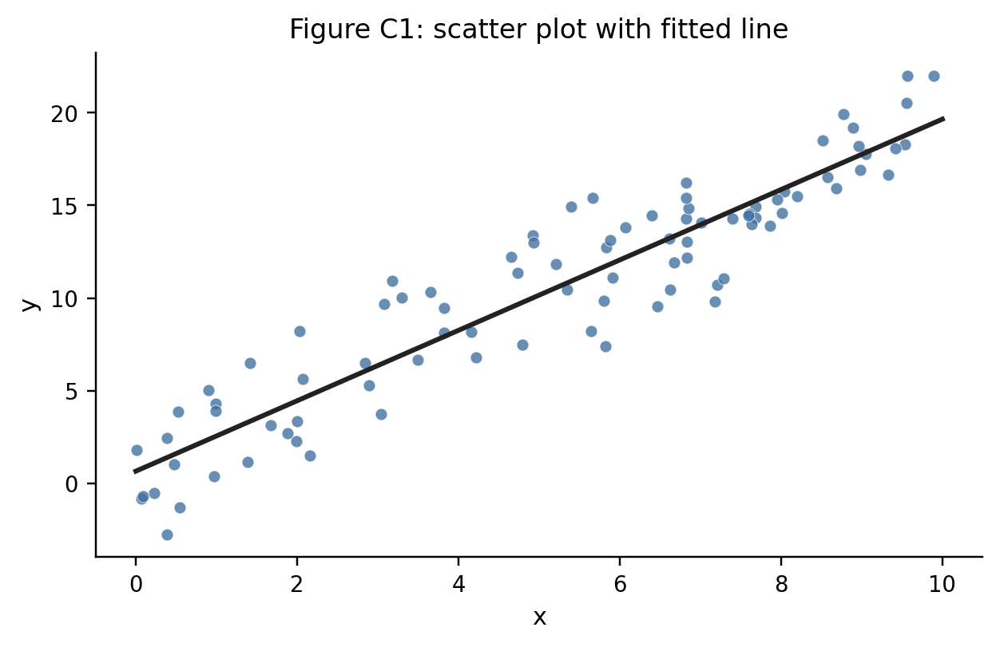{width=72%}

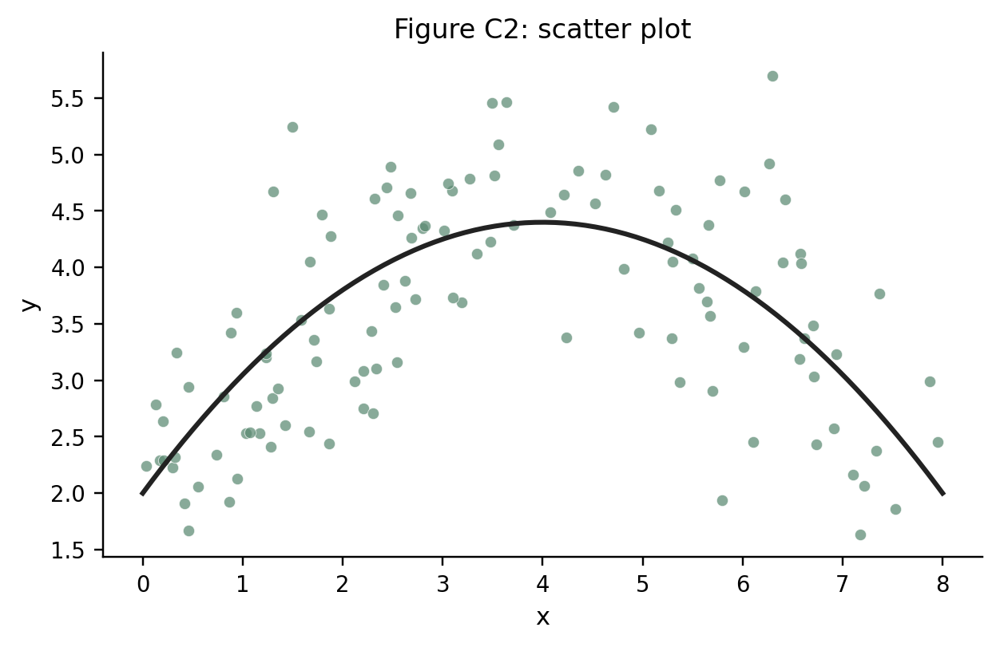{width=72%}

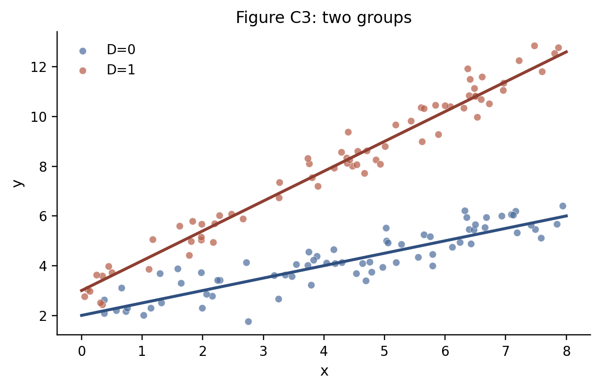{width=72%}

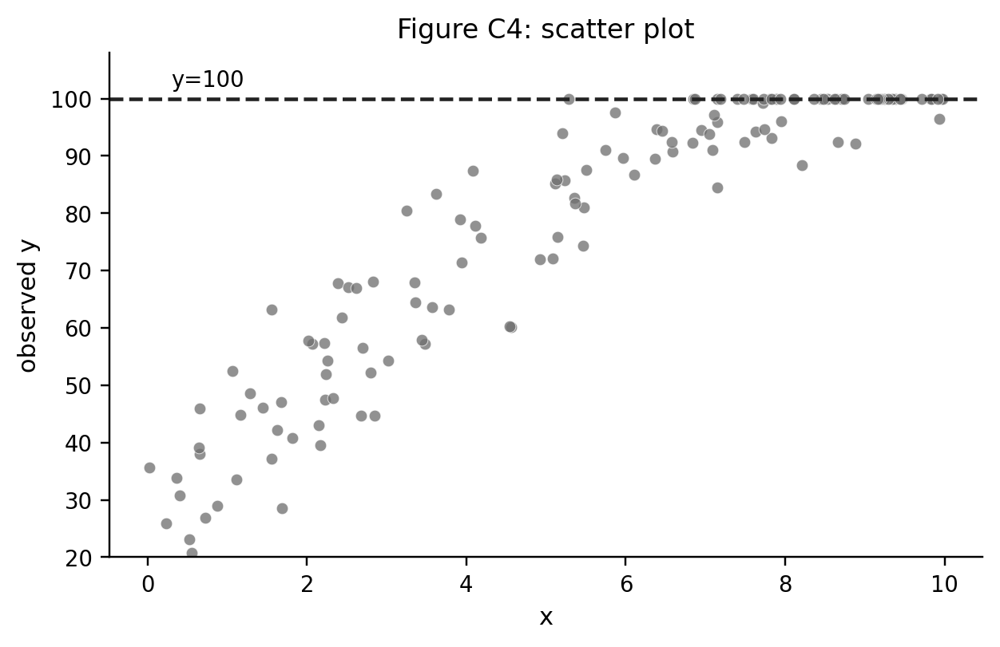{width=72%}

### Q20 資料C: 散布図C1と回帰表

図C1の散布図とOLS直線に対応する回帰表として整合的なものはどれか。

A.
$$
\begin{array}{lc}
\hline
&y\\
\hline
x&-1.8\\
&(0.2)\\
定数項&20.0\\
&(0.8)\\
\hline
\end{array}
$$
B.
$$
\begin{array}{lc}
\hline
&y\\
\hline
x&1.8\\
&(0.2)\\
定数項&1.2\\
&(0.8)\\
\hline
\end{array}
$$
C.
$$
\begin{array}{lc}
\hline
&y\\
\hline
x&0.0\\
&(0.2)\\
定数項&12.0\\
&(0.8)\\
\hline
\end{array}
$$
D.
$$
\begin{array}{lc}
\hline
&y\\
\hline
x^2&1.8\\
&(0.2)\\
定数項&1.2\\
&(0.8)\\
\hline
\end{array}
$$

### Q21 資料C: 図C1からの予測

Q20で選んだ回帰表を使う。$x=5$ のときの予測値 $\hat y$ に最も近いものはどれか。

A. $1.8$  
B. $1.2+5/1.8\simeq4.0$  
C. $1.2+1.8\times5=10.2$  
D. $1.2+1.8\times5^2=46.2$

### Q22 資料C: 散布図C2と関数形

図C2と整合的な回帰式・係数の組み合わせはどれか。

A. $y_i=\alpha+1.2x_i+0.15x_i^2+u_i$  
B. $y_i=\alpha-1.2x_i-0.15x_i^2+u_i$  
C. $y_i=\alpha+0.15x_i+1.2D_i+u_i$  
D. $y_i=\alpha+1.2x_i-0.15x_i^2+u_i$

### Q23 資料C: 図C2の頂点

Q22で選んだ式にもとづくと、曲線の頂点の $x$ はどれか。

A. $1.2/(2\times0.15)=4$  
B. $-1.2/(2\times0.15)=-4$  
C. $1.2/0.15=8$  
D. $0.15/1.2=0.125$

### Q24 資料C: 散布図C3と交差項

図C3には $D=0$ と $D=1$ の2グループと、それぞれのあてはめ線が描かれている。回帰式は

$$
y_i=\alpha+\beta x_i+\gamma D_i+\delta(D_i\times x_i)+u_i
$$

であり、$D=0$ を基準カテゴリとする。表では定数項は省略している。これと整合的な回帰表はどれか。

A.
$$
\begin{array}{lc}
\hline
&y\\
\hline
x&0.5\\
D&1.0\\
D\times x&0.0\\
\hline
\end{array}
$$
B.
$$
\begin{array}{lc}
\hline
&y\\
\hline
x&1.2\\
D&-1.0\\
D\times x&-0.7\\
\hline
\end{array}
$$
C.
$$
\begin{array}{lc}
\hline
&y\\
\hline
x&0.5\\
D&1.0\\
D\times x&0.7\\
\hline
\end{array}
$$
D.
$$
\begin{array}{lc}
\hline
&y\\
\hline
x&0.0\\
D&0.0\\
D\times x&1.0\\
\hline
\end{array}
$$

### Q25 資料C: 散布図C4と記録ルール

図C4と整合する観測値の作られ方はどれか。

A. $y_i$ が100を超える観測はデータから削除される  
B. $y_i$ が100未満の観測だけ $y_i=100$ と記録される  
C. $x_i$ が大きい観測はすべて削除される  
D. 潜在的な $y_i^*$ が100を超えると、観測値は $y_i=100$ と記録される

### 資料D: 関数形とダミー変数

以下の式を必要に応じて用いる。ここで $\log$ は自然対数を表す。

$$
\begin{array}{ll}
(A)& y_i=2+0.5x_i-0.02x_i^2+u_i\\
(B)& \log y_i=1+0.08D_i+u_i\\
(C)& y_i=10+2\log x_i+u_i\\
(D)& \log y_i=1+0.7\log x_i+u_i\\
(E)& y_i=1+0.5D_i+0.2Female_i+0.3(D_i\times Female_i)+u_i
\end{array}
$$

### Q26 資料D: 二次項の限界効果

式 (A) で、$x=10$ における $x$ の限界効果として正しいものはどれか。

A. $0.5-0.02\times10=0.3$  
B. $0.5-0.04\times10=0.1$  
C. $2+0.5\times10-0.02\times10^2=5$  
D. $-0.02$

### Q27 資料D: 二次関数の頂点

式 (A) で、$y$ を最大にする $x$ として正しいものはどれか。

A. $0.5/0.02=25$  
B. $2/0.5=4$  
C. $0.02/0.5=0.04$  
D. $0.5/(2\times0.02)=12.5$

### Q28 資料D: 式(B)の解釈

式 (B) で $D_i$ が0から1に変わるとき、$y_i$ の近似的な変化率として正しいものはどれか。

A. 約 $0.08\%$ 増加  
B. 約 $8\%$ 増加  
C. 8単位増加  
D. 約 $1/0.08=12.5\%$ 増加

### Q29 資料D: 式(C)の解釈

式 (C) で $x_i$ が1%増えるとき、$y_i$ の近似的な変化として正しいものはどれか。

A. $2$ 単位増える  
B. $0.02$ 単位増える  
C. $2\%$ 増える  
D. $200\%$ 増える

### Q30 資料D: 式(D)の解釈

式 (D) の係数 $0.7$ の読み方として、式と整合するものはどれか。

A. $x_i$ が1単位増えると、$y_i$ は0.7単位増える  
B. $x_i$ が1%増えると、$y_i$ は70単位増える  
C. $x_i$ が1%増えると、$y_i$ は約0.7%増える  
D. $x_i$ が0.7%増えると、$y_i$ は1%減る

### Q31 資料D: 交差項

式 (E) で $Female_i=1$ の個体について、$D_i$ が0から1に変わるときの $y_i$ の変化として正しいものはどれか。

A. $0.5$  
B. $0.2$  
C. $0.5+0.3=0.8$  
D. $1+0.2=1.2$

### Q32 ダミー変数と基準カテゴリ

次の回帰表では、被説明変数は合格ダミーで、切片を含む。学部Aが基準カテゴリである。

$$
\begin{array}{lcc}
\hline
 & 係数 & 標準誤差\\
\hline
定数項&0.40&(0.04)\\
学部B&-0.10&(0.05)\\
学部C&0.05&(0.05)\\
学部D&-0.20&(0.06)\\
\hline
\end{array}
$$

学部Dの予測合格率として正しいものはどれか。

A. $0.40$  
B. $0.40-0.20=0.20$  
C. $-0.20$  
D. $0.40+0.05=0.45$

### Q33 Censoring と truncation

所得の記録ルールが次の表のようになっている。

| 真の所得 | データセットAでの記録 | データセットBでの記録 |
|---:|---:|---:|
| 80 | 80 | 記録されない |
| 500 | 500 | 500 |
| 1200 | 1000 | 1200 |

データセットAとBの特徴として正しいものはどれか。

A. Aは下側 truncation を含み、Bは上側 censoring を含む  
B. AもBも fixed effects である  
C. Aは上側 censoring を含み、Bは下側 truncation を含む  
D. AもBも weak IV である

### Q34 Censoring された被説明変数

真の潜在変数 $y_i^*$ と観測値 $y_i$ が

$$
y_i=\min(y_i^*,100)
$$

で結びついている。観測データの散布図として整合するものはどれか。

A. $y<100$ の観測がすべて消える  
B. $x$ が大きいほど必ず $y$ が負になる  
C. すべての点が $y=0$ に集まる  
D. $y=100$ のところに点がたまりうる

### Q35 ダミー変数と完全多重共線性

4つの学部A-Dがあり、各観測はいずれか1つの学部に必ず属する。学部ごとの平均差を回帰式に入れたうえで、切片も含めて回帰したい。完全多重共線性を避ける指定として正しいものはどれか。

A. 切片と、学部A・B・C・Dの4つのダミーをすべて入れる  
B. 切片だけを入れ、学部ダミーをすべて捨てる  
C. 切片と、学部B・C・Dの3つのダミーを入れる  
D. 被説明変数を学部Aダミーに置き換える

### Q36 正確な変化率

次の回帰結果がある。

$$
\log y_i=\alpha+0.20D_i+u_i
$$

$D_i$ が0から1に変わるときの $y_i$ の正確な変化率として最も近いものはどれか。

A. $0.20\%$  
B. $\exp(0.20)-1\simeq22.1\%$  
C. $20$ 単位  
D. $\log(0.20)\simeq-1.61\%$

## 第5部 潜在アウトカムと因果効果の定義（3問）

### 資料E: 潜在アウトカム

次の表は4人について、処置 $D_i$、処置を受けないときの潜在アウトカム $Y_i(0)$、処置を受けるときの潜在アウトカム $Y_i(1)$ を示している。

| 個人 | $D_i$ | $Y_i(0)$ | $Y_i(1)$ |
|---:|---:|---:|---:|
| 1 | 1 | 4 | 7 |
| 2 | 1 | 6 | 8 |
| 3 | 0 | 5 | 6 |
| 4 | 0 | 7 | 9 |

実際に観察されるアウトカムは $Y_i=D_iY_i(1)+(1-D_i)Y_i(0)$ だけであり、表の両方の潜在アウトカムは概念説明のために示している。

### Q37 資料E: ATE

この表で、平均処置効果 ATE はどれか。

A. $(3+2+1+2)/4=2.0$  
B. $(7+8)/2=7.5$  
C. $(4+6+5+7)/4=5.5$  
D. $(7+8)/2-(5+7)/2=1.5$

### Q38 資料E: ATT

この表で、処置群に対する平均処置効果 ATT はどれか。

A. $(1+2)/2=1.5$  
B. $(3+2+1+2)/4=2.0$  
C. $(3+2)/2=2.5$  
D. $(7+8+6+9)/4=7.5$

### Q39 資料E: 観察される平均差

この表で観察される平均差は $1.5$ である。これをそのまま ATT と読めない理由として正しいものはどれか。

A. ATE と ATT は常に同じなので、平均差も必ず同じである  
B. 処置群が処置を受けなかった場合の平均 $E[Y(0)\mid D=1]$ は、実際には観察されない  
C. 対照群の $Y(1)$ は観察されているので、反実仮想は不要である  
D. 平均差は標準誤差を含まないため、必ずゼロになる

## 第6部 DiD・parallel trends・event study（15問）

### 資料F: Difference-in-Differences の散布図

図F1は、処置群と対照群の各年の散布図とセル平均を重ねたものである。点線より右が処置後である。

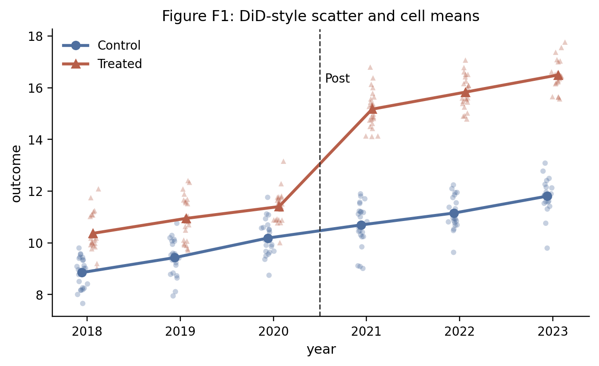{width=78%}

この資料では、$Treat_i$ は処置群ダミー、$Post_t$ は処置後ダミーである。

Q41では、2018-2020年平均を処置前、2021-2023年平均を処置後として2群2期に集計する。このとき4セル平均は、対照群の処置前が9.6、対照群の処置後が11.2、処置群の処置前が11.0、処置群の処置後が15.8である。

### Q40 資料F: 図F1とDiD回帰式

図F1の処置後ジャンプを DiD 係数として直接読む回帰式はどれか。$Treat_i$ は処置群ダミー、$Post_t$ は処置後ダミーである。

A. $Y_{it}=\alpha+\beta Treat_i+u_{it}$  
B. $Y_{it}=\alpha+\beta Post_t+u_{it}$  
C. $Y_{it}=\alpha+\gamma Treat_i+\lambda Post_t+\tau(Treat_i\times Post_t)+u_{it}$  
D. $Treat_i=\alpha+\beta Y_{it}+u_{it}$

### Q41 資料F: 図F1と回帰表

図F1と整合的な2群2期 DiD の回帰表はどれか。

A.
$$
\begin{array}{lc}
\hline
&Y\\
\hline
Treat_i&1.4\\
Post_t&1.6\\
Treat_i\times Post_t&3.2\\
\hline
\end{array}
$$
B.
$$
\begin{array}{lc}
\hline
&Y\\
\hline
Treat_i&1.4\\
Post_t&1.6\\
Treat_i\times Post_t&0.0\\
\hline
\end{array}
$$
C.
$$
\begin{array}{lc}
\hline
&Y\\
\hline
Treat_i&-1.4\\
Post_t&-1.6\\
Treat_i\times Post_t&-3.2\\
\hline
\end{array}
$$
D.
$$
\begin{array}{lc}
\hline
&Treat\\
\hline
Y&3.2\\
Post_t&1.6\\
Treat_i\times Post_t&1.4\\
\hline
\end{array}
$$

### Q42 資料F: 図F1と event study

図F1を event study で表すとき、処置開始年を2021年、$k=t-2021$ とし、基準時点を処置直前の2020年、つまり $k=-1$ とする。図F1と整合的な係数パターンはどれか。

A.
$$
\begin{array}{c|rrrrr}
k&-3&-2&0&1&2\\
\hline
\hat\tau_k&3.0&3.2&0.0&0.1&0.0\\
\hline
\end{array}
$$
B.
$$
\begin{array}{c|rrrrr}
k&-3&-2&0&1&2\\
\hline
\hat\tau_k&0.1&-0.1&3.2&3.1&3.3\\
\hline
\end{array}
$$
C.
$$
\begin{array}{c|rrrrr}
k&-3&-2&0&1&2\\
\hline
\hat\tau_k&-3.2&-3.1&-3.0&-3.1&-3.3\\
\hline
\end{array}
$$
D.
$$
\begin{array}{c|rrrrr}
k&-3&-2&0&1&2\\
\hline
\hat\tau_k&0.0&0.0&0.0&0.0&0.0\\
\hline
\end{array}
$$

### Q43 資料F: parallel trends の読み方

図F1のような2群2期の DiD で、処置前の情報を使って parallel trends を考える。正しい読み方はどれか。

A. 処置前の傾きが似ていれば、parallel trends は論理的に証明されたことになる  
B. 処置前の動きが大きく異なるなら、parallel trends への懸念が強くなる  
C. 処置後の水準差だけを見れば、parallel trends を直接検定できる  
D. 時点固定効果を入れれば、parallel trends は必ず成り立つ

### Q44 Event study の基準時点

event study で、処置直前の時点 $k=-1$ を基準時点にする。正しい説明はどれか。

A. $k=-1$ のダミーも含め、すべての event-time ダミーを同時に入れる必要がある  
B. $k=-1$ を落とすことで完全多重共線性を避け、他の係数を $k=-1$ との差として読む  
C. 処置後のダミーだけを落とせば、処置前の係数はすべて因果効果になる  
D. 基準時点の係数そのものが DiD 推定量である

### 資料G: DiD と event study の補充

平均アウトカムは次の通りである。

|  | 処置前 | 処置後 |
|---|---:|---:|
| 処置群 | 10 | 16 |
| 対照群 | 8 | 11 |

### Q45 資料G: DiD の計算

DiD 推定量として正しいものはどれか。

A. $16-11=5$  
B. $(16-10)-(11-8)=3$  
C. $16-10=6$  
D. $10-8=2$

### Q46 資料G: event study の pre-trend

Event study の推定結果が次の表である。基準時点は $k=-1$ である。

$$
\begin{array}{c|rrrrr}
k&-3&-2&0&1&2\\
\hline
\hat\tau_k&0.80&0.70&1.10&1.30&1.40\\
SE&0.25&0.24&0.30&0.32&0.35\\
\hline
\end{array}
$$

この表と整合する読み方はどれか。

A. 処置前の $k=-3,-2$ で係数が大きく、pre-trend に注意が必要である  
B. 処置前の係数がすべて0なので、平行トレンドは完全に証明された  
C. 処置後の係数は標準誤差を持たない  
D. 基準時点 $k=-1$ の係数は表にないので、処置効果は計算できない

### Q47 資料G: event study の回帰式

個体固定効果 $\alpha_i$ と時点固定効果 $\lambda_t$ を入れ、基準時点 $k=-1$ を落として event study を推定したい。$G_i$ は個体 $i$ の処置開始時点であり、$1\{t-G_i=k\}$ は event time $k$ のダミーである。式として正しいものはどれか。

A. $Y_{it}=\alpha+\beta Treat_i+u_{it}$  
B. $Y_{it}=\alpha_i+\lambda_t+\sum_{k\ne -1}\tau_k 1\{t-G_i=k\}+u_{it}$  
C. $1\{t-G_i=k\}=\alpha+\beta Y_{it}+u_{it}$  
D. $Y_{it}=\tau_{-1}1\{t-G_i=-1\}+u_{it}$

### 資料H: DiD と event study の図表

この資料では、2群2期の DiD を次の回帰式で考える。

$$
Y_{it}=\alpha+\beta NJ_i+\gamma Post_t+\delta(NJ_i\times Post_t)+u_{it}
$$

ここで $Y_{it}$ は店舗 $i$ の時点 $t$ における雇用、$NJ_i$ はニュージャージー州の店舗なら1、ペンシルベニア州の店舗なら0のダミー、$Post_t$ は最低賃金引き上げ後なら1のダミーである。店舗ごとの雇用変化 $\Delta Y_i$ を使うと、同じ比較は

$$
\Delta Y_i=a+c\,NJ_i+u_i
$$

とも書ける。図H1は、最低賃金引き上げ前後の平均雇用変化を示す表の抜粋である。

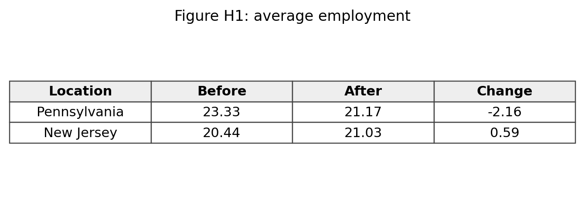{width=72%}

### Q48 資料H: 差の差の計算

図H1では、ペンシルベニア州の変化は $-2.16$、ニュージャージー州の変化は $0.59$ である。差の差に最も近いものはどれか。

A. $0.59-(-2.16)=2.75$  
B. $-2.16-0.59=-2.75$  
C. $0.59+(-2.16)=-1.57$  
D. $0.59/(-2.16)=-0.27$

### Q49 資料H: t 値

図H1の差の差はおよそ $2.76$、標準誤差は $1.36$ である。t 値に最も近いものはどれか。

A. $1.36/2.76\simeq0.49$  
B. $2.76/1.36\simeq2.03$  
C. $2.76-1.36=1.40$  
D. $2.76+1.36=4.12$

### Q50 禁煙法の回帰表

次の表は、地域ごとの禁煙法導入を使った固定効果回帰の結果である。推定している基本式は

$$
Y_{iat}=\alpha+\beta SmokingLaw_{at}+X_{iat}'\gamma+\mu_a+\lambda_t+u_{iat}
$$

である。ここで $Y_{iat}$ は地域 $a$ に住む個人 $i$ が時点 $t$ に各場所で受動喫煙に曝露されたかどうか、$SmokingLaw_{at}$ は地域 $a$ で時点 $t$ に禁煙法が施行されているかどうか、$X_{iat}$ は個人属性などのコントロール変数、$\mu_a$ は地域固定効果、$\lambda_t$ は年固定効果である。表では $SmokingLaw_{at}$ の係数 $\beta$、標準誤差、Baseline mean を示している。

$$
\begin{array}{lcc}
\hline
&Restaurant&Bar\\
\hline
Smoking\ law&-0.396&-0.239\\
SE&(0.049)&(0.015)\\
Baseline\ mean&0.539&0.376\\
City\ FE&Yes&Yes\\
Year\ FE&Yes&Yes\\
\hline
\end{array}
$$

Restaurant 列について、ベースライン平均に対する低下率として最も近いものはどれか。

A. $0.049/0.539\simeq9.1\%$  
B. $0.396-0.049=34.7\%$  
C. $0.539/0.396\simeq136.1\%$  
D. $0.396/0.539\simeq73.5\%$

### Q51 禁煙法の固定効果

Q50の表で City FE と Year FE を入れる意味として正しいものはどれか。

A. City FE は年ごとの全国ショックだけを吸収し、Year FE は都市の時間不変差だけを吸収する  
B. City FE は都市ごとの時間不変差を、Year FE は全都市に共通する年ごとのショックを吸収する  
C. 固定効果を入れると、処置変数の係数は必ずゼロになる  
D. 固定効果は標準誤差だけを変え、係数には一切関係しない  

図H2は、基準時点を $k=-1$ とした event study の係数である。基本式は

$$
Y_{it}=\alpha_i+\lambda_t+\sum_{k\neq -1}\tau_k 1\{K_{it}=k\}+u_{it}
$$

である。ここで $K_{it}$ は処置時点から見た相対時点であり、$k=-1$ のダミーを基準として落としている。図H2では、各 $\tau_k$ とその信頼区間を示している。

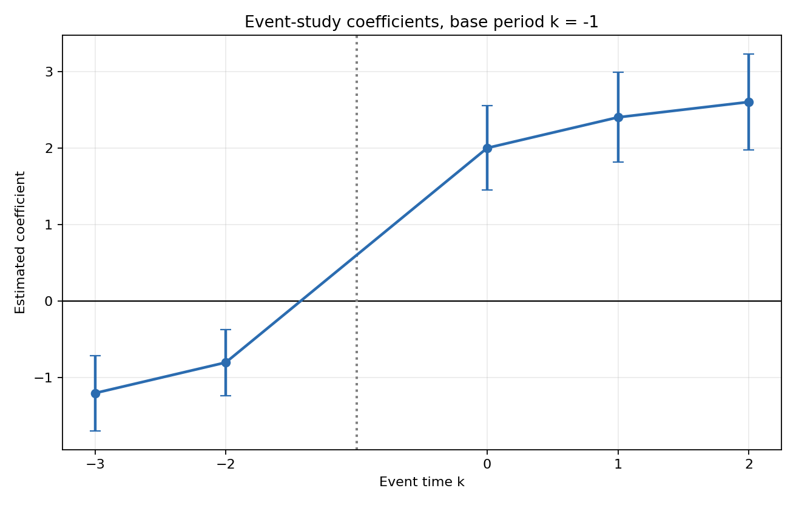{width=76%}

### Q52 資料H: pre-trend

図H2から読めることとして正しいものはどれか。

A. 処置前の $k=-3,-2$ の係数がゼロから離れており、parallel trends への懸念がある  
B. 処置前の係数はすべてちょうどゼロなので、懸念はまったくない  
C. 処置後の係数が正なので、処置前の確認は不要である  
D. 基準時点 $k=-1$ の係数が一番大きい

### Q53 資料H: 処置後の係数

図H2の処置後の係数について、最も整合的な読み方はどれか。

A. $k=0,1,2$ はすべて大きく負である  
B. $k=0,1,2$ はすべてほぼゼロである  
C. $k=0,1,2$ はおおむね2から2.6程度の正の値である  
D. $k=0,1,2$ は基準時点なので推定されていない

### Q54 event study 係数の解釈

基準時点を $k=-1$ とした event study で、$\hat\tau_1=2.4$ と推定された。正しい解釈はどれか。

A. $k=1$ の水準そのものが2.4である  
B. 固定効果などを調整した上で、$k=1$ は基準時点 $k=-1$ に比べて2.4高い  
C. $k=-1$ の係数が2.4である  
D. 処置前の平均が必ず2.4である

## 第7部 パネルデータ・固定効果・TWFE・AKM（14問）

### 資料I: パネルデータと固定効果

次の農家パネルデータを考える。

| 農家 | 月 | 肥料投入量 $x$ | 収穫量 $y$ |
|---|---:|---:|---:|
| A | 1 | 10 | 30 |
| A | 2 | 12 | 34 |
| B | 1 | 20 | 20 |
| B | 2 | 22 | 24 |

### Q55 資料I: 個体内比較

農家固定効果モデルが使う比較として、資料Iと整合するものはどれか。

A. AとBの平均収穫量の差だけを見る  
B. 同じ農家の中で、普段より肥料が多い月と少ない月を比べる  
C. 肥料投入量が最大の観測だけを見る  
D. 月1の観測だけを使う

### Q56 資料I: within 変換

農家Aについて、月2の within 変換後の値 $(x_{A2}-\bar x_A,\ y_{A2}-\bar y_A)$ として正しいものはどれか。

A. $(12,34)$  
B. $(1,2)$  
C. $(2,4)$  
D. $(-1,-2)$

### Q57 資料I: 差分回帰

各農家について月2から月1を引く。差分 $(\Delta x,\Delta y)$ として正しいものはどれか。

A. AもBも $(2,4)$  
B. Aは $(10,30)$、Bは $(20,20)$  
C. AもBも $(-2,-4)$  
D. Aは $(2,-10)$、Bは $(2,4)$

### Q58 固定効果と消える変数

次のモデルを考える。

$$
y_{it}=\beta x_{it}+\alpha_i+u_{it}
$$

$t=1,2$ の2期だけ観測されているとき、2期差分として正しいものはどれか。

A. $y_{i2}-y_{i1}=\beta(x_{i2}-x_{i1})+\alpha_i+(u_{i2}-u_{i1})$  
B. $y_{i2}+y_{i1}=\beta(x_{i2}-x_{i1})+u_{i2}$  
C. $y_{i2}-y_{i1}=\alpha_i$  
D. $y_{i2}-y_{i1}=\beta(x_{i2}-x_{i1})+(u_{i2}-u_{i1})$

### 資料J: 2×2 の TWFE

$$
\begin{array}{c|cc|cc}
&x_{i1}&x_{i2}&y_{i1}&y_{i2}\\
\hline
i=A&1&3&10&16\\
i=B&2&2&11&13\\
\hline
\end{array}
$$

ここで $\bar x_i$ は個体 $i$ の平均、$\bar x_t$ は時点 $t$ の平均、$\bar x$ は全体平均を表す。

### Q59 資料J: double demeaning

資料Jで、$x_{A2}$ の double-demeaned value

$$
x_{A2}-\bar x_A-\bar x_2+\bar x
$$

として正しいものはどれか。

A. $3-2=1$  
B. $3-2-2.5+2=0.5$  
C. $3-2.5=0.5$  
D. $3+2+2.5=7.5$

### Q60 資料J: TWFE 係数

資料Jの表にもとづいて、TWFE 回帰の $\hat\beta$ として正しいものはどれか。

A. 0  
B. 1  
C. 2  
D. 4

### Q61 AKM 型の固定効果

労働者Aが企業1から企業2に移り、賃金が次のように変わった。

| 労働者 | 時点1の企業 | 時点1賃金 | 時点2の企業 | 時点2賃金 |
|---|---|---:|---|---:|
| A | 1 | 20 | 2 | 25 |

モデル $w_{it}=\alpha_i+\psi_{j(i,t)}+u_{it}$ の直感として、この観測から主に情報が得られるものはどれか。

A. 労働者Aの性別  
B. 企業1と企業2の所在地の平均  
C. 誤差項が必ず0であること  
D. 同じ労働者が移動したので、企業固定効果の差 $\psi_2-\psi_1$

### 資料K: 固定効果と個体内変化

図K1は、農家ごとの肥料投入量と農業生産の関係を示している。

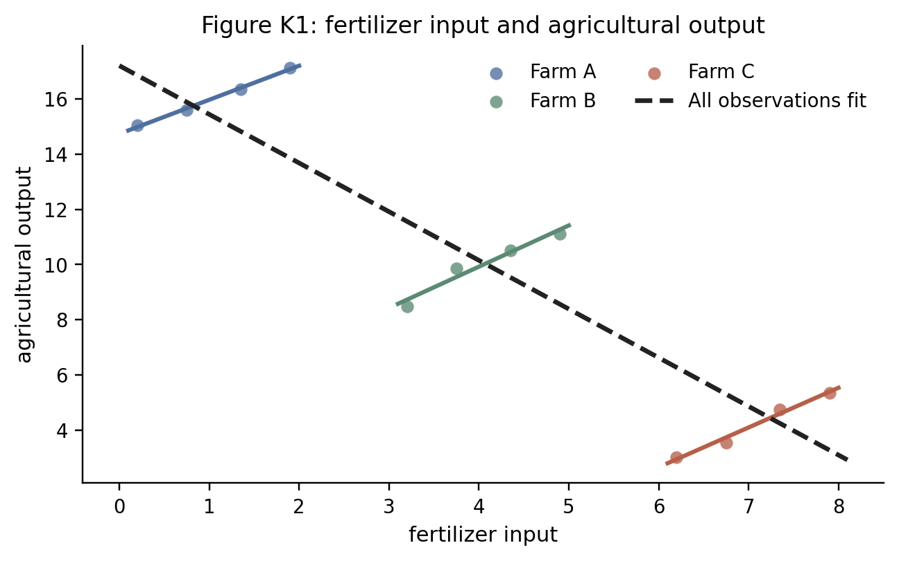{width=78%}

### Q62 資料K: 図K1の読み方

図K1と整合的な説明はどれか。

A. pooled OLS が右下がりなので、農家固定効果を入れても係数は必ず負になる  
B. 農家内の変化を見ると正の関係があり、農家固定効果はこの個体内変化を使う  
C. 固定効果は農家ごとの平均差を強調して、個体内変化を捨てる  
D. 図K1では各農家の中で肥料投入は変化していない

### Q63 資料K: 差分回帰

次の2期間データを考える。

| 農家 | 期間1の $x$ | 期間2の $x$ | 期間1の $y$ | 期間2の $y$ |
|---|---:|---:|---:|---:|
| A | 1 | 3 | 10 | 14 |
| B | 4 | 6 | 8 | 12 |

各農家で期間2から期間1を引いたとき、$\Delta y/\Delta x$ として読める傾きはどれか。

A. $1$  
B. $1.5$  
C. $2$  
D. $4$

### Q64 固定効果で消えるもの

農家ごとの土地の質 $\alpha_i$ が時間を通じて変わらず、生産量にも肥料投入にも関係している。農家固定効果や差分で取り除けるものはどれか。

A. すべての時間変動する天候ショック  
B. 肥料投入の測定誤差  
C. 将来の政策変更の影響  
D. 農家ごとに時間を通じて変わらない土地の質

### Q65 時点固定効果

全農家に共通して、期間2だけ天候がよくなり生産量が5だけ上がった。時点固定効果の役割として正しいものはどれか。

A. 農家ごとの時間不変な違いだけを吸収する  
B. 全農家に共通する期間2のショックを吸収する  
C. 肥料投入の個体内変化をゼロにする  
D. 被説明変数を必ず対数に変換する

### Q66 Short panel と測定誤差

個体数は多いが各個体の期間数 $T$ が短く、説明変数の個体内変化が小さい。説明変数に測定誤差があるとき、特に起きやすい問題はどれか。

A. 個体内の本当の変化に比べて測定誤差の比重が大きくなり、係数が不安定になりやすい  
B. 固定効果を入れると測定誤差は必ず完全に消える  
C. 標準誤差は必ずゼロになる  
D. pooled OLS と fixed effects は常に同じ係数になる

### 資料L: 労働者と企業の固定効果

次の表は、労働者がどの企業で働いたかを示している。

| 労働者 | 期間1 | 期間2 |
|---|---|---|
| 1 | 企業A | 企業B |
| 2 | 企業B | 企業C |
| 3 | 企業D | 企業D |

AKM 型の賃金分解では、賃金を労働者固定効果、企業固定効果、共変量に分けて表す。

### Q67 資料L: 企業固定効果の識別

企業固定効果を労働者固定効果と同時に入れるとき、表から読めることとして正しいものはどれか。

A. 企業A、B、Cは労働者の移動でつながっているが、企業Dはこの表だけではA、B、Cと比較しにくい  
B. 企業Dは移動がないので、企業Dの効果だけが最も精密に識別される  
C. 労働者固定効果を入れると、企業固定効果は常にすべて同じ値になる  
D. 労働者が一度も移動しなくても、企業間の相対効果は必ず識別できる

### Q68 AKM 型の分解の解釈

賃金を労働者固定効果、企業固定効果、共変量で分解する AKM 型の回帰について、正しい読み方はどれか。

A. 企業固定効果は、その企業に入れば誰でも必ず同じだけ賃金が上がるという実験的な因果効果である  
B. 労働者固定効果を入れると、企業間の賃金差はすべて消える  
C. 企業固定効果は賃金構造の統計的分解として有用だが、そのまま因果効果とは限らない  
D. 企業固定効果は、労働者の移動データがなくても常に正確に推定できる

## 第8部 操作変数・2SLS・weak IV・LATE（14問）

### 資料M: 操作変数

次の集計値を用いる。

| $Z$ | $E[Y\mid Z]$ | $E[D\mid Z]$ |
|---:|---:|---:|
| 0 | 4.0 | 0.20 |
| 1 | 5.5 | 0.50 |

必要なら $Z=1$ と $Z=0$ の条件付き平均を比較する。回帰で書くと、reduced form は $Y_i=\rho_0+\rho_1Z_i+e_i$、first stage は $D_i=\pi_0+\pi_1Z_i+v_i$ である。

### Q69 資料M: Wald 推定量

Wald 推定量として正しいものはどれか。

A. $(0.50-0.20)/(5.5-4.0)=0.2$  
B. $5.5-4.0=1.5$  
C. $0.50-0.20=0.30$  
D. $(5.5-4.0)/(0.50-0.20)=5$

### Q70 First stage と reduced form

次の2本の回帰結果がある。

$$
\begin{array}{lcc}
\hline
&D_i&Y_i\\
\hline
Z_i&0.30&1.50\\
&(0.05)&(0.40)\\
\hline
\end{array}
$$

この表から Wald/IV の比として正しいものはどれか。

A. $1.50/0.30=5$  
B. $0.30/1.50=0.2$  
C. $1.50-0.30=1.20$  
D. $0.05/0.40=0.125$

### Q71 2SLS の手順

次の2段階を考える。

$$
\begin{aligned}
D_i&=\pi_0+\pi_1Z_i+X_i'\pi_2+v_i\\
Y_i&=\alpha+\beta \widehat D_i+X_i'\gamma+u_i
\end{aligned}
$$

この式の読み方として正しいものはどれか。

A. 第1段階で $Y_i$ の予測値を作り、第2段階で $Z_i$ を説明する  
B. $Z_i$ は第1段階にも第2段階にも現れてはいけない  
C. $X_i$ は必ず捨てる  
D. 第1段階で $D_i$ の予測値 $\widehat D_i$ を作り、第2段階でそれを使って $Y_i$ を説明する

### Q72 Weak IV

2つの IV 推定の結果がある。

$$
\begin{array}{lcc}
\hline
&列(1)&列(2)\\
\hline
TSLS\ 係数&0.10&0.08\\
標準誤差&(0.04)&(0.03)\\
First\ stage\ F&4.2&25.1\\
\hline
\end{array}
$$

weak IV の観点から注意が必要な列はどれか。

A. 列 (2)  
B. どちらも First stage F が十分大きい  
C. 列 (1)  
D. First stage F は IV では見ない

### Q73 LATE

各タイプについて、$Z=0$ のときの処置状態 $D(0)$ と、$Z=1$ のときの処置状態 $D(1)$ は次の通りである。

| タイプ | $D(0)$ | $D(1)$ |
|---|---:|---:|
| I | 0 | 0 |
| II | 0 | 1 |
| III | 1 | 1 |

complier に対応するタイプはどれか。

A. I  
B. II  
C. III  
D. I と III

### Q74 IV の排除制約

次の因果図を考える。

$$
Z\longrightarrow D\longrightarrow Y,\qquad Z\longrightarrow Y
$$

この図が IV の排除制約と整合しない理由として、図から直接読めるものはどれか。

A. $Z$ から $D$ への矢印があるから  
B. $D$ から $Y$ への矢印があるから  
C. $Z$ から $Y$ への直接の矢印があるから  
D. $Y$ が観測されているから

### 資料N: IV の補充

この資料でも、操作変数 $Z_i$ が1つのときの reduced form と first stage を比べる。

### Q75 First stage の強さ

第1段階の回帰結果が次の通りである。

$$
\begin{array}{lc}
\hline
&D_i\\
\hline
Z_i&0.06\\
&(0.03)\\
\hline
\end{array}
$$

$Z_i$ が1つだけの操作変数であるとき、first-stage F 統計量に近いものはどれか。

A. $0.06/0.03=2$  
B. $0.06-0.03=0.03$  
C. $(0.06/0.03)^2=4$  
D. $0.03/0.06=0.5$

### Q76 Reduced form と first stage の符号

次の2本の回帰結果がある。

$$
\begin{array}{lcc}
\hline
&D_i&Y_i\\
\hline
Z_i&0.25&-0.50\\
&(0.05)&(0.20)\\
\hline
\end{array}
$$

Wald/IV の比として正しいものはどれか。

A. $0.25/(-0.50)=-0.5$  
B. $-0.50-0.25=-0.75$  
C. $0.25+(-0.50)=-0.25$  
D. $-0.50/0.25=-2$

### Q77 Monotonicity とタイプ表

各タイプについて、$Z=0$ のときの処置状態 $D(0)$ と、$Z=1$ のときの処置状態 $D(1)$ は次の通りである。

| タイプ | $D(0)$ | $D(1)$ |
|---|---:|---:|
| I | 0 | 0 |
| II | 0 | 1 |
| III | 1 | 1 |
| IV | 1 | 0 |

monotonicity $D(1)\ge D(0)$ と整合しないタイプはどれか。

A. I  
B. II  
C. IV  
D. I と III

### 資料O: IV と weak IV

この資料では、2SLS の標準誤差と first stage の情報を扱う。

### Q78 2SLS の標準誤差

2SLS を手作業で、第1段階で $\hat D_i$ を作り、第2段階で $Y_i$ を $\hat D_i$ に OLS 回帰した。第2段階の OLS 出力に表示される通常の標準誤差について、正しい説明はどれか。

A. 係数も標準誤差も、そのまま2SLSの正しい結果である  
B. 係数は2SLSと一致しうるが、標準誤差は第1段階の推定を反映したIV用の計算が必要である  
C. 第1段階が強いほど、標準誤差は必ず無限大になる  
D. 2SLS では標準誤差を計算できない  

図O1は、first-stage F と 2SLS の標準誤差の関係を示している。

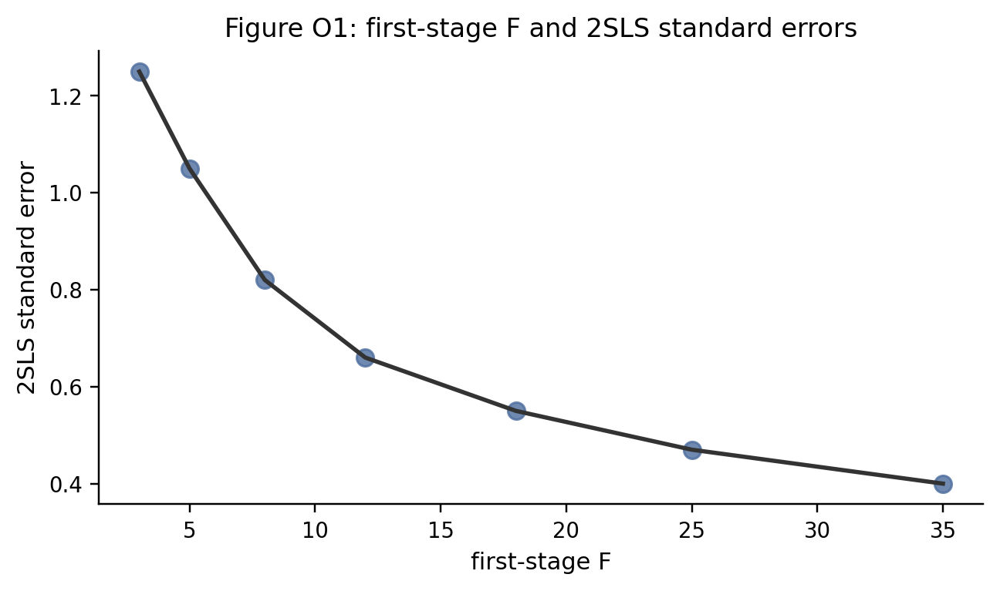{width=72%}

### Q79 資料O: 図O1の読み方

図O1と整合的な説明はどれか。

A. 第1段階の F 統計量が小さいほど、2SLS の標準誤差も必ず小さい  
B. 第1段階が弱いほど、2SLS の標準誤差が大きくなりやすい  
C. 第1段階の強さは、2SLS の標準誤差と無関係である  
D. F 統計量が大きいほど、操作変数の外生性は自動的に証明される

### Q80 First stage の比較

同じ内生変数に対して、2つの操作変数候補を使った第1段階の結果がある。

$$
\begin{array}{lcc}
\hline
&候補A&候補B\\
\hline
First\ stage\ coefficient&0.08&0.35\\
SE&(0.033)&(0.066)\\
First\ stage\ F&6.0&28.0\\
\hline
\end{array}
$$

weak IV の観点から正しい読み方はどれか。

A. 候補Aの方が F 統計量が小さく、weak IV の懸念が大きい  
B. 候補Bの方が F 統計量が大きいので、必ず排除制約も満たす  
C. F 統計量は標準誤差とは無関係なので見なくてよい  
D. 候補Aも候補Bも同じ強さである

### Q81 LATE とタイプ

次の表は、操作変数 $Z$ が0または1のときの処置状態をタイプ別に示している。

| タイプ | $D(0)$ | $D(1)$ | 処置効果 |
|---|---:|---:|---:|
| I | 0 | 0 | 1 |
| II | 0 | 1 | 4 |
| III | 1 | 1 | 2 |

単調性などの仮定のもとで、Wald 推定量が識別する LATE として正しいものはどれか。

A. タイプIの処置効果 1  
B. タイプIIIの処置効果 2  
C. タイプIIの処置効果 4  
D. 3タイプの単純平均 $(1+4+2)/3$

### Q82 排除制約

奨学金の当選を操作変数 $Z$、大学進学を処置 $D$、賃金をアウトカム $Y$ とする。排除制約への違反として最も明確なものはどれか。

A. 奨学金の当選が、大学進学とは別に、在学中の生活費余裕を通じて将来賃金に直接影響する  
B. 奨学金の当選が大学進学率を上げる  
C. 大学進学が賃金に影響する  
D. 当選者と非当選者の人数が同じである

## 第9部 RDD・fuzzy RDD・診断（18問）

### 資料P: RDD の散布図

ランニング変数は $X_i$、カットオフは $c=0$ である。図P1はアウトカムの散布図、図P2は処置率とアウトカム平均の binned scatter である。

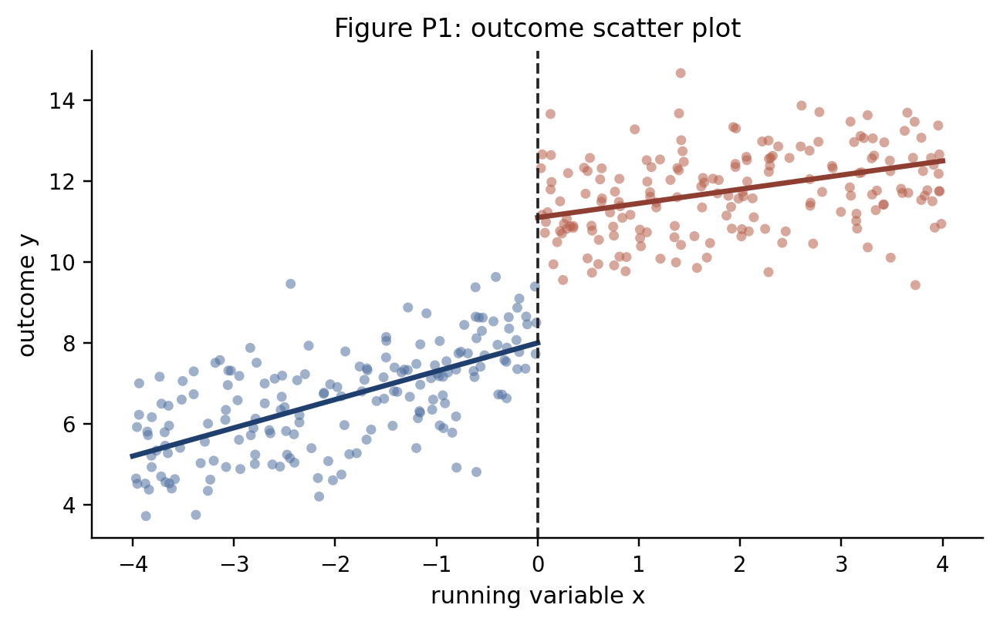{width=78%}

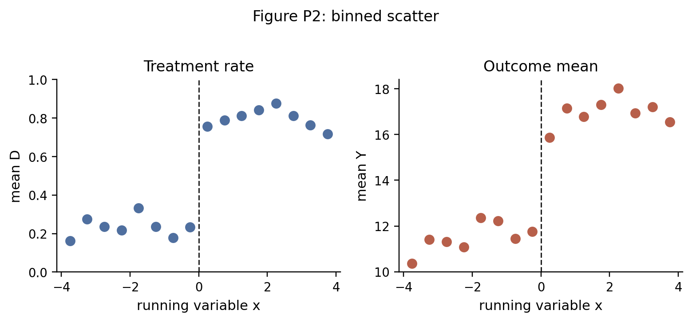{width=84%}

### Q83 資料P: 図P1と回帰表

図P1のカットオフ近傍の段差と左右の傾きに対応する局所線形回帰表として整合的なものはどれか。$D_i=1\{X_i\ge0\}$、$r_i=X_i$ とする。

A.
$$
\begin{array}{lc}
\hline
&Y\\
\hline
D_i&3.1\\
r_i&0.7\\
D_i\times r_i&-0.35\\
\hline
\end{array}
$$
B.
$$
\begin{array}{lc}
\hline
&Y\\
\hline
D_i&0.0\\
r_i&0.7\\
D_i\times r_i&0.0\\
\hline
\end{array}
$$
C.
$$
\begin{array}{lc}
\hline
&Y\\
\hline
D_i&-3.1\\
r_i&-0.7\\
D_i\times r_i&0.35\\
\hline
\end{array}
$$
D.
$$
\begin{array}{lc}
\hline
&D\\
\hline
Y_i&3.1\\
r_i&0.7\\
D_i\times r_i&-0.35\\
\hline
\end{array}
$$

### Q84 資料P: 図P1と回帰式

図P1のようにカットオフ左右で切片も傾きも変わりうる局所線形 RDD の回帰式として正しいものはどれか。

A. $Y_i=\alpha+\tau X_i+u_i$  
B. $D_i=\alpha+\tau Y_i+u_i$  
C. $Y_i=\alpha+\tau D_i^2+u_i$  
D. $Y_i=\alpha+\tau D_i+\beta r_i+\gamma(D_i\times r_i)+u_i$

### Q85 資料P: 図P2と first stage / reduced form

図P2と整合的な first stage と reduced form の表はどれか。

A.
$$
\begin{array}{lcc}
\hline
&D&Y\\
\hline
1\{X_i\ge0\}&0.00&4.0\\
\hline
\end{array}
$$
B.
$$
\begin{array}{lcc}
\hline
&D&Y\\
\hline
1\{X_i\ge0\}&0.50&0.0\\
\hline
\end{array}
$$
C.
$$
\begin{array}{lcc}
\hline
&D&Y\\
\hline
1\{X_i\ge0\}&0.50&4.0\\
\hline
\end{array}
$$
D.
$$
\begin{array}{lcc}
\hline
&D&Y\\
\hline
1\{X_i\ge0\}&-0.50&-4.0\\
\hline
\end{array}
$$

### Q86 資料P: 図P2とRDDでのWald比

図P2からカットオフ前後の変化を近似して、RDDでの Wald 比として最も近いものはどれか。

A. $4.0/0.50=8.0$  
B. $0.50/4.0=0.125$  
C. $4.0-0.50=3.5$  
D. $4.0+0.50=4.5$

### Q87 資料P: 図P1と図P2の対応

図P1と図P2の違いとして、図から読めるものはどれか。

A. 図P1ではカットオフでアウトカムが連続である  
B. 図P2では処置率が0から1に完全に切り替わらず、fuzzy RDD 型である  
C. 図P2では処置率がカットオフで下がっている  
D. 図P1も図P2も DiD の図である

### Q88 RDD の操作可能性

カットオフ周辺の観測数が次の通りである。

| 区間 | 観測数 |
|---|---:|
| $[-2,-1)$ | 210 |
| $[-1,0)$ | 205 |
| $[0,1)$ | 430 |
| $[1,2)$ | 220 |

この表から RDD の妥当性について生じる懸念として正しいものはどれか。

A. カットオフ直後に観測が不自然に多く、ランニング変数の操作を疑う  
B. 観測数があるので RDD は必ず妥当である  
C. カットオフ前後の観測数は一切見ない  
D. 観測数が整数なので問題はない

### Q89 RDD の共変量チェック

カットオフ直前・直後で、処置前に決まっている共変量の平均が次の通りである。

| 共変量 | 直前 | 直後 |
|---|---:|---:|
| 年齢以外の健康指標 | 50.1 | 50.2 |
| 前年所得 | 310 | 450 |

この表と整合するチェック結果はどれか。

A. 前年所得がカットオフで大きく跳んでおり、比較可能性に注意が必要である  
B. すべての共変量が完全に連続である  
C. 共変量は RDD では一切見ない  
D. 共変量が跳んでいれば必ず処置効果は0である

### Q90 RDD と全体平均差

年齢70歳をカットオフにした RDD で、55-85歳全体の平均を比べる表がある。

| グループ | 平均外来受診回数 |
|---|---:|
| 70歳未満全体 | 8 |
| 70歳以上全体 | 13 |

RDD の発想に沿って、この表だけでは足りない理由として正しいものはどれか。

A. 平均値はどんな場合も計算してはいけない  
B. 70歳以上の平均が大きいので、必ず政策効果は5である  
C. 年齢を使う分析では回帰式を書けない  
D. RDD はカットオフ近傍の比較を見るので、遠い年齢をまとめた全体平均差だけでは局所効果を読みにくい

### 資料Q: RDD の補充

bandwidth $h$ は、$|X_i-c|\le h$ のように、カットオフ $c$ の近傍として分析に使う範囲を表す。

### Q91 Sharp RDD と Fuzzy RDD

カットオフ直前・直後の処置率は次の通りである。

|  | $X<0$ 直近 | $X\ge 0$ 直近 |
|---|---:|---:|
| ケース1 | 0.00 | 1.00 |
| ケース2 | 0.30 | 0.75 |

ケース1とケース2の呼び方として正しいものはどれか。

A. ケース1が fuzzy RDD、ケース2が sharp RDD  
B. ケース1が sharp RDD、ケース2が fuzzy RDD  
C. ケース1が DiD、ケース2が FE  
D. ケース1が weak IV、ケース2が OLS

### Q92 Sharp RDD の段差

カットオフ近傍の平均アウトカムが次の通りである。

| 区間 | 平均 $Y$ |
|---|---:|
| $[-2,-1)$ | 10.2 |
| $[-1,0)$ | 10.5 |
| $[0,1)$ | 13.6 |
| $[1,2)$ | 13.9 |

カットオフでの局所的な段差として読む値に最も近いものはどれか。

A. $13.6-10.5=3.1$  
B. $13.9-10.2=3.7$  
C. $10.5-10.2=0.3$  
D. $13.9-13.6=0.3$

### Q93 RDD の bandwidth

同じ RDD で、次の推定結果がある。

$$
\begin{array}{lccc}
\hline
Bandwidth&5&10&30\\
\hline
\hat\tau&3.2&3.0&1.1\\
SE&(0.8)&(0.6)&(0.3)\\
\hline
\end{array}
$$

カットオフ近傍の局所比較という RDD の発想から見て、特に確認したいことはどれか。

A. bandwidth を大きくした列だけを常に採用する  
B. 近傍の bandwidth で推定値がどの程度安定しているかを見る  
C. SE が一番小さい列だけを必ず採用する  
D. bandwidth は RDD では使わない

### Q94 RDD と全体関数形

同じ RDD で、次の3列が報告されている。

$$
\begin{array}{lccc}
\hline
&h=5&h=10&全データ三次式\\
\hline
\hat\tau&3.1&3.0&-0.2\\
SE&(0.8)&(0.6)&(0.2)\\
\hline
\end{array}
$$

表から読めることとして正しいものはどれか。

A. 全データ三次式の SE が小さいので、RDD の局所比較は不要である  
B. 近傍の2列は約3で安定しているが、全データ三次式は大きく違うため、図と近傍推定を確認する必要がある  
C. $h=5$ と $h=10$ の推定値が近いので、カットオフは存在しない  
D. RDD では全データだけを使う必要がある

### 資料R: RDD

図R1は fuzzy RDD の第1段階、図R2はアウトカムの binned plot である。

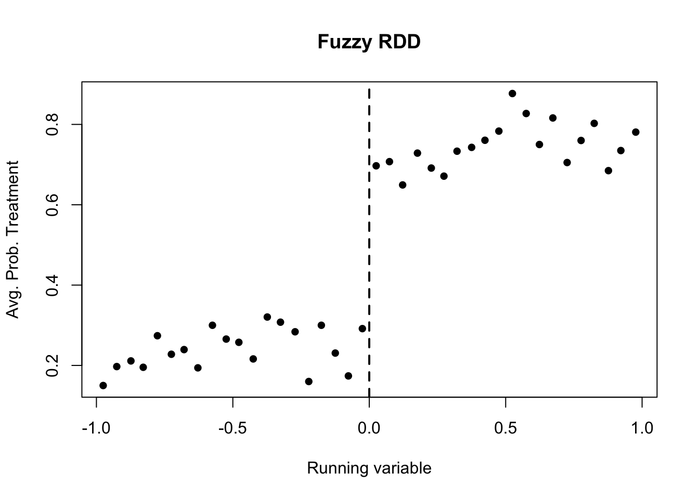{width=70%}

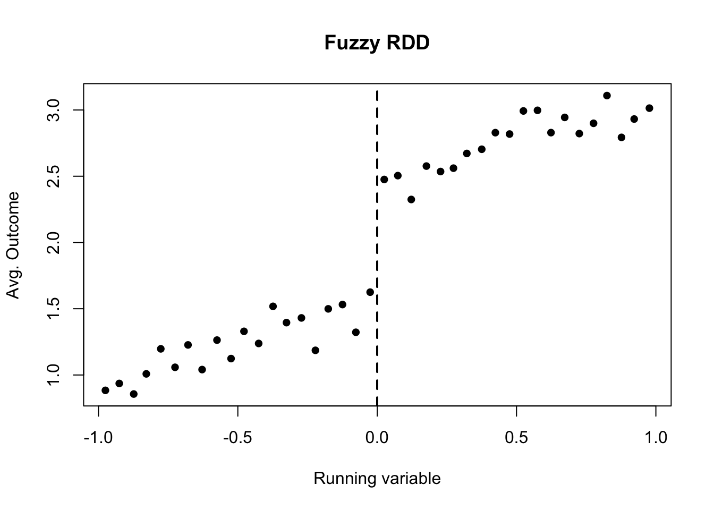{width=70%}

### Q95 資料R: 第1段階ジャンプ

図R1のカットオフ直前と直後を比べた処置確率のジャンプとして最も近いものはどれか。

A. $0.05$  
B. $0.45$  
C. $1.50$  
D. $-0.45$

### Q96 資料R: アウトカムのジャンプ

図R2のカットオフ直前と直後を比べたアウトカムのジャンプとして最も近いものはどれか。

A. $0.05$  
B. $0.30$  
C. $0.90$  
D. $-0.90$

### Q97 Fuzzy RDD の Wald 比

Q95とQ96の近似値を使うと、fuzzy RDD の Wald 比に最も近いものはどれか。

A. $0.45/0.90=0.5$  
B. $0.90/0.45=2.0$  
C. $0.90+0.45=1.35$  
D. $0.90-0.45=0.45$

### Q98 RDD の診断表

ある RDD で、次の診断結果がある。

$$
\begin{array}{lcc}
\hline
検査&推定ジャンプ&p値\\
\hline
ランニング変数の密度&0.30&0.02\\
事前共変量W&0.01&0.65\\
\hline
\end{array}
$$

最も自然な読み方はどれか。

A. 密度に不連続がありそうなので、カットオフ付近での操作可能性を疑う  
B. 事前共変量Wの p値が大きいので、密度の問題も自動的に消える  
C. RDD では密度も共変量も確認する必要がない  
D. p値が小さいほど、必ず因果効果が大きい

### Q99 Bandwidth のトレードオフ

RDD で bandwidth を小さくすることの典型的な利点と欠点の組み合わせとして正しいものはどれか。

A. より遠い観測を多く使えるが、局所比較ではなくなる  
B. カットオフ近傍に絞れるが、使うデータが減り標準誤差が大きくなりやすい  
C. 標準誤差は必ずゼロになるが、係数は推定できない  
D. bandwidth は sharp RDD では使うが fuzzy RDD では使わない

### Q100 RDD の効果の範囲

70歳で医療費自己負担率が下がる制度を使った RDD で、受診行動への効果を推定した。推定された効果の解釈として正しいものはどれか。

A. すべての年齢の人に対する平均処置効果である  
B. 20歳の人に対する効果も同じ大きさだと直接わかる  
C. カットオフ近傍、つまり70歳付近の人々に対する局所的な効果として読む  
D. カットオフから遠い人だけを使った平均差である
