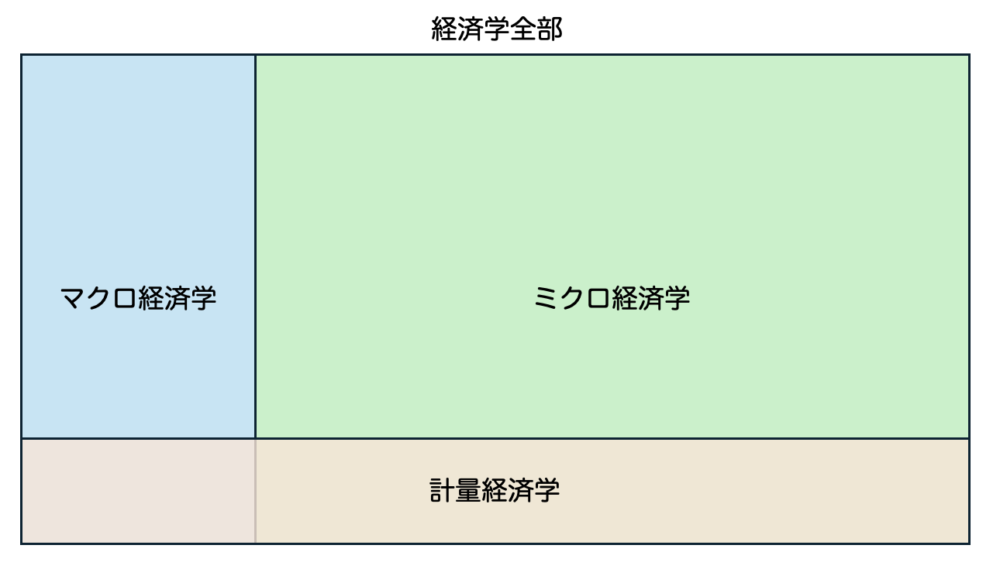

::: {.callout-important title="この講義で押さえたいこと"}
- **実験できるなら、まず実験を考える。**
- **実験できない世界では、単純な比較だけでは人を納得させにくい。**
- **計量経済学は、そういう状況で相手を納得させるための分析の作法として登場する。**
:::

<div class="lead">
この初回では、計量経済学をいきなり厳密に定義するのではなく、
「なぜこんな学問が必要になるのか」を、実験・エビデンス・ミクロ実証の流れの中でつかむ。
</div>

# 計量経済学って何？

この授業は計量経済学の入門である。とはいえ、最初から厳密な定義に入るよりも、まずは素朴な疑問から始めた方がわかりやすい。

## 最初に出てくる疑問

- 計量経済学の超ざっくりした理解：データを分析して何かを見つけるやつ
- でも、ここで素朴な疑問が出てくる
  - データを使うとは？
  - それって統計学じゃないの？
  - どこが経済学なの？

::: {.callout-note title="この節のゴール"}
初回では、この3つの疑問に完全に答え切るというより、**この授業で何を学ぶのかの地図を作る**ことを目標にする。
:::

# 納得するにはエビデンスが必要

エビデンス（証拠）は、物事を納得して進めるうえで重要である。

## 例1：事件

- 直接証拠：殺人の場面が監視カメラに写っていた
- 状況証拠：凶器に指紋、殺害動機につながる事情
- 供述証拠：目撃者の証言

こうしたエビデンスの積み重ねによって、検事、弁護人、裁判官、裁判員は納得できる結論に近づこうとする。

## 例2：医療

- Evidence-based medicine：エビデンスに基づく医療
- 発想はシンプルで、**「効果があるというエビデンス」に基づいて医療行為を選ぼう**というもの

高い医療費を払うためには、「本当に効果がある」と納得できる必要がある。すると自然に、次の問いが出てくる。

- 「効果があるというエビデンス」って何なのか？

::: {.callout-tip title="ここでのポイント"}
「エビデンスが大事」というのは多くの人が同意する。問題は、**どんなエビデンスなら相手が納得するのか**である。
:::

# できるなら実験をしよう

::: {.callout-important title="統計学の超重要メッセージ"}
**実験できるなら、まず実験を考える。**
:::

## たとえば治験

血圧を下げる薬の治験を考える。

- この授業の受講者をランダムに半分に分ける
- 半分には既存薬、もう半分には新薬を与える
- 既存薬グループよりも、新薬グループの方が血圧を大きく低下させていたら、効果があると言えそうに見える

## ここで統計学が考えること

典型的な問題意識は次のようなものになる。

- どのくらい差があれば「効果がある」と言い切れるか
- どのくらいの人数を集めれば「効果がある」薬をちゃんと見つけられるか

データの見方も比較的シンプルである。

- グループ間比較
- グループ間の実験前後の値の比較

## なぜ実験は強いのか

以上で見たようなエビデンスは納得度が高い。言い換えると、**反論するのが難しい**。

- 適切に管理された実験で
- 十分なサンプル数を集めて
- 比較を行い
- 新薬の効果が統計的に検出された

この条件がそろっていたら、その新薬に対して「いや、実は効果がないはずだ」と言い続けるのは難しい。

だから、何かを反論されにくい形で主張したいなら、**十分なサンプルを集めて適切な実験をする**のが王道である。

めでたしめでたし……と言いたいところだが、問題はここからである。

::: {.callout-warning title="ただし"}
実験が強いのは、比較の相手がランダムに決まっているからである。後で見るように、社会のデータではこの条件が崩れやすい。
:::

# エビデンス（データ分析）への需要拡大と懸念

エビデンスやデータ分析への期待は、医療だけでなく、政策やビジネスにも広がっている。

## 政策・ビジネスでの広がり

- Evidence-Based Policy Making (EBPM)：エビデンスに基づく政策策定
  - 発想：医療みたいな感じで、データを分析して、いい政策を選んで実行すれば優勝じゃん
- Quantitative marketing：数量マーケティング
  - 発想：医療みたいな感じで、データを分析して、最強の売り方を見つければいいじゃん

## 共通の懸念

ただし、実験室ではない場所から生まれたデータには共通する難しさがある。

- 実験室以外で、統制の取れた実験をするのはめちゃくちゃ難しい

# 対策1：社会を実験室にしてしまう

- 巨大テック（Google や Uber など）は、自分たちの施策を考えるときに、消費者をランダムに分けて、施策 A と施策 B のどちらがより効果的かを統計学で検証する
- 通称 A/B テスト
- これができるなら、まずこれをやるべき
- 障壁：倫理 / 実現可能性

::: {.callout-tip title="対策1の要点"}
**社会の中で実験を作れるなら、それが一番強い。** ただし、常に許されるわけではない。
:::

# 対策2：計量経済学

- ほとんどすべての政策は実験できない
- 多くのセンシティブな事案も実験の対象にはできず、A/B テストはできない
- そもそも施策を考える以前に、現状認識のためのデータ分析ですら、実験室ではない状況を加味しなくてはいけない
- このとき役に立つのが計量経済学

ただし、ここで言う「計量経済学」は、ひとまず次のように理解しておくとよい。

::: {.callout-important title="この講義でのひとまずの定義"}
計量経済学とは、**実験できない状況でも、この分析なら「ひとまず納得できる」とみなされている約束事の束**である。
:::

もちろん障壁もある。

- むずい
- 職人芸的な部分がある
- 特定集団の言語になっている側面がある

# 例1：大学院入学試験における女性差別問題

::: {.callout-note title="この例で見たいこと"}
実験室の外では、**データで事実を確認することすら簡単ではない**。そのことを実感するための有名な例が、UC Berkeley の大学院入試データである。
:::

- 時は1970年代のカリフォルニア
- アメリカでは公民権運動の余韻が残り、Title IX（教育の場での性差別を禁じる法律）がちょうど施行されたばかり
- 大学も「差別」に関してはピリピリしていた
- そんな中、UC Berkeley の大学院入試（1973年秋入学）の数字がまとまり、結果は以下の通りだった

## まずは全体集計を見る

| 性別   | 志願者数 | 合格者数（実現値） | 合格者数（望ましい数） | 実現値 - 望ましい数 |
|------|-----------:|--------------------:|--------------------:|--------------------:|
| Men  | 8,442      | 3,738               | 3,460.7             | +277.3              |
| Women| 4,321      | 1,494               | 1,771.3             | −277.3              |
| Total| 12,763     | 5,232               | 5,232.0             | 0.0                 |

<div class="small-muted">
出典：Table 1 in Bickel, Hammel, and O’Connell (1975)
</div>

ここで「合格者数（望ましい数）」は、男女で合格率に差がないときの合格者数である。つまり、

- 男：8442 × (5232 / 12763) = 3460.7
- 女：4321 × (5232 / 12763) = 1771.3

実現した合格者数は、この望ましい合格者数よりも男性が 277.3 人多い。

- 統計学でできること：この差が「有意」かを計算する

### データ（2×2 分割表：性別 × 合否）

- 男性：出願 $n_m=8442$、合格 $a_m=3738$、不合格 $d_m=4704$
- 女性：出願 $n_w=4321$、合格 $a_w=1494$、不合格 $d_w=2827$
- 合計：$N=n_m+n_w=12763$、合格 $A=a_m+a_w=5232$、不合格 $D=d_m+d_w=7531$

### 検定したいこと（帰無仮説と対立仮説）

- 帰無仮説：性別と合否は独立（＝合格確率が同じ）

$$
H_0:
 p_m=p_w
$$

- 対立仮説（両側）：

$$
H_1:
 p_m\neq p_w
$$

### 手法：2×2 表の独立性のカイ二乗検定（Pearson $\chi^2$）

まず、$H_0$ の下での **期待度数**（expected counts）を計算する。

行合計 × 列合計 ÷ 総数、という形で

$$
E(\text{men, admit})=\frac{n_m\cdot A}{N},\quad E(\text{women, admit})=\frac{n_w\cdot A}{N}
$$

$$
E(\text{men, deny})=\frac{n_m\cdot D}{N},\quad E(\text{women, deny})=\frac{n_w\cdot D}{N}
$$

この例の期待度数は次の通り。

- $E_{m,\text{adm}}=\frac{8442\cdot 5232}{12763}\approx 3460.671$
- $E_{w,\text{adm}}=\frac{4321\cdot 5232}{12763}\approx 1771.329$
- $E_{m,\text{den}}=8442-3460.671\approx 4981.329$
- $E_{w,\text{den}}=4321-1771.329\approx 2549.671$

検定統計量（Pearson）は

$$
\chi^2=
\sum_{i\in\{m,w\}}\sum_{j\in\{\text{adm},\text{den}\}}\frac{(O_{ij}-E_{ij})^2}{E_{ij}}
$$

この例では

$$
\chi^2 \approx 111.250,\quad \text{df}=1
$$

なので、p 値は極小（両側で $\approx 5.2\times 10^{-26}$ 程度）である。

### ここでの解釈

- $H_0$（性別と合否が独立）は強く棄却される
- したがって、ここだけ見ると「男性が有意に合格しやすい。女性が差別的な扱いを受けている」と言いたくなる

::: {.callout-warning title="ここで飛びつきたくなる結論"}
全体集計だけを見ると、かなり強い確率で「女性差別だ」と言いたくなる。だが、この例の面白さは**そこでは終わらない**。
:::

当時バークレーの統計学者だったビッケルはここまでの話を学長に相談され、詳細に調査してくれと依頼された。彼は天才なので、これが **シンプソンのパラドックス** の一例であると即座に見抜き、以下のようなことが起こりうることを指摘した。

## しかし学部ごとに見ると景色が変わる

### Department A

| Sex | Admitted | Denied | Total | Admit rate |
|---|---:|---:|---:|---:|
| Men | 512 | 313 | 825 | 62.1% |
| Women | 89 | 19 | 108 | 82.4% |

（A では **女性 82.4% > 男性 62.1%**）

### Department F

| Sex | Admitted | Denied | Total | Admit rate |
|---|---:|---:|---:|---:|
| Men | 22 | 351 | 373 | 5.9% |
| Women | 24 | 317 | 341 | 7.0% |

（F でも **女性 7.0% > 男性 5.9%**）

#### A と F を合算（全体集計）

| Sex | Admitted | Denied | Total | Admit rate |
|---|---:|---:|---:|---:|
| Men | 534 | 664 | 1,198 | 44.6% |
| Women | 113 | 336 | 449 | 25.2% |

（合算すると **男性 44.6% > 女性 25.2%** に“逆転”）

### つまり何が起きていたのか

- 男性は「通りやすい A」に相対的に多く出願していた
- 女性は「通りにくい F」に相対的に多く出願していた
- その結果、**学部ごとの比較（条件付き）**と **合算（周辺化）**で結論が反転した

男性と女性という「割り当て」がランダムではないから、こういうことが起こる。

ビッケルは天才だったから、どういうことが起きうるかを理解して詳細なデータを見比べ、結論を下すことができた。
しかし普通の人である我々は、学部ごとの合否表を見せられたら「女性が有利じゃないか」と思い、合算した表を見せられたら「男性が有利じゃないか」と思い、結局どっちなの？となってしまう。

::: {.callout-important title="この例の教訓"}
社会から生み出されたデータでは、**単なる比較だけで結論が明らかになることはほぼない**。どの比較をしているかによって、結論は簡単にひっくり返る。だから、ほとんどの統計的分析には文句をつける余地がある。
:::

# 経済学の中の計量経済学

- 計量経済学は、経済学が提示した仮説をデータで検証するという営みとして方法論を確立してきた。だから経済学の一分野である
- しかし、経済理論が生み出す仮説のテストという役割は、現代ではほぼ失われている
  - 計量経済学の標準的なテキストでは大体このような説明がなされるが、現代的な見方ではないと思う
- そこで以下では、経済学諸分野とからめて計量経済学の現代的な立場を整理する

## 経済学について

- そもそも経済学って何？
- 経済学全体の略式図は以下の通り
  - 大きく分けてマクロとミクロ、およびそれらにデータ分析のツールを提供する計量経済学
  - マクロ、ミクロともに **理論** と、データ分析をする **実証** とに分かれる
  - それぞれを支える計量経済学のツールは若干異なる。マクロは時系列、ミクロはそれ以外という感じ
  - この授業でやるのはミクロの方の基礎となる計量経済学

::: {.callout-tip title="この授業の立ち位置"}
この講義で中心になるのは、**ミクロ実証の基礎としての計量経済学**である。
:::

<div id="img-seq-1" style="text-align:center; margin: 1em 0;">
  
  <p id="img-seq-1-caption" style="margin-top: .5em; color: #666;">
    1 / 3（画像をクリックで次へ）
  </p>
</div>

<script>
(function() {
  const images = ["img1.png", "img2.png", "img3.png"];
  let idx = 0;

  const img = document.getElementById("img-seq-1-view");
  const cap = document.getElementById("img-seq-1-caption");

  function update() {
    img.src = images[idx];
    cap.textContent = `${idx + 1} / ${images.length}（画像をクリックで次へ）`;
  }

  img.addEventListener("click", function() {
    idx = (idx + 1) % images.length;
    update();
  });
})();
</script>

- 現代的な経済学 = **ミクロ実証経済学**
  - というよりも、そうなるように経済学はその内容を変化させてきた
  - 「それも経済学ですね」といった具合に、別の学問分野に侵攻してきた
- **ミクロ経済学**はこの30年ほどの間にデータとの融和性を高めてきた
- データの取得が容易になったことを背景に、実証分析が花開き、今では極めて広範な対象の分析が **ミクロ実証** と一括りに呼ばれ、大体同じ方法論で分析できるようになっている
- そして、データを用いて統計的な分析をするという部分と、経済学的な発想の部分とをいい感じに組み合わせる役目を果たす理論を **計量経済学** と大きく括って呼んでいる
- 現代的には、計量経済学やミクロ理論を単体で学んでもいいことは少ない。**ミクロ実証というデータ分析のお作法を中心に、計量とミクロ理論を絡めて学ぶべき**である

# ミクロ実証研究の具体例：Angrist and Krueger (1991)

ミクロ理論と計量経済学的なアイディアがうまく生かされているミクロ実証の例として、
Joshua Angrist と、もし存命であれば David Card と同時に受賞していただろう Alan Krueger による超有名論文
**Does Compulsory School Attendance Affect Schooling and Earnings?, QJE, 1991**
について解説する。

::: {.callout-important title="この論文を通じて見る流れ"}
**問い → 素朴な相関 → 経済学的なツッコミ → ランダムな変動を探す → Wald 推定量**

この流れを見ると、ミクロ理論と計量経済学がどうつながるかがかなりはっきり見える。
:::

## Step 1. 問い（ミクロ実証としての価値）

問いはシンプルである。

- **教育年数が増えると賃金は上がるのか？**
- 上がるとすれば、どれくらいか？（教育の収益率）

この問いは、労働経済学・教育政策・人的資本投資の中心的なテーマであり、実証的に答える価値が高い。  
また、政策的にも「教育への投資はどの程度リターンがあるのか」というかたちで重要な含意をもつ。

## Step 2. 素朴な分析（「一見これでよさそう」な推定）

この問いに対して、最初に思いつくのは次のような分析である。

- たくさんの人を集めて、それぞれに現在の賃金と教育年数を答えてもらう
- この2つの変数について散布図を作る
  - 縦軸：賃金（あるいは対数賃金）
  - 横軸：教育年数
- 右肩上がりになっていれば、「教育年数が長い人ほど賃金が高い」と言えそうに見える
- したがって、教育年数が賃金を押し上げている、という結論を言いたくなる

この発想は自然であり、実際、実証研究の出発点としてとても重要である。  
少なくとも、データにどのような相関があるのかを確認するという意味では有益である。

下にそれっぽい散布図を出しておく。縦軸が賃金、単位は万円。横軸が教育年数、単位は年。

```{r}
#| echo: false
#| fig-cap: "教育年数と対数賃金の素朴な散布図"
# =========================================
# Demo scatter: wage vs schooling (toy data)
# =========================================
set.seed(123)

N <- 600

# 教育年数（だいたい 9〜20年）
schooling <- pmin(pmax(round(rnorm(N, mean = 13.5, sd = 2.2)), 9), 20)

# 観測されない能力（本当は見えない要因）
ability <- rnorm(N, mean = 0, sd = 1)

# 対数賃金の生成（教育 + 能力 + ノイズ）
# ※ ability も賃金に効くようにしておく（後で「バイアス」の話につなげやすい）
log_wage <- 1.6 + 0.1 * schooling + 0.20 * ability + rnorm(N, sd = 0.22)

# レベル賃金（適当な単位）
wage <- exp(log_wage)

df_demo <- data.frame(
  schooling = schooling,
  wage = wage,
  log_wage = log_wage
)

# -----------------------------------------
# Plot : log wage vs schooling
# -----------------------------------------
plot(
  df_demo$schooling, df_demo$wage,
  pch = 16, cex = 0.7,
  xlab = "Years of Schooling",
  ylab = "Wage",
  main = "Naive Scatter Plot: Wage and Schooling"
)

abline(lm(wage ~ schooling, data = df_demo), lwd = 2)

fit_ols <- lm(wage ~ schooling, data = df_demo)

beta_hat <- coef(fit_ols)[["schooling"]]
```

この散布図ではほんのり右上がりの方向があるので、教育年数が増えると賃金は増えるっぽい。

より正確にこの「上がってる度合い」を知りたいなら、**回帰分析**をやる。$i$ さんについて

- **被説明変数**：賃金を $w_i$ と書く
- **説明変数**：教育年数を $s_i$ と書く

回帰分析とは、この二つの変数の関係性を一番よく表す直線を見つける計算のこと。すなわち、次のような関係を満たす一番「いい」$\alpha$ と $\beta$ を見つける計算である。詳しくは今後の授業で扱うが、ここではシンプルに、一番当てはまりのいい傾きを見つけていると思えばよい。

$$
w_i = \alpha + \beta \, s_i
$$

つまり $\beta$ を「教育1年の収益率」と読みたくなる。

実際、先ほどのデータでこの係数を回帰分析で求めてみると、$\hat{\beta} = `r round(beta_hat, 3)`$ だった。つまり教育年数が1年伸びると、$`r round(beta_hat, 3)`$ 万円だけ賃金が伸びる。

たとえば君が官僚で、上司から教育の経済効果を推定しろと言われたとする。幸運にも上記のようなデータが手元にあった君は、上記のような分析をして、結果を国の審議会に報告することができた。

しかし、その審議会には不幸なことに経済学者が出席しており、しかも彼は貴重な研究時間を審議会に割くことになりイライラしていた。

このとき、君の分析は以下のようなツッコミを受けることになり、上司のメンツを潰した君のキャリアは断たれることになる。

::: {.callout-warning title="一見もっともらしいが危ない"}
散布図や OLS が悪いわけではない。問題は、**それだけで「因果効果」まで言いたくなる**ことである。
:::

## Step 3. ミクロ理論のツッコミ（素朴な比較の落とし穴）

ここでミクロ理論（人的資本理論 + 教育選択の考え方）が重要になる。  
ミクロ理論の役割は、この文脈では「教育は大事だ」と言うことではなく、むしろ次の懸念を与えることにある。

- **教育年数は人々の選択の結果である**
- したがって、**教育年数は内生的かもしれない**

「内生的」という言葉は専門用語であり、今後の授業でその意味内容を詳しく解説するが、結局のところ以下のことを言っている。

- **教育年数はランダム割り当てではない。つまり教育年数を実験でいじることはできない。**

具体的には、素朴な回帰には次のような混入が起こりうる。

### 3.1 能力による自己選択

- 能力が高い人ほど教育を長く受けるかもしれない
- 能力が高い人は教育とは別に賃金も高いかもしれない

この場合、教育年数の係数には「教育の効果」だけでなく

- 能力の差

による影響が混ざる可能性がある。

### 3.2 家庭背景・環境

- 親の学歴
- 家計の豊かさ
- 地域環境

などは、教育年数と将来賃金の両方に影響しうる。

これらが十分に観測できて分析で取り除かれていないと、これらの影響も先ほどの係数には混じっていることになる。

### 3.3 選好や将来計画

- 早く働きたい人
- 学校教育を好む人
- 特定の職業進路を目指す人

こうした選好も教育選択に影響し、将来の賃金にも関係しうる。

結果として、素朴な OLS の係数は、教育の効果そのものではなく、**選択の影響が混ざったもの**になりうる。

## Step 4. ミクロ理論は何をしてくれたのか？

ここで強調したいのは、ミクロ理論はこの論文において、単なる背景説明ではないということである。

ミクロ理論がしてくれたことは、主に次の3つに整理できる。

### 4.1 素朴な推定への「経済学的な反論」を与えた

素朴な散布図は「教育年数が長い人ほど賃金が高い」という相関を捉えるが、ミクロ理論はそこに対して、

- それは教育の効果ではなく、能力や家庭背景の差ではないか？
- 教育は自己選択の結果なので、説明変数が内生的ではないか？

という反論を与える。

この反論があるからこそ、後述する計量経済学的な工夫が必要になる。

### 4.2 バイアスの“向き”や“中身”を考える視点を与えた

ミクロ理論は「バイアスがあるかもしれない」と言うだけではなく、どのような要因が混ざるのか（能力、家庭背景、選好など）を具体的に言語化してくれる。

その結果、実証分析は単なる統計処理ではなく、

- 何が観測できていて
- 何が観測できておらず
- その未観測要因がどこに入り込むか

を意識した設計になる。

### 4.3 計量経済学の課題を定義した

この論文の文脈では、ミクロ理論の重要な役割は「答えを出す」ことよりも、むしろ

- **何をそのまま信じてはいけないか**
- **何を識別しなければならないか**

をはっきりさせることにある。

ミクロ理論はここで、計量経済学に対して以下の課題を出していると言える。

- 教育の因果効果を知りたい
- しかし教育年数は **内生的（ランダムじゃない変動）**
- では、教育年数の **外生的な変動（ランダムな変動）** をどう見つけるか？

この問いが次のステップにつながる。

::: {.callout-note title="ミクロ理論の仕事"}
この文脈でのミクロ理論は、答えを直接くれるというより、**何が怪しいのかを言語化し、計量経済学が解くべき問題を定義する**役割を果たしている。
:::

## ここまでのまとめ（Step 1–4）

Angrist & Krueger (1991) をこの講義の観点から見ると、流れは次のように整理できる。

- **ミクロ実証の問い**：教育は賃金をどれだけ上げるのか？
- **素朴な推定**：賃金を教育年数に回帰する
- **ミクロ理論のツッコミ**：教育は自己選択の結果であり、OLS はバイアスを含みうる
- **ミクロ理論の役割**：バイアスの可能性を言語化し、計量経済学が解くべき問題を定義する

この意味で、ミクロ理論は **計量経済学の設計を駆動する出発点** として機能している。

## Step 5. やることはランダムな変動を探すこと

要するに先ほどのツッコミは「教育年数はランダムじゃない」という点である。したがって、分析者たる君のやることは、**ランダムな教育年数の変動**を見つけることである。

そんなものがあるのか？ そもそも「ランダムな教育年数の変動」とは何なのか？

たとえば全く同じ池上が二人いたとする。この二人の池上は高校卒業まで全く同じ人生を歩んできたとする。二人とも同じ大学に行く予定だった。

池上 A が順当に大学に進学する一方、池上 B はたまたま道で再会した悪い中学の先輩の口車に乗せられてしまい、大学なんてやってられないと突然就職してしまった。

この二人の池上の30歳時点での賃金を計って比べれば、それはかなり正確に大学教育4年分の経済効果であろう。なぜなら、この二人の池上の教育年数は「ランダムに変動」しているからである。能力も同じ、今までたどってきた人生も同じ、ただ教育年数だけが違う二人の人間。これがいれば、その二人の比較で教育の経済効果を知ることができる。

だが問題は、**他の要素はまったく同じで、教育年数だけ違う二人**なんてこの世にはいないことである。

ではどうするのか。

Angrist and Krueger (1991) では、そのランダムな教育年数の変動として **誕生月** が使えることを発見し、教育の経済効果を推定したことでノーベル賞級の評価を受けた。

以下ではまず、**なぜ誕生月がランダムな教育年数の変化を生むのか** を解説し、さらに **その変動を利用してどのように教育の経済効果を見つけるのか** を解説する。

::: {.callout-tip title="ここでの発想"}
計量経済学が探しているのは、「教育年数そのもの」ではなく、**教育年数のうち本人の選択から切り離しやすい変動**である。
:::

## Step 6. なぜ誕生月はランダムな教育年数の変動を生むのか

Angrist and Krueger (1991) のアイデアの核心は、**誕生月そのもの** に注目することではなく、**誕生月 × 学校制度（入学ルール・義務教育法）** の組み合わせに注目する点にある。

### 6.1 入学時点での年齢のズレが生じる

多くの地域では、子どもが小学校に入学できるかどうかは、ある基準日（cutoff date）までに一定年齢に達しているかで決まる。  
このため、同じ学年に入る子どもであっても、誕生月によって入学時の年齢に差が生じる。

- 年の前半に生まれた子どもは、同じ学年の中で相対的に年齢が高い
- 年の後半に生まれた子どもは、同じ学年の中で相対的に年齢が低い

この「学年内での年齢差」自体は小さいが、後で義務教育の離学可能年齢と組み合わさると、教育年数に差を生む可能性がある。

### 6.2 義務教育法と組み合わさると、教育年数に差が出る

ポイントは、学校をやめてもよい年齢（school-leaving age）が、学年修了ベースではなく **年齢ベース** で決まっていることである。

たとえば、ある州で「16歳になれば退学できる」とする。  
このとき、同じ学年にいる生徒でも、誕生月が早い人の方が先に16歳に達する。

すると、誕生月が早い生徒は

- 法的に退学できるタイミングが早く来る
- その結果、ある学年を終える前に退学しやすくなる

一方で、誕生月が遅い生徒は、同じ時点ではまだ退学可能年齢に達していないため、もう少し長く学校に残る可能性が高い。

このようにして、**誕生月の違いが、制度を通じて平均教育年数の違いに変換される**。

### 6.3 「誕生月が教育年数を動かす」のではなく、「制度が誕生月を通じて教育年数を動かす」

ここで強調したいのは、誕生月そのものに教育的な意味がある、という主張ではないことである。  
重要なのは、

- 誕生月は（少なくとも個人の教育選択に比べて）ランダムに与えられる要因であり、
- それが制度ルールと結びつくことで、教育年数に小さなズレを生む

という構造である。

### 6.4 なぜ「ランダムな変動」と言ってよいのか

もちろん、現実には誕生月が完全にランダムとは言い切れない場合もある。  
たとえば出生の季節性や、家族背景と出生時期の相関がまったくないと断言するには慎重さが必要である。

それでもこの文脈で「ランダムな変動」と言うのは、次の意味である。

- 個人がどれだけ進学するかという選択に比べると、誕生月ははるかに外生的（ランダム）である
- 少なくとも、能力や進学意欲を直接反映して教育年数が決まるという経路からは切り離しやすい
- そのうえで、制度を通じて教育年数に影響することが確認できる

つまりここで使っている「ランダム」とは、**教育年数の自己選択に比べて、より外生的で、識別に使える変動**という意味である。

::: {.callout-note title="ここでの『ランダム』の意味"}
完全な無作為という意味ではなく、**本人の進学選択よりは外から与えられていて、識別に使いやすい**という意味で「ランダム」と呼んでいる。
:::

## Step 7. 教育の経済効果を見つける：計量経済学の出番

Step 6 では、誕生月（正確には誕生月 × 制度）が教育年数に小さなズレを生むことを見た。  
ここから先の問いは次である。

- **その教育年数のズレは、賃金にもズレを生んでいるのか？**
- もし生んでいるなら、その比率から教育の効果を取り出せないか？

このときに登場するのが、計量経済学のアイディアである **Wald 推定量** である。

### 7.1 発想：誕生月で生じた「賃金の差」を「教育年数の差」で割る

誕生月の違いを使って、2つのグループを比べることを考える。  
Angrist and Krueger (1991) では、直感をはっきり示すために、たとえば

- 第1四半期生まれ
- それ以外（第2〜第4四半期生まれ）

の比較を用いている。

このとき、もし第1四半期生まれの人々が平均的に教育年数も賃金も少し低いなら、その「賃金差 ÷ 教育年数差」は、教育1年あたりの賃金効果を表していそうに見える。

この考え方を式で書くと、Wald 推定量は

$$
\hat{\beta}_{Wald}
=
\frac{
E[w \mid Z=1]-E[w \mid Z=0]
}{
E[s \mid Z=1]-E[s \mid Z=0]
}
$$

となる。

ここで

- $s$ は教育年数
- $w$ は賃金
- $Z\in\{0,1\}$ は第1四半期生まれダミー。1 なら第1四半期生まれ、0 ならそれ以外生まれ

である。

- $E[X \mid Z=1]$ は $X$ の $Z=1$ での **条件付き期待値**
  - つまり第1四半期生まれの人についてのみ、変数 $X$ の平均をとっている
- $E[X \mid Z=0]$ は $X$ の $Z=0$ での **条件付き期待値**
  - つまり第1四半期生まれではない人についてのみ、変数 $X$ の平均をとっている

Wald 推定量は、

- 分子：誕生月によって生じた賃金の差
- 分母：誕生月によって生じた教育年数の差

の比として、教育の経済効果を推定する。

### 7.2 なぜこれが OLS よりよいのか

素朴な OLS では、教育年数は本人の選択の結果なので、

- 能力
- 家庭背景
- 選好

といった要因が混ざりやすかった（Step 3, 4）。

一方、Wald 推定量では、教育年数のうちでも **誕生月 × 制度によって動かされた部分** だけを使う。  
したがって、少なくとも狙いとしては、

- 「教育をたくさん受けたい人がそうしている」という自己選択の部分ではなく、
- 「制度のために少し長く / 短くなった教育年数」の部分

から賃金効果を見ようとしている。

この意味で、Wald 推定量は **ミクロ理論が指摘した内生性の問題に対する、計量経済学の応答** になっている。

### 7.3 Angrist & Krueger (1991) の Wald 推定量（Table III）

Angrist and Krueger (1991) は、Table III で Wald 推定量を明示的に計算している。  
そこでは、40–49歳男性のサンプルを中心に、出生四半期による

- 平均 log weekly wage の差
- 平均教育年数の差

を計算し、その比を教育収益率の推定値として示している。

たとえば Table III の Panel A（1970 Census, 1920–1929年生まれ）では、第1四半期生まれとそれ以外の比較から Wald 推定量が計算されている。


この表には、Wald 推定量を作るのに必要なものが並んでいる。

- `ln (wkly. wage)` の行：平均対数週賃金
- `Education` の行：平均教育年数
- 右端の列：第1四半期生まれ − それ以外の差（標準誤差つき）

ここで注目すると、

- 第1四半期生まれの方が平均対数賃金は低い（差は負）
- 第1四半期生まれの方が平均教育年数も低い（差は負）

となっている。

つまり、誕生四半期の違いによって、教育年数と賃金の両方に小さな差が生じている。

### Wald 推定量の直感

Wald 推定量は、誕生四半期による賃金差を、誕生四半期による教育年数差で割ったものである。

$$
\hat\beta_{Wald}
=
\frac{
\Delta \log(\text{wage})
}{
\Delta \text{education}
}
$$

この表の数値を使うと、

- 賃金差：$-0.00898$
- 教育年数差：$-0.1256$

なので、比を取るとおよそ

$$
\frac{-0.00898}{-0.1256} \approx 0.0715
$$

となる。これは表の `Wald est. of return to education` の値（0.0715）と一致する。

### 解釈

この $0.0715$ は、対数賃金を使っているので、ざっくり言えば

- **教育年数が1年増えると、週賃金が約7%高くなる**

という教育収益率の推定値として読める（対数にすると変化率を読みやすい。講義でも後々出てくるので、今はそういうものだと思っておいてよい）。

重要なのは、ここで使っている教育年数の変動が、本人の自己選択そのものではなく、**誕生四半期 × 制度によって生じた部分**だという点である。

つまりこの推定は、素朴な OLS のように「教育年数が長い人は能力も高いかもしれない」という混入をできるだけ避けて、制度により動かされた教育年数の変動から賃金効果を読み取ろうとしている。

### 回帰分析との比較

表の最後の行には `OLS return to education` も載っている。これは先ほど見た回帰分析での推定結果である。ここでは推定値は 0.0801 で、Wald 推定値 0.0715 と大きくは離れていない。

つまり推定結果自体は、最初に見た散布図のやつとそこまで変化はなかった。

しかし、この追加の推定を見せることで、君が分析結果を見せた経済学者は納得し、君は上司のメンツを潰さずにすみ、出世できる。ここが重要である。

::: {.callout-important title="AK 論文から学ぶいちばん大事な点"}
大事なのは、推定値が少し変わったことそれ自体ではない。**「なぜその数字を信じてよいのか」を説明できるようになったこと**である。
:::

---

上記の例を受けて、各分野との適切な向き合い方を以下にまとめる。

# ミクロ実証

::: {.callout-important title="この講義での立場"}
**ミクロ実証は議論の方法の一つであり、真実の探究そのものではない。**
:::

- ミクロ実証、そしてそれに限らず多くの経済学的なデータ分析は、データを用いて世界の真実に迫るための一連の手法として教えられる
- しかし、この講義では、経済学的なデータ分析は世界の真実に迫るためのものでは **まったくない** という立場をとる
- あくまでも対話、議論、つまり相手のいる場において、相手を打ち負かす / 相手に打ち負かされないための技術として経済学的なデータ分析を捉え直す
  - たとえば、先ほどの教育効果の分析結果を見せるときに、審議会に経済学者がいなければ、君はこんなしちめんどくさいことをする必要はないわけである

## この立場を取る教育上のメリット

- 計量経済学の学習内容に必然を見出すことができるようになる
  - なぜ推定量の統計的性質についていちいち調べなくてはいけないのか
  - その中でも、いくつかの性質が特にありがたがられているのはなぜか
  - 様々な統計的バイアスをケアしなくてはいけないのはなぜか
- このように計量経済学の授業では、習うまで明確に意識することのなかった問題意識が唐突に出てきて、学生を大いに混乱させる
- これらを学ぶ理由は、**これらの問題をケアしないと納得しない相手に向けて分析結果を発表するから** にすぎない
  - 決して「これらの問題をケアしないと世界の真実にたどり着かないから」ではない
  - 経済学に限らず、すべての社会科学（そしておそらくは多くの自然科学でも）は、世界の真実にたどり着くための技法ではない
  - 対面する相手に議論で勝ち、納得させ、自分の望む方向に進ませるための技法である
  - そのためには、「相手が何をしたら納得するのか」を知らなくてはいけない
  - そして、現代のグローバルなコミュニティにおいて受け入れられているミクロ実証の手法は、この「ここまでやったら納得します」という基準を提供している
  - このコミュニティで議論ができること、そしてその議論で負けないことこそ、計量経済学とそれに基づくミクロ実証を学ぶ意義であり、すべての学習内容はそのための論法にすぎない

# ミクロ経済学

::: {.callout-tip title="この講義での立場"}
**ミクロ経済学は議論における攻め技であり、意思決定の科学ではない。**
:::

- データを用いた議論で納得させる技術の双対系として、相手の繰り出してくるデータを用いた議論に納得しないための技術が存在する
- 議論を攻めと守りで区別するならば、計量経済学は守りの技術を提供する。攻めの技術を提供するのがミクロ経済学である
- 少々カッコよすぎるが、要するに、ミクロ経済学は「頭のいい現場の人が言いそうなこと」を様々な局面で体系的に生み出すためのツールである
  - 様々な局面で、というのは重要なポイントで、自分にとってまったく未知の分野の話でも、その分野の人々が直面している環境や制度の話を聞くと、経済学の知識を使って大体こういう問題がありそうだなと考えることができるようになる
  - もしその分野でデータ分析がされていて、あなたがコンサルとしてその分析にチャチャを入れる立場だったら、こういうバイアスが乗った推定をしているからこの結論は信頼できないと言ったり、逆にあなたがデータを分析して行政や株主に「問題がない」と納得させる立場なら、最も頭のいい人でもこの辺のことまでしか思いつかないだろう、というところまでを想定し、それに対処した分析を披露することもできる
- よくある言い方は「ミクロ経済学は意思決定の科学」みたいなやつだが、全く科学ではないので、研究費とかを取るための方便だと理解するべきである

# 計量経済学

::: {.callout-note title="この講義での立場"}
**計量経済学は議論における守り技であり、理論の検証そのものではない。**
:::

- よく耳にするが、あまり納得できない計量経済学の説明：「計量経済学は経済理論をチェックするものである」
  - 計量経済学の最も典型的な説明である
  - もちろん今でも理論のチェックとしてのデータ分析という使われ方はされている。これが「本来」の使われ方であろう。古典的な経済学のデータ分析の論文を見ると、確かにこのような方向性であったように思われる
  - しかし、現代的にメジャーな計量経済学の使われ方は、この本来のあり方とは大きく乖離しているように感じる。国際機関や営利企業でのデータ分析が非常に多くなってきた現代、本来の理論の検証という純アカデミックな問題意識での分析が少なくなったのは言わずもがなである
- さらに、アカデミックな論文でもこのような問題意識の分析は現代では少なくなっていると考える。これは、「構造推定」というアプローチの隆盛を見れば明らかである
  - 構造推定のアプローチは「理論の検証」の対極にある分析手法である。攻めの技術である経済学の理論が出しそうな論点を事前にすべて含んだモデルを組み立て、そのモデルをデータを用いて推定し、さらにその結果を用いて様々なシミュレーションを行うことで、攻めづらい議論を展開する技術である
  - ここにおいて理論は検証の対象ではない。結果的に推定結果から特定の理論がサポートされたりされなかったりするが、それ自体が分析の関心であることはほぼない。理論は検証ではなく、それを前提として利用し、さらなるクエッションに答えるための分析となっている

# まとめ

::: {.callout-important title="今日の結論"}
- データで何かを主張したい時、**実験できるなら実験をしろ**
- 実験できない時のデータ分析はめちゃくちゃ難しい
- 計量経済学を学ぶとは、そういうややこしいデータの分析を通じて、**相手を納得させるための数字付きの文章の書き方**を学ぶことである
:::

- なぜ難しいか：何を言えば誰が納得するのかよくわからないから
- その学習内容は、今現在、グローバルなコミュニティで「これなら納得できる」とされる分析のお作法である
- そのお作法は、経済学的な発想で繰り出される文句への対処としての働きが大きく、決して真理の追求のためのお作法ではない
- 要するに：**計量経済学を学ぶと、文句を言われにくい主張ができるようになる**

# 宿題

::: {.callout-tip title="次回までにやること"}
- [ ] **R** という統計ソフトと **Quarto** というソフトウェアが何なのかをざっくり Google で検索する
- [ ] ChatGPT に「**Quarto を動かすための環境構築をしたい**」とお願いして、その指導に従って Quarto を自分のパソコンで動かせるようにしておく
  - 来週以降は全員が Quarto を動かせる前提で話す
:::
