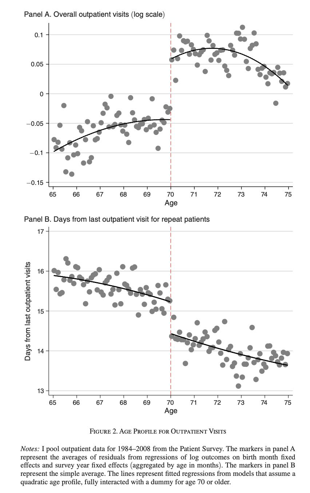
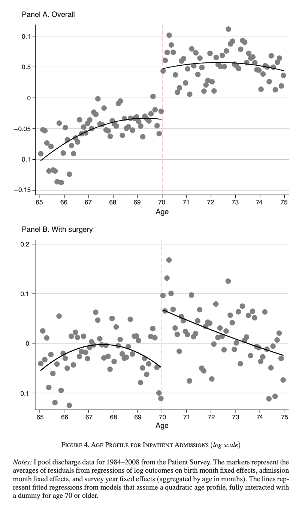
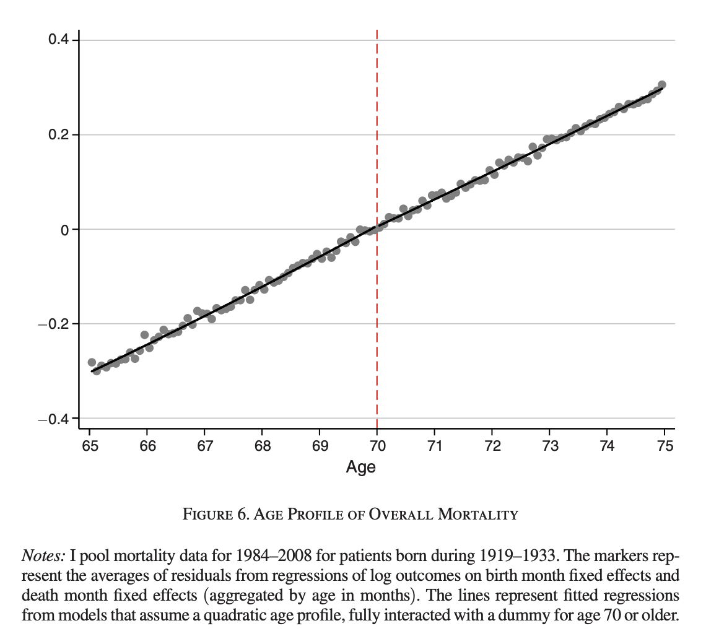

::: {.callout-important title="この講義で押さえたいこと"}
- **RDD** は、制度が作るカットオフの不連続を使って因果効果を識別する方法である。
- 識別の核心は、**カットオフ近傍では他の要因が滑らかに変化する** と考えられることである。
- **sharp RDD と fuzzy RDD** の違い、そして実装上の注意点を分けて理解することが大事である。
- RDD で推定される効果も基本的には **local** な効果であり、とくに fuzzy RDD は Lecture 10 の **LATE** として読める。
:::

<div class="lead">
    今回はまず、素朴な回帰では自己負担の因果効果が見えないことを確認し、その後で制度のカットオフを使う RDD の発想に入る。後半では sharp / fuzzy RDD の違い、Lecture 10 で導入した LATE との関係、実装上の注意点、そして実証研究での読み方を整理する。
</div>

::: {.callout-note title="この lecture の流れ"}
1. まず、素朴な相関ではなぜ因果効果が分からないのかを確認する。
2. 次に、sharp RDD と fuzzy RDD の識別の考え方をフォーマルに整理する。
3. 最後に、RDD における local の意味、実装上の注意点、Shigeoka (2014) を中心とした実証研究の読み方を確認する。
:::

# 導入：素朴な回帰ではなぜだめか

前回、操作変数法について学んだ。操作変数法は強力だが、いかんせん強い操作変数を見つけるのが難しいというのが欠点である。

逆に言えば、「強い IV」さえ見つけられれば大体の経済学者を黙らせる分析が可能になる。

今回紹介する**不連続回帰デザイン**、**Regression Discontinuity Design (RDD)**は、「強い IV」を見つけて利用する系統的な方法論として理解して良い。

RDD の発想をつかむために、まずは政策担当者の立場で考えてみよう。

高齢者の医療費自己負担をどのように設計すべきかを考えている官僚がいるとする。

自己負担を下げれば受診は増えるだろうが、それが本当に必要な医療へのアクセス改善につながるのか、それとも単に医療費を膨らませるだけなのかは重要な問題である。

制度設計のためには、まず「自己負担が下がると人々はどれだけ医療を利用するようになるのか」を知りたい。

これが厚生労働省の官僚たる君の今回の仕事である。

そこで最初にやりたくなるのは、**個人ごとの自己負担額**と**外来受診回数**を集めて、散布図を書いたり単純な回帰をしたりすることである。

やってみる。

```{r}
#| label: naive-rdd-motivation
#| echo: true
#| message: false
#| warning: false

set.seed(1234)

n <- 3000

# 観測されない健康状態（大きいほど健康が悪い）
health_bad <- rnorm(n)

# 真の自己負担額
copay <- 25 + 10 * health_bad + rnorm(n, sd = 8)

# 真の構造：自己負担が高いほど受診回数は減る
# ただし健康が悪い人ほど受診回数は多い
visits <- 8 - 0.15 * copay + 2.2 * health_bad + rnorm(n, sd = 1.8)

df_naive <- data.frame(
  copay = copay,
  visits = visits
)

plot(df_naive$copay, df_naive$visits,
     pch = 16, cex = 0.5,
     xlab = "Copayment",
     ylab = "Outpatient visits",
     main = "Naive Scatterplot of Copayment and Outpatient Visits")

abline(lm(visits ~ copay, data = df_naive), lwd = 2)
```

```{r}
#| label: naive-rdd-motivation-reg
#| echo: true

summary(lm(visits ~ copay, data = df_naive))
```


しかし、この素朴な方法はうまくいかない。

なぜなら、

- もともと病気が重い人ほど病院に多く通うし、
- 支払う医療費も多くなりやすいからである。

つまりデータの中で見えている相関は、「価格が高いと受診しない」という因果効果ではなく、「具合の悪い人ほどたくさん受診し、たくさん支払う」という健康状態の違いを反映しているかもしれない。

ということで、上記の散布図や回帰結果は、自己負担の因果効果をそのまま教えてはくれない。


問題を整理すると以下のような感じ。

数式で書けば、官僚が見たいのは本当は

$$
\text{visits}_i = \alpha + \beta\, \text{copay}_i + u_i
$$

における $\beta$ である。

ここで $\text{visits}_i$ は外来受診回数、$\text{copay}_i$ は自己負担額である。政策担当者が知りたいのは、自己負担が外生的に変化したときに受診回数がどう動くか、すなわち $\beta$ の因果的な意味である。

ところが実際には、観測されない健康状態 $h_i$ が存在して、

$$
\text{visits}_i = \alpha + \beta\, \text{copay}_i + \gamma h_i + \varepsilon_i
$$

のようになっていると考えるのが自然である。ここで、単純な回帰 $\text{visits}_i = \alpha + \beta\, \text{copay}_i + u_i$ の誤差項は、実際には $u_i=\gamma h_i+\varepsilon_i$ を含んでいる。
さらに、健康状態の悪い人ほど多く医療を利用するので、自己負担額とも相関しやすい。すると

$$
\operatorname{Cov}(\text{copay}_i,u_i) \neq 0
$$

となり、単純な散布図や OLS では $\beta$ をきれいに識別できない。


::: {.callout-note title="RDD の直感"}
RDD では、cutoff のすぐ左とすぐ右の人たちを比べる。したがって、まず treatment のジャンプと outcome のジャンプの両方を見る、という順番が大事である。
:::

## 制度を使う

この問題はただのエクササイズではなく、実際の制度設計でも重要な問題である。

Shigeoka (2014) はこの問題を正面から扱った論文であり、その識別戦略は今回注目するRDDである。

Shigeoka (2014) の研究が利用しているのは、

> 日本では当時、**70歳になると医療費の自己負担が大きく下がる**というルール

である。

70歳未満の人と70歳以上の人では患者負担が制度上大きく異なっており、この **カットオフ** が非常に強い価格変化を生んでいる。

この制度の重要な点は、**年齢そのものは連続的に変化するのに、自己負担だけが70歳で不連続に変わる**ことである。

69歳11か月の人と70歳0か月の人は、本来きわめてよく似た人たちだと考えられる。健康状態も、所得も、生活環境も、年齢に対して通常は滑らかに変わるはずである。ところが制度上の価格だけは、70歳を境にジャンプする。もし受診回数もその地点でジャンプしていれば、その差を自己負担の因果効果として解釈できるのではないか、というのが RDD の基本アイデアである。

この発想をシミュレーションで見てみよう。ここでは 70歳未満では自己負担が高く、70歳以上では自己負担が低くなるような制度を人工的に作る。

```{r}
#| label: rdd-sim-data
#| echo: true
#| message: false
#| warning: false

set.seed(5678)

n <- 4000
age <- runif(n, min = 68, max = 72)
post70 <- ifelse(age >= 70, 1, 0)

# 健康状態は年齢に対して滑らかに変化
health_bad <- 0.4 * (age - 70) + rnorm(n)

# 70歳で自己負担が不連続に低下
copay <- 30 - 12 * post70 + 4 * health_bad + rnorm(n, sd = 2)

# 自己負担が下がると受診回数が増える
visits <- 6 - 0.25 * copay + 1.5 * health_bad + 0.3 * (age - 70) + rnorm(n, sd = 1.5)

df_rdd <- data.frame(
  age = age,
  copay = copay,
  visits = visits
)
```

まず、70歳で本当に自己負担が jump していることを確認する。

```{r}
#| label: rdd-first-stage-plot
#| echo: true
#| message: false
#| warning: false

plot(df_rdd$age, df_rdd$copay,
     pch = 16, cex = 0.4,
     xlab = "Age",
     ylab = "Copayment",
     main = "Copayment Drops Discontinuously at Age 70")

abline(v = 70, lty = 2, lwd = 2)

fit_left  <- lm(copay ~ age, data = subset(df_rdd, age < 70))
fit_right <- lm(copay ~ age, data = subset(df_rdd, age >= 70))

xx_left  <- seq(68, 70, length.out = 100)
xx_right <- seq(70, 72, length.out = 100)

lines(xx_left, predict(fit_left, newdata = data.frame(age = xx_left)), lwd = 2)
lines(xx_right, predict(fit_right, newdata = data.frame(age = xx_right)), lwd = 2)
```

次に、外来受診回数も 70歳で jump しているかを見る。

```{r}
#| label: rdd-outcome-plot
#| echo: true
#| message: false
#| warning: false

plot(df_rdd$age, df_rdd$visits,
     pch = 16, cex = 0.4,
     xlab = "Age",
     ylab = "Outpatient visits",
     main = "Is There a Discontinuity in Outpatient Visits at Age 70?")

abline(v = 70, lty = 2, lwd = 2)

fit_left_y  <- lm(visits ~ age, data = subset(df_rdd, age < 70))
fit_right_y <- lm(visits ~ age, data = subset(df_rdd, age >= 70))

lines(xx_left, predict(fit_left_y, newdata = data.frame(age = xx_left)), lwd = 2)
lines(xx_right, predict(fit_right_y, newdata = data.frame(age = xx_right)), lwd = 2)
```

ここで見ているのは、**70歳の直前と直後で 結果 にどれだけ大きな ジャンプ があるか**である。

年齢の効果そのものは滑らかだと考え、制度によって価格だけが不連続に変化するなら、その不連続を利用して価格の因果効果を識別できる。これが RDD の考え方である。

前回の IV の話とのつながりで言えば、RDD は「制度の cutoff に埋め込まれた非常に強い外生 variation を使う方法」である。


普通の IV では、操作変数が本当に強いか、外生的か、という点がいつも問題になる。これに対して RDD では、制度それ自体が強い不連続を作ってくれている。だから RDD はしばしば非常に説得力のある実証デザインになる。

もちろん、カットオフがあるだけで何でも識別できるわけではない。
本当に重要なのは、**カットオフの直前直後で人々が十分に似ているか**、そして **制度以外の要因がその点で不連続に変化していないか** である。


以下では、この考え方をより フォーマルに定義する。
まずは

* running variable
* cutoff
* treatment の不連続
* outcome の不連続

という概念を導入し、RDD がどのように因果効果を識別するのかを説明する。


::: {.callout-important title="ここからは定義を整理する"}
ここでは running variable、cutoff、sharp RDD、fuzzy RDD という基本用語をそろえる。直感だけでなく、**どの極限を比較しているのか** を意識して読むと理解しやすい。
:::

# RDD をフォーマルに書く

RDD では、各個人 $i$ に対して、連続的な変数 $X_i$ が観測されているとする。  
これを **ランニング変数** と呼ぶ。先ほどの例では年齢がこれにあたる。

また、ある閾値 $c$ が存在し、この値を境に制度上の扱いが変わるとする。  
この $c$ を **カットオフ** と呼ぶ。

RDD の基本的な発想は、

> カットオフのごく近くでは、$X_i$ が少し違うだけの個人同士は非常によく似ているはずであり、その一方で処置だけがカットオフで不連続に変化する

というものである。

まずは、処置がカットオフをまたぐと完全に切り替わる、最も基本的な **シャープRDD** から考える。

## シャープRDD

シャープRDDでは、処置はランニング変数がカットオフを超えたかどうかだけで機械的に決まる。  
つまり、

$$
D_i = 1\{X_i \ge c\}
$$

である。ここで $D_i$ は処置ダミーであり、$1\{\cdot\}$ は条件が成り立つとき1、そうでないとき0をとる指示関数である。

たとえば、

* $X_i$ = 年齢
* $c = 70$
* $D_i$ = 70歳以上で低い自己負担率が適用されるかどうか

というのが先ほどの例である。

## シャープRDDのシミュレーション

ここで、シャープRDDを簡単なデータで先に確認しておく。
ランニング変数 $X_i$ が一様分布に従い、カットオフは $c=0$ とする。
$X_i \ge 0$ なら必ず処置を受けるので、

$$
D_i = 1\{X_i \ge 0\}
$$

である。
また、処置を受けないときの結果は $X_i$ に沿って滑らかに変化し、処置を受けると結果が $1.5$ だけ上がるように作る。

```{r}
#| label: sharp-rdd-sim-data
#| echo: true
#| message: false
#| warning: false

set.seed(123)

n <- 2000
x <- runif(n, min = -1, max = 1)
d <- ifelse(x >= 0, 1, 0)
u <- rnorm(n, mean = 0, sd = 0.5)

y0 <- 2 + 0.8 * x + u
y1 <- y0 + 1.5
y  <- d * y1 + (1 - d) * y0

df_sharp <- data.frame(
  x = x,
  d = d,
  y = y
)

head(df_sharp)
```

まず、ランニング変数と処置の関係を描いてみる。
シャープRDDでは、cutoff で処置が完全に切り替わる。

```{r}
#| label: sharp-rdd-treatment-plot
#| echo: true
#| message: false
#| warning: false

plot(df_sharp$x, df_sharp$d,
     pch = 16, cex = 0.4,
     xlab = "Running variable",
     ylab = "Treatment dummy",
     main = "Sharp RDD")

abline(v = 0, lty = 2, lwd = 2)
```

次に、結果変数を見る。
左側から cutoff に近づいたときの予測値と、右側から cutoff に近づいたときの予測値がずれている。
この縦のズレが、シャープRDDで読む処置効果である。

```{r}
#| label: sharp-rdd-outcome-plot
#| echo: true
#| message: false
#| warning: false

plot(df_sharp$x, df_sharp$y,
     pch = 16, cex = 0.4,
     xlab = "Running variable",
     ylab = "Outcome",
     main = "Sharp RDD: Difference in Predicted Values")

abline(v = 0, lty = 2, lwd = 2)

fit_left  <- lm(y ~ x, data = subset(df_sharp, x < 0))
fit_right <- lm(y ~ x, data = subset(df_sharp, x >= 0))

xx_left  <- seq(-1, 0, length.out = 100)
xx_right <- seq(0, 1, length.out = 100)

lines(xx_left,
      predict(fit_left, newdata = data.frame(x = xx_left)),
      lwd = 2)

lines(xx_right,
      predict(fit_right, newdata = data.frame(x = xx_right)),
      lwd = 2)
```

同じことを回帰で推定すると、`d` の係数が cutoff における予測値の差を表す。

```{r}
#| label: sharp-rdd-reg
#| echo: true

fit_sharp <- lm(y ~ d + x + d:x, data = df_sharp)
summary(fit_sharp)
```

今回のシミュレーションでは真の処置効果を $1.5$ に設定しているので、推定値もそれに近い値になるはずである。

さらに、cutoff から遠い観測を落として、$|X_i| \le 0.3$ のデータだけで同じ回帰をしてみる。

```{r}
#| label: sharp-rdd-local-reg
#| echo: true

df_sharp_local <- subset(df_sharp, abs(x) <= 0.3)

fit_sharp_local <- lm(y ~ d + x + d:x, data = df_sharp_local)
summary(fit_sharp_local)
```

cutoff 近くに絞るほど、「左右の個人は十分似ているはずだ」という RDD の発想に忠実になる。
一方で、使うデータが少なくなるので標準誤差は大きくなりやすい。
このトレードオフが、後で学ぶ **バンド幅選択** の問題である。

ここからは、いま図で見た「cutoff における予測値の差」がなぜ因果効果と読めるのかを、潜在結果変数を使って整理する。

## 潜在結果変数

因果効果を考えるために、各個人について潜在結果変数を導入する。  
$Y_i(1)$ を処置を受けたときの潜在結果変数、$Y_i(0)$ を処置を受けなかったときの潜在結果変数とする。

観察される結果変数は

$$
Y_i = D_i Y_i(1) + (1-D_i) Y_i(0)
$$

である。

我々が知りたいのは、カットオフ近傍にいる個人にとって処置が結果変数に与える影響である。  
RDDではこれを、$X_i=c$ における局所的な平均因果効果として捉える。

ここでいう **local** は、Lecture 10 の LATE と同じく「母集団全体の平均効果ではない」という意味を持つ。
ただし、RDD でまず出てくる local は、**ランニング変数の値がカットオフ $c$ の近くにある人々に対する効果** という意味である。
70歳をカットオフにするなら、推定しているのは70歳近傍の人々にとっての効果であって、40歳や90歳の人にそのまま一般化できるとは限らない。

## 識別のアイデア

シャープRDDの核心は、潜在結果変数の条件付き期待値がカットオフで連続である、という仮定である。  
すなわち、

$$
\lim_{x \downarrow c} E[Y_i(0)\mid X_i=x]
=
\lim_{x \uparrow c} E[Y_i(0)\mid X_i=x]
$$

かつ

$$
\lim_{x \downarrow c} E[Y_i(1)\mid X_i=x]
=
\lim_{x \uparrow c} E[Y_i(1)\mid X_i=x]
$$

を仮定する。

この仮定の意味は、「もし制度がなければ、結果変数はカットオフのところで滑らかに変化していたはずだ」ということである。  
したがって、実際に観察される結果変数の条件付き期待値にカットオフで不連続があれば、それは処置の導入によるものだと解釈できる。

この点は図で見るとかなり分かりやすい。
左の図では、処置がなかった場合の結果変数の道筋が cutoff で滑らかにつながっている。
この場合、観察された縦のジャンプは処置効果と読める。
右の図では、処置がなかったとしても cutoff で結果変数がジャンプしている。
この場合、観察されたジャンプには処置以外の変化も混ざってしまう。

```{r}
#| label: continuity-assumption-plot
#| echo: true
#| message: false
#| warning: false

x_grid <- seq(-1, 1, length.out = 300)
treat_effect <- 1.2

y0_smooth <- 2 + 0.7 * x_grid + 0.25 * x_grid^2
y_obs_valid <- ifelse(x_grid < 0, y0_smooth, y0_smooth + treat_effect)

y0_jump <- y0_smooth + ifelse(x_grid >= 0, 0.8, 0)
y_obs_invalid <- ifelse(x_grid < 0, y0_jump, y0_jump + treat_effect)

old_par <- par(mfrow = c(1, 2), mar = c(4.2, 4.2, 3.2, 1.2))

plot(x_grid, y_obs_valid,
     type = "l", lwd = 2, ylim = c(1.1, 5.2),
     xlab = "Running variable",
     ylab = "Outcome",
     main = "Continuity Holds")
lines(x_grid, y0_smooth, lwd = 2, lty = 2)
abline(v = 0, lty = 3, lwd = 2)
text(0.86, 3.55, "Observed", pos = 2, cex = 0.75)
text(0.86, 2.35, "No treatment", pos = 2, cex = 0.75)

plot(x_grid, y_obs_invalid,
     type = "l", lwd = 2, ylim = c(1.1, 5.2),
     xlab = "Running variable",
     ylab = "Outcome",
     main = "Continuity Fails")
lines(x_grid, y0_jump, lwd = 2, lty = 2)
abline(v = 0, lty = 3, lwd = 2)
text(0.86, 4.45, "Observed", pos = 2, cex = 0.75)
text(0.86, 3.15, "No treatment", pos = 2, cex = 0.75)

par(old_par)
```

左のように、処置がない世界では左右が滑らかにつながると考えられるなら、cutoff で観察される縦の差を処置効果と読める。
右のように、処置がない世界でも cutoff に段差があるなら、観察された差だけでは処置効果を取り出せない。

実際、シャープRDDでは

$$
E[Y_i \mid X_i=x]
=
\begin{cases}
E[Y_i(0)\mid X_i=x] & (x<c) \\
E[Y_i(1)\mid X_i=x] & (x\ge c)
\end{cases}
$$

なので、カットオフにおける左右極限の差は

$$
\lim_{x \downarrow c} E[Y_i\mid X_i=x]
-
\lim_{x \uparrow c} E[Y_i\mid X_i=x]
$$

$$
=
\lim_{x \downarrow c} E[Y_i(1)\mid X_i=x]
-
\lim_{x \uparrow c} E[Y_i(0)\mid X_i=x].
$$

連続性仮定より、これは

$$
E[Y_i(1)-Y_i(0)\mid X_i=c]
$$

に等しい。

したがってシャープRDDでは、カットオフにおける結果変数の不連続が、そのままカットオフ近傍での平均因果効果になる。

これをシャープRDDの識別対象と書けば、

$$
\tau_{SRD}
=
\lim_{x \downarrow c} E[Y_i\mid X_i=x]
-
\lim_{x \uparrow c} E[Y_i\mid X_i=x].
$$

そして連続性仮定のもとで

$$
\tau_{SRD}
=
E[Y_i(1)-Y_i(0)\mid X_i=c].
$$

これがシャープRDDの識別結果である。

::: {.callout-note title="シャープRDDにおける local"}
シャープRDDの local は、**カットオフ $X_i=c$ における局所性**である。処置はカットオフで完全に切り替わるので、complier という追加の絞り込みは必要ない。識別しているのは、カットオフにいる人々にとっての平均処置効果である。
:::

## 何を仮定しているのか

ここで重要なのは、RDDが「カットオフの前後の人が完全に同じ」と言っているわけではないことである。  
年齢が少し違えば、健康状態や所得も少しは違うかもしれない。  
RDDが必要としているのは、それらの違いが **滑らかに** 変化していることである。

つまり、カットオフで不連続に変わるのが処置だけであれば、結果変数に現れる不連続も処置の効果だと考えられる。

逆に言えば、カットオフで処置以外のものまで同時に不連続に変わってしまうと、RDDの解釈は壊れる。  
したがって実証では、

* ランニング変数の密度がカットオフで不連続でないか
* あらかじめ決まっている共変量がカットオフで不連続でないか

を確認することが重要になる。

## シャープRDDの回帰表現

実務では、カットオフの近傍だけに注目して、結果変数をランニング変数の関数として近似する。  
もっとも単純には、cutoff の左側と右側で別々の直線を引き、その2本の直線が cutoff で予測する値の差を読む。

cutoff を中心化して $X_i-c$ と書くと、この考え方は

$$
Y_i
=
\alpha
+
\tau D_i
+
\beta_1 (X_i-c)
+
\beta_2 D_i (X_i-c)
+
u_i
$$

という回帰で表現できる。

ここで

* $\alpha$ は cutoff のすぐ左から近づいたときの予測値
* $\alpha+\tau$ は cutoff のすぐ右から近づいたときの予測値
* $\tau$ はその2つの予測値の差
* $\beta_1$ はカットオフ左側の傾き
* $\beta_1+\beta_2$ はカットオフ右側の傾き

を表す。

この式で最も重要なのは $\tau$ である。
シャープRDDでは、処置が cutoff で完全に切り替わるので、この「cutoff における予測値の差」がそのまま処置効果に対応する。

もちろん、実際にはカットオフから遠いところのデータをそのまま使うのではなく、カットオフ近傍だけを用い、しかも近い観測に大きな重みを置くのが一般的である。  
この点はバンド幅の話で後で詳しく扱う。

## ファジーRDD

ここまでは、カットオフをまたぐと処置が完全に切り替わるシャープRDDを見た。  
しかし現実には、制度上はカットオフがあっても、人々が必ずしもそのルールどおりに処置を受けるとは限らない。

たとえば、

* 70歳を超えると自己負担率は下がるはずだが、実際の負担額には多少のばらつきがある
* テストの点数が基準を超えたら補習の対象から外れるはずだが、実際には裁量で例外がある
* 所得基準を超えたら給付金が減るはずだが、事務処理や申請の有無で完全には一致しない

ということがある。

このように、カットオフで処置の**確率**は不連続に変化するが、処置が完全には決まらない状況を **ファジーRDD** という。

シャープRDDでは

$$
D_i = 1\{X_i \ge c\}
$$

だったが、ファジーRDDではこれは成り立たない。  
代わりに

$$
P(D_i=1\mid X_i=x)
$$

が $x=c$ で不連続になることを利用する。

すなわち、

$$
\lim_{x \downarrow c} E[D_i\mid X_i=x]
-
\lim_{x \uparrow c} E[D_i\mid X_i=x]
\neq 0
$$

であることが重要である。

## ファジーRDDのシミュレーション

ここで先に、ファジーRDDをシミュレーションで確認する。
cutoff を超えると処置を受ける確率は大きく上がるが、処置が完全には決まらない状況を作る。

```{r}
#| label: fuzzy-rdd-sim-data
#| echo: true
#| message: false
#| warning: false

set.seed(456)

n <- 3000
x <- runif(n, min = -1, max = 1)
z <- ifelse(x >= 0, 1, 0)

# 処置確率は cutoff で不連続に上がる
p_d <- ifelse(x < 0, 0.2 + 0.1 * (x + 1), 0.7 + 0.1 * x)
p_d <- pmin(pmax(p_d, 0.01), 0.99)

d <- rbinom(n, size = 1, prob = p_d)
u <- rnorm(n, mean = 0, sd = 0.5)

y0 <- 1 + 0.5 * x + u
y1 <- y0 + 2
y  <- d * y1 + (1 - d) * y0

df_fuzzy <- data.frame(
  x = x,
  z = z,
  d = d,
  y = y,
  p_d = p_d
)

head(df_fuzzy)
```

まず、cutoff で処置確率が不連続に変化していることを図で確認する。
個票のままだと見にくいので、区間ごとの平均を描く。

```{r}
#| label: fuzzy-rdd-firststage-binned
#| echo: true
#| message: false
#| warning: false

breaks <- seq(-1, 1, by = 0.05)
bin_id <- cut(df_fuzzy$x, breaks = breaks, include.lowest = TRUE)

bin_mean_x <- tapply(df_fuzzy$x, bin_id, mean)
bin_mean_d <- tapply(df_fuzzy$d, bin_id, mean)

plot(bin_mean_x, bin_mean_d,
     pch = 16,
     xlab = "Running variable",
     ylab = "Avg. Prob. Treatment",
     main = "Fuzzy RDD: First Stage")

abline(v = 0, lty = 2, lwd = 2)
```

次に、結果変数にも cutoff で不連続があるかを見る。

```{r}
#| label: fuzzy-rdd-outcome-binned
#| echo: true
#| message: false
#| warning: false

bin_mean_y <- tapply(df_fuzzy$y, bin_id, mean)

plot(bin_mean_x, bin_mean_y,
     pch = 16,
     xlab = "Running variable",
     ylab = "Avg. Outcome",
     main = "Fuzzy RDD: Reduced Form")

abline(v = 0, lty = 2, lwd = 2)
```

ファジーRDDでは、結果変数の不連続をそのまま処置効果とは読めない。
cutoff で変わっているのは、処置そのものではなく、処置を受ける**確率**だからである。
そこで、結果変数のジャンプを処置確率のジャンプで割る。

```{r}
#| label: fuzzy-rdd-wald-manual
#| echo: true

fit_y <- lm(y ~ z + x + z:x, data = df_fuzzy)
fit_d <- lm(d ~ z + x + z:x, data = df_fuzzy)

jump_y <- coef(fit_y)["z"]
jump_d <- coef(fit_d)["z"]

wald_fuzzy <- jump_y / jump_d

jump_y
jump_d
wald_fuzzy
```

ここで

* `jump_y` は cutoff における結果変数の不連続
* `jump_d` は cutoff における処置確率の不連続
* `wald_fuzzy` はその比

であり、これがファジーRDDの推定量である。

同じ発想は、`AER` パッケージの `ivreg()` でも実装できる。

```{r}
#| label: fuzzy-rdd-ivreg
#| echo: true
#| message: false
#| warning: false

library(AER)

fit_iv <- ivreg(
  y ~ d + x + z:x |
    z + x + z:x,
  data = df_fuzzy
)

summary(fit_iv)
```

この回帰では、`d` が内生的な処置、`z` が操作変数、`x` と `z:x` が cutoff の左右で別々の直線を引くための項である。
考え方としては、「cutoff をまたいだことが処置確率をどれだけ変え、その結果として結果変数をどれだけ変えたか」を見ている。

以下では、この図と計算で見た比がどのような因果効果を識別しているのかを整理する。

## ファジーRDDの識別対象

ファジーRDDでは、結果変数の不連続そのものは処置効果ではない。  
なぜなら、カットオフをまたいでも処置を受ける人の割合が0から1に完全には変わらないからである。

その代わり、カットオフにおける

* 結果変数の不連続
* 処置確率の不連続

の比をとる。

つまり、

$$
\tau_{FRD}
=
\frac{
\lim_{x \downarrow c} E[Y_i\mid X_i=x]
-
\lim_{x \uparrow c} E[Y_i\mid X_i=x]
}{
\lim_{x \downarrow c} E[D_i\mid X_i=x]
-
\lim_{x \uparrow c} E[D_i\mid X_i=x]
}.
$$

この形は、まさに Wald 推定量である。  
したがってファジーRDDは、**カットオフをまたいだかどうかを操作変数としたIV** だと理解できる。

具体的には、

$$
Z_i = 1\{X_i \ge c\}
$$

を操作変数と考える。  
すると $Z_i$ はカットオフをまたいだかどうかを表し、これが処置 $D_i$ を不連続に動かす。  
一方で、連続性仮定のもとでは、$Z_i$ はカットオフ近傍では処置を通じてのみ結果変数に影響すると考えられる。

この意味でファジーRDDは、**ランニング変数がカットオフを超えたかどうかを操作変数として使う局所的な2段階最小二乗法** である。

ここで Lecture 10 の LATE がそのまま出てくる。
$Z_i=1\{X_i\ge c\}$ を操作変数と見ると、各個人には

* $D_i(1)$：カットオフ右側の制度ルールが適用されたときに処置を受けるか
* $D_i(0)$：カットオフ左側の制度ルールが適用されたときに処置を受けるか

という潜在的な処置選択がある。
このとき fuzzy RDD の Wald 比が識別するのは、カットオフ近傍で $Z$ によって処置状態が実際に変わる人々、つまり

$$
D_i(1)>D_i(0)
$$

となる **complier** に対する平均処置効果である。
したがって、単調性などの通常の IV/LATE の仮定を置くと、fuzzy RDD の識別対象は

$$
\tau_{FRD}
=
E\left[
Y_i(1)-Y_i(0)
\mid D_i(1)>D_i(0),\ X_i=c
\right]
$$

と読める。
ここでの local は二重の意味を持つ。
第一に、$X_i=c$ という **カットオフ近傍の人々** に限られる。
第二に、その中でも **カットオフをまたぐことで処置状態が変わる complier** に限られる。

## ファジーRDDの回帰表現

ファジーRDDでは、sharp RDD のように「結果変数のジャンプそのもの」を処置効果とは読まない。
まず、cutoff をまたいだかどうか

$$
Z_i = 1\{X_i \ge c\}
$$

を定義する。
そして、同じ形の回帰を2本考える。

結果変数については

$$
Y_i
=
a_Y
+
\delta_Y Z_i
+
b_Y (X_i-c)
+
g_Y Z_i (X_i-c)
+
e_i
$$

を推定する。
ここで $\delta_Y$ は **cutoff における結果変数のジャンプ** である。

処置については

$$
D_i
=
a_D
+
\delta_D Z_i
+
b_D (X_i-c)
+
g_D Z_i (X_i-c)
+
v_i
$$

を推定する。
ここで $\delta_D$ は **cutoff における処置確率のジャンプ**、つまり first stage である。

ファジーRDDの推定量は

$$
\widehat{\tau}_{FRD}
=
\frac{\widehat{\delta}_Y}{\widehat{\delta}_D}
$$

である。
sharp RDD では $\delta_D=1$ なので、結果変数のジャンプをそのまま読める。
fuzzy RDD では $\delta_D$ が1より小さいので、結果変数のジャンプを first stage の大きさで割って読む。

同じことは2段階最小二乗法としても書ける。
第一段階で

$$
D_i
=
\pi_0
+
\pi_1 Z_i
+
\pi_2 (X_i-c)
+
\pi_3 Z_i (X_i-c)
+
\eta_i
$$

を推定し、第二段階で

$$
Y_i
=
\alpha
+
\tau \widehat{D}_i
+
\beta_1 (X_i-c)
+
\beta_2 Z_i (X_i-c)
+
u_i
$$

を推定する、と考えればよい。

## ファジーRDDはなぜIVなのか

IVの言葉で言えば、$Z_i=1\{X_i\ge c\}$ は次の2つの性質を持つ。

第一に、**関連性** がある。  
つまりカットオフをまたぐことで処置の受けやすさが不連続に変化する。

$$
\lim_{x \downarrow c} E[D_i\mid X_i=x]
\neq
\lim_{x \uparrow c} E[D_i\mid X_i=x].
$$

第二に、カットオフ近傍では **外生性** や **排除制約** が成り立つと考える。  
すなわち、$X_i$ のその他の効果は滑らかであり、$Z_i$ が結果変数に与える不連続な影響は処置を通じたものだけだと考える。

その結果、ファジーRDDの識別対象はIVのWald比と同じ形になる。  
つまり、

$$
\text{IV推定量}
=
\frac{\text{操作変数が結果変数をどれだけ動かしたか}}{\text{操作変数が処置をどれだけ動かしたか}}
$$

という前回の形が、そのまま

$$
\tau_{FRD}
=
\frac{\text{カットオフにおける結果変数の不連続}}{\text{カットオフにおける処置確率の不連続}}
$$

として現れているのである。

したがってファジーRDDは、

> **カットオフをまたいだかどうかを操作変数とする局所的なIV**

だと理解すればよい。

この「局所的なIV」という言い方は、単にカットオフ近くのデータを使うという意味だけではない。
Lecture 10 の言葉で言えば、fuzzy RDD は **カットオフ近傍の complier に対する LATE** を推定している。

## シャープRDDとファジーRDDの違い

両者の違いは、カットオフで何が不連続に変化するかにある。

シャープRDDでは、処置そのものがカットオフで完全に切り替わる。  
したがって、結果変数の不連続がそのまま処置効果になる。

一方、ファジーRDDでは、カットオフで不連続に変化するのは処置そのものではなく、処置を受ける**確率**である。  
したがって、結果変数の不連続をそのまま処置効果とは読めず、処置確率の不連続で割る必要がある。  
この点で、ファジーRDDはIVと全く同じ発想になる。
その解釈も IV と同じく、カットオフによって処置状態が変わる人々への LATE である。

::: {.callout-warning title="実装ではこの点を外さない"}
RDD は説得力の強いデザインだが、実装を雑にするとかなり危うくなる。特に **カットオフ近傍に絞ること**、**高次多項式に頼りすぎないこと**、**操作や共変量の不連続を点検すること** が重要である。
:::

# RDD の実装

ここまでで、RDD の基本的な識別の考え方は確認した。  
しかし実証では、単に「カットオフで不連続が見えたから効果がある」と言うだけでは不十分である。  
実際には、

* どのデータを使って推定するのか
* 図をどう読むのか
* 推定結果をどこまで信用してよいのか

を慎重に考えなければならない。

この節では、RDD を実際に使うときに重要になる実装上のポイントを整理する。

## RDDの図をどう読むか

RDD の図で見たいものは、ランニング変数と結果変数の関係そのものではない。  
本質は、**カットオフにおける不連続** である。

横軸にランニング変数、縦軸に結果変数をとって散布図を描くとき、重要なのは

* カットオフの左側で結果変数がどう推移しているか
* カットオフの右側で結果変数がどう推移しているか
* その2つをカットオフまで延長したとき、縦にどれだけズレているか

である。

言い換えると、RDD は「左側の平均」と「右側の平均」を比べる方法ではない。  
比べているのは、**カットオフにおける左右の極限** である。

シャープRDD の識別対象は

$$
\tau_{SRD}
=
\lim_{x \downarrow c} E[Y_i\mid X_i=x]
-
\lim_{x \uparrow c} E[Y_i\mid X_i=x]
$$

だった。  
したがって図でも、単に左右で水準が違うことよりも、**カットオフちょうどのところで不連続があるか** が重要になる。

また、左右の傾きが違っていても、それ自体は問題ではない。  
RDD の本質は傾きではなく、カットオフにおける縦のズレである。

## なぜカットオフ近傍だけを見るのか

RDD の識別は、カットオフの近くにいる個人同士は十分似ている、という考え方に依存している。  
したがって、カットオフから遠い観測まで無条件に使うのは危険である。

たとえば年齢をランニング変数にして 70 歳をカットオフとする場合、69 歳 11 か月の人と 70 歳 0 か月の人はかなり似ていると考えやすい。  
しかし 55 歳の人と 85 歳の人まで同じ回帰式でまとめてしまうと、年齢に伴うさまざまな違いが大きすぎて、カットオフ近傍の比較という RDD の発想から離れてしまう。

このため、RDD では通常、**カットオフ近傍のデータだけを使って推定する**。  
この「どこまでを近傍とみなすか」を決めるのが **バンド幅** である。

バンド幅を小さくすると、比較される個人同士はより似たものになり、識別の説得力は高まる。  
しかしその一方で、使えるデータが減るので推定は不精確になりやすい。

逆にバンド幅を大きくすると、推定は安定しやすくなるが、カットオフから遠い観測まで混ざってしまい、局所比較としての説得力は弱まる。

つまりバンド幅の選択には、

* 小さすぎると不精確
* 大きすぎると比較が雑になる

というトレードオフがある。

実務では、この問題に対処するために、カットオフ近傍だけを使い、左右で別々に直線を引く方法がよく使われる。  
これは、カットオフの左右それぞれで単純な直線を当てはめ、その不連続を読む方法である。

## なぜ単純な高次多項式に頼りすぎてはいけないのか

RDD を初めて学ぶと、全標本を使って

$$
Y_i
=
\alpha
+
\tau D_i
+
\beta_1 X_i
+
\beta_2 X_i^2
+
\beta_3 X_i^3
+
\cdots
+
u_i
$$

のような高次多項式を入れればよいのではないか、と思うかもしれない。  
しかし現在の実務では、このような全標本に対する高次多項式回帰に強く依存するやり方はあまり好まれない。

理由は単純で、高次多項式はカットオフから遠い領域の形に強く影響されやすく、カットオフ近傍での推定を不自然に歪めることがあるからである。  
RDD が本当に知りたいのはカットオフ近傍の局所比較なので、全体の複雑な形を当てにいくよりも、近傍での単純な近似を重視したほうがよい。

したがって、講義レベルでは

> RDD ではカットオフ近傍だけを使い、左右で別々に直線を引いて、その cutoff でのズレを読むのが標準的である

と理解しておけば十分である。

## RDDで必ず確認すべきこと

RDD が説得力を持つためには、「カットオフで不連続なのは処置だけである」という解釈が成り立たなければならない。  
そのため実証では、推定結果そのものだけでなく、その前提がもっともらしいかを確認する作業が非常に重要である。

### 共変量がカットオフで不連続でないか

まず確認すべきなのは、あらかじめ決まっている個人属性や共変量がカットオフで不連続になっていないかである。

たとえば、

* 性別
* 学歴
* 家族背景
* 過去の健康状態
* 前年度の成績

など、処置の前に決まっている変数がカットオフで急に飛んでいるとしたら、左右の個人が「ほとんど同じ」とは言いにくくなる。

理想的には、これらの変数については

$$
\lim_{x \downarrow c} E[W_i\mid X_i=x]
=
\lim_{x \uparrow c} E[W_i\mid X_i=x]
$$

が成り立っていてほしい。  
ここで $W_i$ は事前に決まっている共変量である。

したがって実証では、主要な共変量についても RDD の図や回帰を行い、カットオフで不連続がないことを確認する。

### ランニング変数の密度がカットオフで不連続でないか

次に重要なのが、ランニング変数そのものの分布がカットオフで不連続でないか、という点である。

もし人々がカットオフの左右を意図的に操作できるなら、カットオフ近傍の左右の個人はもはや「ほとんどランダムに分かれた集団」とは言えなくなる。  
たとえば試験の点数を少し操作できる、申請基準の直前直後に合わせて行動を変えられる、というような場合には注意が必要である。

この問題は、ランニング変数の密度をカットオフ近傍で描くことである程度確認できる。  
もしカットオフの片側に観測が不自然に集中していれば、操作や選別が起きている可能性がある。

古典的な例として、ケトレーがフランスの徴兵検査における身長分布から徴兵逃れを疑った話がある。[^quetelet-height]
当時、身長 157cm 前後、あるいは 62 inches が徴兵対象の cutoff だったと説明されることが多く、記録された身長分布では cutoff を少し上回る人が少なく、cutoff を少し下回る人が多かった。
これは、「本当は cutoff の少し上にいる人の一部が、記録上は cutoff の少し下に移ったのではないか」と疑わせるパターンである。

```{r}
#| label: running-variable-density-bunching
#| echo: true
#| message: false
#| warning: false

set.seed(2026)

n <- 8000
true_height <- rnorm(n, mean = 162, sd = 6)
recorded_height <- true_height

near_cutoff <- which(true_height >= 157 & true_height < 160)
manipulated <- near_cutoff[runif(length(near_cutoff)) < 0.45]
recorded_height[manipulated] <- runif(length(manipulated), min = 155.3, max = 156.9)

hist(recorded_height,
     breaks = seq(130, 195, by = 1),
     xlim = c(145, 175),
     ylim = c(0, 680),
     col = "gray80",
     border = "white",
     main = "Recorded Height Around a Conscription Cutoff",
     xlab = "Recorded height (cm)",
     ylab = "Count")

height_grid <- seq(145, 175, length.out = 300)
expected_count <- dnorm(height_grid, mean = 162, sd = 6) * n
lines(height_grid, expected_count, lwd = 2, lty = 2)

abline(v = 157, lty = 2, lwd = 2)
text(157.4, 610, "Cutoff: 157 cm", pos = 4)
arrows(154.8, 560, 156.2, 430, length = 0.08)
text(154.3, 590, "Bunching below cutoff", pos = 2)
arrows(161.8, 470, 158.5, 330, length = 0.08)
text(162.2, 500, "Missing mass above cutoff", pos = 4)
text(173.8, 410, "Expected smooth density", pos = 2)
```

> カットオフの左右に不自然な人の集まり方がないかを確認する。

[^quetelet-height]: 総務省統計局「ケトレーと身長の正規分布」（https://www.stat.go.jp/library/pdf/scolumn09.pdf）を参照。同資料は 157cm 前後での歪みを説明している。Utah State University の教材 “Adolphe Quetelet” も、62 inches の cutoff 直上が少なく直下が多いことを紹介している（https://www.usu.edu/math/schneit/StatsHistory/EarlyDataAnalysts/Quetelet）。

### プラセボ・カットオフ

さらに有用なのが、**本当のカットオフ以外の場所でも不連続が出ていないか** を見ることである。  
もし 70 歳で制度が変わるはずなのに、68 歳や 72 歳でも同じような不連続が大量に見えるなら、その結果は本当に制度の効果なのか疑わしくなる。

このため、実証では本来のカットオフとは別の場所に偽のカットオフを置いて、同じような推定を行うことがある。  
これを **プラセボ・カットオフ** の確認という。

本物の制度変更点でだけ不連続が見え、他の場所では見えないのであれば、RDD の解釈はより説得的になる。

## RDDの推定結果をどう解釈するか

RDD が識別しているのは、一般に **カットオフ近傍での局所的な効果** である。  
これはとても重要な点である。

たとえば 70 歳をカットオフにした医療制度の RDD で識別されるのは、70 歳近傍にいる人々にとっての自己負担変化の効果である。  
それが 40 歳や 90 歳の人にも同じように当てはまるとは限らない。

したがって RDD は非常に説得力のある因果効果を与える一方で、その効果は本質的に **局所的** である。

この local には、sharp RDD と fuzzy RDD で少し違う読み方がある。

| デザイン | local の意味 | 識別される効果 |
|---|---|---|
| sharp RDD | カットオフ $X_i=c$ の近傍にいる人々 | カットオフにおける平均処置効果 |
| fuzzy RDD | カットオフ近傍にいて、かつカットオフをまたぐことで処置状態が変わる人々 | カットオフ近傍の complier に対する LATE |

つまり、fuzzy RDD の local は Lecture 10 の LATE と直接つながっている。
カットオフをまたいだかどうかが処置確率を動かす IV になっており、その IV に反応して処置状態を変える人々の効果を見ているからである。

言い換えると、RDD の強みは「かなりきれいな比較ができる」ことにあるが、その代償として「わかるのはカットオフ近傍の効果に限られる」ことが多い。

## RDDの限界

RDD は強力な方法だが、万能ではない。主な限界は次の通りである。

第一に、カットオフ近傍でしか識別できない。  
したがって、外的妥当性には常に注意が必要である。

第二に、ランニング変数が操作可能だとデザインが壊れうる。  
人々がカットオフの左右に自分をうまく配置できるなら、比較の信頼性は低下する。

第三に、推定は仕様に敏感になりうる。  
バンド幅の選び方や近似の仕方によって結果が変わる可能性があるため、複数の仕様で頑健性を確認することが重要である。

第四に、カットオフ近傍のデータが少ないと、不精確な推定になりやすい。  
局所比較を厳密にしようとするほど、標準誤差が大きくなることは避けにくい。


::: {.callout-note title="論文を読むときの視点"}
実証研究では、どの制度ルールが cutoff を作っているのか、その cutoff の前後で本当に人々が似ていると言えそうか、そしてどの範囲の local effect を読んでいるのか、という順に確認すると読みやすい。
:::

# RDD を使った実証研究

## Shigeoka (2014) : *The Effect of Patient Cost Sharing on Utilization, Health, and Risk Protection*

ここでは、RDD を使った代表的な実証研究として Shigeoka (2014) を取り上げる。  
この論文は、日本では 70 歳になると医療費の自己負担が大きく下がる、という制度上の不連続を利用して、自己負担の変化が

* 医療利用
* 健康
* 家計の医療費リスク

に与える因果効果を推定している。

この論文の魅力は、RDD の発想が非常に明確に表れている点にある。  
年齢は連続的に変化するが、医療費自己負担は 70 歳のところで制度的に不連続に変わる。  
したがって、70 歳の直前と直後を比較することで、自己負担の変化が医療行動や健康に与える影響を説得的に識別できる。

### 制度の設定

この論文が利用している制度的ショックは、70 歳到達時点での自己負担率の大幅な低下である。  
したがって、この論文における

* ランニング変数は **年齢**
* カットオフは **70 歳**
* 処置は **低い自己負担率が適用されること**

である。

この設定のもとで、論文は次の問いを考えている。

* 医療価格が下がると、人はどれだけ多く医療を使うようになるのか
* その利用増加は健康改善につながるのか
* 自己負担軽減は家計の医療費リスクをどれだけ下げるのか

---

### メインの回帰式

この論文では、結果変数に応じて少し異なる形の RDD 回帰を使っている。

#### 個人レベルの結果変数

健康状態や自己負担支出のように、個人ごとに観察できる変数については、基本的に

$$
Y_{iat} = f(a) + \beta \,\mathrm{Post70}_{iat} + X_{iat}'\gamma + \varepsilon_{iat}
$$

という形の回帰を行う。

ここで

* $Y_{iat}$ は個人 $i$、年齢 $a$、年 $t$ における結果変数
* $\mathrm{Post70}_{iat}$ は 70 歳以上ダミー
* $f(a)$ は年齢の滑らかな関数
* $X_{iat}$ は共変量

である。

この式における $\beta$ は、**70 歳で自己負担が下がることによる不連続な変化** を表している。

#### 集計カウントの結果変数

一方、患者数や死亡数のように人数の集計として観察される変数については、

$$
\log(Y_{at}) = f(a) + \beta \,\mathrm{Post70}_{at} + \mu_{at}
$$

という形を使う。

ここで $Y_{at}$ は年齢 $a$、年 $t$ における患者数や死亡数である。  
このとき $\beta$ は、70 歳到達による人数のパーセント変化として読める。

つまりこの論文は、結果変数に応じて

* 個人データなら通常の RDD
* カウントデータなら対数カウントを使った RDD

を使い分けている。

---

### 実際の推定のイメージ

実装の中身は、70 歳の周辺で年齢プロファイルを左右別々の滑らかな関数で近似し、その 70 歳での縦のズレを読む、という標準的な RDD である。

その考え方は、たとえば

$$
Y_i
=
\alpha
+
\tau D_i
+
\beta_1 (A_i-70)
+
\beta_2 D_i(A_i-70)
+
u_i
$$

のように、70 歳の左右で別々の直線を引く回帰で表現できる。  
ここで

* $A_i$ は年齢
* $D_i = 1\{A_i \ge 70\}$ は 70 歳以上ダミー
* $\tau$ は 70 歳における不連続

である。

論文そのものでは、70 歳近傍のサンプルに絞り、年齢の多項式を左右で別々に入れ、さらに共変量も加える、という形でより丁寧に推定している。  
ただし本質は同じであり、見ているのは **70 歳のところで結果変数がどれだけ不連続に変化するか** である。

---

### 外来受診は 70 歳で増える



Figure 2 は、この論文の中心的な結果を示している。  
70 歳のところで、外来受診に関する指標がはっきりと上に不連続にずれている。

この図の構造は RDD の基本そのものである。

* 横軸は年齢
* 縦軸は外来受診に関する結果変数
* 70 歳の縦線がカットオフ
* 左右で滑らかな年齢プロファイルを引いたとき、70 歳で縦のズレが生じている

この不連続は、70 歳で自己負担率が下がったことによって、外来利用が増えたことを意味している。

また Figure 2 には、単に「受診したかどうか」だけでなく、再診患者の受診間隔に関する情報も含まれている。  
したがってこの図は、

* 受診者数が増える
* 既存患者もより頻繁に通うようになる

という2つの変化を同時に示している。

論文の第一の結論は、**自己負担が下がると外来利用は増える**、という点にある。

---

### 入院も 70 歳で増える



Figure 4 は、入院に関する年齢プロファイルを示している。  
ここでも 70 歳のところで不連続が見られ、自己負担率の低下が入院利用にも影響していることがわかる。

外来だけを見ていると、価格低下によって軽症の受診が少し増えただけではないか、という見方も可能である。  
しかし入院にも反応が見られる以上、価格低下は医療需要全体に影響していると理解できる。

したがってこの論文の第二のポイントは、**自己負担の低下は外来だけでなく入院利用も押し上げる**、という点である。

---

### ただし健康改善ははっきりしない



Figure 6 は、死亡に関する年齢プロファイルを示している。  
ここでは、外来や入院で見られたような明確な不連続は観察されにくい。

この点は論文の重要な含意である。  
自己負担を下げると医療利用は増える。これは Figure 2 と Figure 4 でかなり明確に見えている。  
しかし、その利用増加が死亡率の大きな改善として直ちに現れているわけではない。

したがって、この論文のメッセージは単純な「価格を下げれば健康が改善する」というものではない。  
むしろ、

* 自己負担軽減は医療利用を増やす
* しかし健康改善の証拠は限定的である
* その一方で、家計の医療費リスクを下げるという保険としての価値はある

という、よりバランスの取れた結論になっている。

---

### この論文の全体像

この論文の構造は、次のようにまとめられる。

まず、70 歳で自己負担率が制度的に下がる。  
その結果、70 歳の直前直後では、人々の属性はほぼ連続的に変化していると考えられる一方で、医療価格だけが不連続に変化する。

そこで著者は、この制度的な不連続を利用して、70 歳のところで

* 外来受診
* 入院
* 死亡
* 自己負担支出

などがどのように変化するかを調べている。

その結果、

1. 外来利用は増える  
2. 入院も増える  
3. しかし健康改善の証拠は強くない  
4. その一方で、家計の医療費リスクは軽減される  

という結論が得られている。

---

### RDD の例としての読み方

この論文を RDD の例として読むときに重要なのは、医療制度の細かな知識よりも、識別の構造をはっきり捉えることである。

* ランニング変数は年齢
* カットオフは 70 歳
* 70 歳で価格だけが制度的に不連続に変わる
* 左右の年齢プロファイルを 70 歳まで延ばし、そこでの予測値の差を読む

このように読むと、Shigeoka (2014) は RDD の非常にきれいな実例になっている。
この論文は、RDD が単に「図に段差があればよい」という手法ではなく、制度上の不連続を利用して価格弾力性、健康効果、リスク保護を同時に考えることのできる、豊かな実証デザインであることを示している。


# RDD を使った代表的研究の例

RDD はかなり広い分野で使われている。  
実際には、ランニング変数とカットオフの置き方はかなり多様である。  
以下では、トップジャーナル周辺に出ている代表例を、**ランニング変数が何で、どこにカットオフがあるのか** がわかる形で並べる。

### 1. Abdulkadiroğlu, Angrist, and Pathak (2014)
**The Elite Illusion: Achievement Effects at Boston and New York Exam Schools**  
*Econometrica*

* ランニング変数：入学試験のスコア順位
* カットオフ：各試験校の合格最低点
* 識別しているもの：試験校にぎりぎり合格したことの効果

超有名な教育RDDである。  
「ほんの少し点数が高くて合格した生徒」と「ほんの少し足りず不合格だった生徒」を比べている。

### 2. Cellini, Ferreira, and Rothstein (2010)
**The Value of School Facility Investments: Evidence from a Dynamic Regression Discontinuity Design**  
*Quarterly Journal of Economics*

* ランニング変数：学校債の住民投票での賛成票比率
* カットオフ：50%
* 識別しているもの：学校施設投資の可決による効果

これは close election 型のRDDで、票差がわずかで可決した地区と否決した地区を比較する。

### 3. Malamud and Pop-Eleches (2011)
**Home Computer Use and the Development of Human Capital**  
*Quarterly Journal of Economics*

* ランニング変数：世帯所得
* カットオフ：コンピュータ購入バウチャーの所得上限
* 識別しているもの：家庭用コンピュータ保有の効果

「所得が上限を少し下回ってバウチャーをもらえた家計」と「少し上回ってもらえなかった家計」を比べる設計である。

### 4. Card, Dobkin, and Maestas (2009)
**Does Medicare Save Lives?**  
*Quarterly Journal of Economics*

* ランニング変数：年齢
* カットオフ：65歳
* 識別しているもの：Medicare 受給開始の効果

年齢RDDの代表例で、65歳で Medicare の適用が大きく変わることを利用している。

### 5. Card, Dobkin, and Maestas (2008)
**The Impact of Nearly Universal Insurance Coverage on Health Care Utilization: Evidence from Medicare**  
*American Economic Review*

* ランニング変数：年齢
* カットオフ：65歳
* 識別しているもの：Medicare eligibility が医療利用に与える効果

同じく Medicare の 65歳カットオフを使った論文で、こちらは主に医療利用への効果を見ている。

### 6. Altmejd et al. (2021)
**O Brother, Where Start Thou? Sibling Spillovers on College and Major Choice in Four Countries**  
*Quarterly Journal of Economics*

* ランニング変数：上のきょうだいの大学入試・出願スコア
* カットオフ：大学・学部ごとの合格ライン
* 識別しているもの：上のきょうだいが特定の大学・専攻に進んだことの下のきょうだいへの波及効果

大学入試の合格ラインをまたぐかどうかを使う、きれいな admissions cutoff 型RDDである。

### 7. Beuermann, Jackson, Navarro-Sola, and Pardo (2023)
**What Is a Good School, and Can Parents Tell? Evidence on the Multidimensionality of School Output**  
*Review of Economic Studies*

* ランニング変数：中等学校入学試験（SEA）のスコア
* カットオフ：学校ごとの配属カットオフ
* 識別しているもの：ある学校に配属されることの効果

学校選択制度が作る複数の合格ラインを使った multi-cutoff RD の代表例である。

### 8. Corbi, Papaioannou, and Surico (2019)
**Regional Transfer Multipliers**  
*Review of Economic Studies*

* ランニング変数：自治体人口
* カットオフ：政府間移転の算定に使われる人口閾値
* 識別しているもの：地方への財政移転増加の効果

「人口が閾値を少し上回るか下回るか」で交付金が不連続に変わることを使う、人口閾値RDDの代表例である。

### 9. Card and Giuliano (2016)
**Can Tracking Raise the Test Scores of High-Ability Minority Students?**  
*American Economic Review*

* ランニング変数：生徒の能力・選抜スコア
* カットオフ：ギフテッド／高能力クラスへの選抜基準
* 識別しているもの：高能力クラスに入ることの効果

教育分野で非常によく読まれるRDDで、選抜基準の直上・直下を比べている。

### 10. Huh, Reif, and Mocan (2021)
**Teenage Driving, Mortality, and Risky Behaviors**  
*AER: Insights*

* ランニング変数：年齢
* カットオフ：最低運転年齢
* 識別しているもの：運転可能になることの効果

これはトップ5誌ではないが、AER系のかなりわかりやすい年齢RDDである。  
「ある年齢に達すると運転できるようになる」という制度が、そのままRDデザインになっている。

### 11. Cohodes (2020)
**The Long-Run Impacts of Specialized Programming for High-Achieving Students**  
*American Economic Journal: Economic Policy*

* ランニング変数：選抜スコア
* カットオフ：高能力向けプログラムの参加基準
* 識別しているもの：高能力向け特別プログラム参加の長期効果

これもトップ5誌ではないが、教育RDDとしてかなり使いやすい例である。
