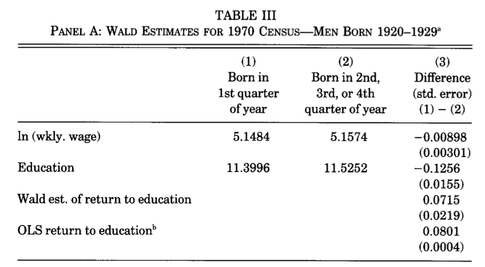

::: {.callout-important title="この講義で押さえたいこと"}
- **モデル**は、変数どうしの関係を記述するための土台である。
- 計量経済学は大きく **識別（Identification）・推定（Estimation）・推論（Inference）** の3ステップから成る。
- 学部レベルでは特に、**何を知りたいパラメータとして置き、どうやってそれを識別するか**を強く意識することが大事である。
:::

<div class="lead">
今回は、計量経済学の3ステップを一気に見渡す。その前に、すべての根幹にある
<strong>モデル</strong>という考え方を導入し、そこから識別・推定・推論へと進む。
</div>

計量経済学は次の3段階で構成される。

- **識別（Identification）**
- **推定（Estimation）**
- **推論（Inference）**

今回は、これらがそれぞれ何なのかを具体例とともに整理する。
ただし、その前に、これらすべての根幹をなす **モデル** というオブジェクトを導入する。

::: {.callout-note title="この lecture の流れ"}
1. まず「モデル」とは何かを確認する。
2. そのあと、計量経済学の3ステップである **識別・推定・推論** を順に位置づける。
3. 例として、Lecture 1 で扱った **教育年数と賃金** の話に戻る。
:::

# モデル

Lecture 1 の教育年数と賃金の関係の例を再掲する。今度はこの図を作るコードも一緒に見てみる。これは「賃金がどのように決まるか」についての一つの **モデル** である。

```{r}
#| fig-cap: "教育年数と賃金の素朴な散布図（能力バイアスあり）"
set.seed(123)

N <- 600

# 観測されない能力（本当は見えない要因）
ability <- rnorm(N, mean = 0, sd = 1)

# 教育年数（ability が高いほど長くなりやすい）
latent_schooling <- 13.5 + 1.2 * ability + rnorm(N, mean = 0, sd = 1.8)
schooling <- pmin(pmax(round(latent_schooling), 9), 20)

# 賃金の生成（教育 + 能力 + ノイズ）
# ability も wage に直接効く
wage <- 10.0 + 0.08 * schooling + 0.25 * ability + rnorm(N, sd = 0.22)


df_demo <- data.frame(
  schooling = schooling,
  wage = wage,
  ability = ability
)

# -----------------------------------------
# Plot : wage vs schooling (naive)
# -----------------------------------------
plot(
  df_demo$schooling, df_demo$wage,
  pch = 16, cex = 0.7,
  xlab = "Years of Schooling",
  ylab = "Wage",
  main = "Naive Scatter Plot: Wage and Schooling"
)

abline(lm(wage ~ schooling, data = df_demo), lwd = 2)
```

## モデルの構成要素：変数とパラメータ

ここでは、教育年数と賃金の関係を考えるための簡単なモデルを例にして、モデルを構成する要素を整理する。

モデルを考えるとき、まず重要なのは次の2つを区別することである。

- **変数（variables）**：個人ごとに値が変わるもの
- **パラメータ（parameters）**：関係の強さや切片などを表す、モデルの「固定された数」

この区別をはっきりさせると、「このモデルで何を知りたいのか」が明確になる。

### この例で使う変数

個人 $i$ ごとに、次のような変数を考えている。

- $S_i$：教育年数（schooling）
- $W_i$：賃金（wage）
- $a_i$：能力（ability, 観測されない要因）

### この例で使うパラメータ

次に、変数どうしの関係を表すために **パラメータ** を置く。

まず、教育年数の潜在変数（丸める前の値）を

$$
S_i^* = 13.5 + 1.2 a_i + u_i
$$

とし、観測される教育年数は

$$
S_i = \mathrm{clip}\!\left(\mathrm{round}(S_i^*), 9, 20\right)
$$

で与える。ここで $u_i$ は平均 $0$、標準偏差 $1.8$ のノイズである。

次に、賃金を

$$
W_i = 10.0 + 0.08 S_i + 0.25 a_i + \varepsilon_i
$$

とする。ここで $\varepsilon_i$ は平均 $0$、標準偏差 $0.22$ のノイズである。

このように書くと、この例でのパラメータは次のように読める。

- **教育年数の式（潜在教育年数）**
  - $13.5$：教育年数のベースライン（能力とノイズが 0 のときの中心水準）
  - $1.2$：能力 $a_i$ が潜在教育年数 $S_i^*$ に与える効果（能力が 1 高いと、潜在教育年数が平均的に 1.2 年分高くなる）
  - $1.8$（ノイズの標準偏差）：教育年数に入るランダムなばらつきの大きさ

- **賃金の式**
  - $10.0$：賃金のベースライン
  - $0.08$：教育年数 $S_i$ が賃金 $W_i$ に与える効果（教育年数が 1 年長いと、賃金が平均的に 0.08 だけ高くなる）
  - $0.25$：能力 $a_i$ が賃金 $W_i$ に与える効果（能力が 1 高いと、賃金が平均的に 0.25 だけ高くなる）
  - $0.22$（ノイズの標準偏差）：賃金に入るランダムなばらつきの大きさ

一般形で書けば、教育年数と賃金の関係はそれぞれ

$$
S_i^* = \alpha_0 + \alpha_1 a_i + u_i
\qquad\text{and}\qquad
W_i = \beta_0 + \beta_1 S_i + \beta_2 a_i + \varepsilon_i
$$

と表せる。このとき、今回のシミュレーションでは

$$
\alpha_0 = 13.5,\quad \alpha_1 = 1.2,\quad
\beta_0 = 10.0,\quad \beta_1 = 0.08,\quad \beta_2 = 0.25
$$

としている。

::: {.callout-note title="ここで重要な点"}
能力 $a_i$ が **教育年数にも賃金にも入っている**。したがって、教育年数と賃金の相関には、教育の効果（$\beta_1$）だけでなく、能力を通じた関係も混ざりうる。
:::

言い換えると、教育年数がランダムではないという状況である。元から高い賃金を得られる人が教育年数も伸びる傾向にあり、単なるランダムな変動ではなくなっている。

### 変数とパラメータの違いをこの例で言い換えると

同じモデル式の中に出てきても、役割は違う。

- $S_i, W_i, a_i$ は **個人ごとに変わる**（$i$ が変わると値が変わる）ので、**変数**
- $\alpha_0, \alpha_1, \beta_0, \beta_1, \beta_2$ は、モデル全体で共通の「関係の強さ」を表すので、**パラメータ**

たとえば、教育年数 $S_i$ は人によって違うが、「教育年数が1年増えると賃金がどれくらい変わるか」を表す $\beta_1$ は、モデルの中で共通の数として置かれている。

::: {.callout-tip title="見方のコツ"}
式を見たときは、まず **人ごとに変わるもの** と **モデル全体で固定されているもの** を分けて読むと理解しやすい。
:::

### モデルって何？

::: {.callout-important title="この講義での一言定義"}
**モデルとは「条件付き分布」の束である。**
:::

意味がわからないと思うので、具体的に見ていく。

上の例では、「能力」を与えると、以下のように「教育年数」を一つ決めることができた。

$$
S_i = \mathrm{clip}\!\left(\mathrm{round}(\alpha_0 + \alpha_1 a_i + u_i), 9, 20\right)
$$

ここで $u_i$ はノイズであった。具体的には $u_i$ は平均 $0$、標準偏差 $1.8$ の **正規分布** から引いてきている。つまり、サンプル一人につき一つこのノイズを引いてきて、それごとに $S_i$ を決定している。

これを一人のサンプルにつき無限回やることを考える。このとき、能力 $a_i$ が決まっていても、毎回引かれる $u_i$ が異なるので、毎回違う $S_i$ が実現することになる。これをヒストグラムにすると、以下のようになる。ただし $a_i = 0$ としている。

```{r}
#| fig-cap: "ability = 0 に固定したときの schooling の分布（繰り返しサンプリング）"
#| echo: true

set.seed(123)

# 元のコードと対応するパラメータ
ability_fixed <- 0
R <- 10000

# ノイズを繰り返し引く（教育年数の式に入るノイズ）
u <- rnorm(R, mean = 0, sd = 1.8)

# 丸める前の教育年数
latent_schooling_rep <- 13.5 + 1.2 * ability_fixed + u

# 観測される教育年数（丸め + [9,20] に切る）
schooling_rep <- pmin(pmax(round(latent_schooling_rep), 9), 20)

# 離散変数なので棒グラフで可視化
tab_schooling <- table(factor(schooling_rep, levels = 9:20))

barplot(
  tab_schooling,
  xlab = "Years of Schooling",
  ylab = "Frequency",
  main = "Distribution of schooling when ability = 0"
)
```

これが **教育年数を能力について条件づけた条件付き分布** である。これはフォーマルには

$$
F(S \mid a_i = 0)
$$

と書くのが一般的である。$F$ は **分布** を表すときによく使われる記号で、$S$ が分布する変数で、$\mid$ 以降が **条件** である。ここでは「能力が $0$」という条件である。

今考えている「賃金」のモデルには変数が三つあった。

- 賃金
- 能力
- 教育年数

もう一つの条件付き分布は、「能力」と「教育年数」を与えると「賃金」の分布が決まる、というものであった。以下のように書ける。ただし $\epsilon_i$ はさっきの $u_i$ と同様に正規分布で、平均は $0$、標準偏差は $0.22$ である。

$$
W_i = \beta_0 + \beta_1 S_i + \beta_2 a_i + \epsilon_i
$$

これも先と同様に条件付き分布を一つ特定している。今度は **賃金 $W_i$ の、教育年数 $S_i$ と能力 $a_i$ について条件づけた分布** である。

注意点として、今回は二つの変数で条件づけていることである。教育年数だけでなく、能力もわからないと賃金の分布を一つ特定することはできない。

この二つの条件付き分布をまとめて一つのモデルと呼んでいる。二つ以上の条件付き分布が出てきうる、という意味で、最初の部分では「モデルとは条件付き分布の束」と書いた。

### モデルで何ができる？

モデルが何かはなんとなくわかった。では、これで何ができるのか。

::: {.callout-tip title="モデルの基本的な働き"}
**モデルがわかると、シミュレーションができる。**
:::

先の散布図を書いたときのコードを再掲する。

```{r}
set.seed(123)

N <- 600

# 観測されない能力（本当は見えない要因）
ability <- rnorm(N, mean = 0, sd = 1)

# 教育年数（ability が高いほど長くなりやすい）
latent_schooling <- 13.5 + 1.2 * ability + rnorm(N, mean = 0, sd = 1.8)
schooling <- pmin(pmax(round(latent_schooling), 9), 20)

# 賃金の生成（教育 + 能力 + ノイズ）
# ability も wage に直接効く
wage <- 10.0 + 0.08 * schooling + 0.25 * ability + rnorm(N, sd = 0.22)


df_demo <- data.frame(
  schooling = schooling,
  wage = wage,
  ability = ability
)
```

これを **シミュレーションコード** と呼ぶ。先ほど特定した二つの条件付き分布が書かれていることがわかるはずだ。つまりこのコードはモデルをそのままコードにしたものであり、それに基づいて決められた数のサンプルの **データ** を生成している。

それだけ？と思うかもしれないが、シミュレーションは複雑なシステムを人間でもわかる形で分析する上で非常に有効な手法である。

#### シミュレーションという手法が重要な理由と3つの例

シミュレーションの強みは、**複雑なシステムを「1本の答え」ではなく、複数のありうる結果とその不確実性ごと扱える** 点にある。特に、要因どうしが相互作用し、初期条件や仮定のわずかな違いが結果に影響する問題で威力を発揮する。

1. **天気予報（アンサンブル予報）**

   天気予報では、初期条件の誤差やモデル誤差のため、1回の計算だけでは将来の予報の不確実性を十分に表せない。そこで、初期条件やモデル設定を少しずつ変えて複数回計算する **アンサンブル予報** が使われる。これにより、「晴れか雨か」だけでなく、**予報のばらつき・確率・自信度** まで評価できる。

2. **感染症の流行予測**

   感染症モデルでは、接触率・変異株・行動変容・介入策（ワクチン、休校、マスクなど）が同時に影響するため、将来を単純な式だけで読み切るのは難しい。シミュレーションを使うと、異なる仮定のもとで複数のシナリオを比較し、**流行規模の見通し** や **介入の効果の違い** を評価できる。

3. **交通渋滞**

   交通では、1台の軽い減速のような小さなショックが、車間距離や反応の遅れを通じて波のように伝わり、**原因が見えにくい渋滞（ファントム渋滞、stop-and-go wave）** を生むことがある。こうした現象は、個々の運転行動の相互作用から生まれるため、シミュレーションで時間発展を追うと理解しやすい。

この3例に共通するのは、シミュレーションが単なる「計算」ではなく、**複雑な世界を理解し、不確実性を含めて意思決定に役立つ形に整理する方法** だという点である。つまりシミュレーションは、答えを1つ出すための道具というより、**どんな結果がどれくらい起こりうるかを見通すための道具** である。

# 計量経済学の目的

::: {.callout-important title="この節の主張"}
**シミュレーションというツールを経済現象に持ち込むのが、計量経済学の究極的な目標である。**
:::

経済現象のモデルについては、ミクロ経済学が大まかなフレームワークを与えてくれる。

たとえば先の例で言えば、「教育年数は能力によって選ばれるだろう」というのは **シグナリング理論** という経済理論から予測される帰結である。また、「賃金は教育年数に応じて上昇するだろう」というのも **人的資本理論** という経済理論から予測される帰結である。この意味で経済理論は、「モデルの大枠」を与えてはくれる。

これでシミュレーションできるだろうか。

できない。

そこには大きく分けて二つの障壁がある。

## 障壁1：モデルの詳細がわからない

**我々はこの世界を動かしているモデルの詳細を知らない**、という問題である。

先の例に戻ると、たとえば現実の世界を支配するパラメータである $\alpha_0, \alpha_1$ と $\beta_0, \beta_1, \beta_2$ がわかっていない。

つまり、賃金が教育年数に対してどのように上昇するのか、というモデルの最も根幹的な部分を我々は知らない。

これでは、たとえこの世の人々の「教育年数」と「能力」がわかったとしても、シミュレーションをすることができない。

## 障壁2：変数は一部しか見えない

たとえば先の例でいくと、「能力」とは何か。

IQ test の結果だろうか。共通テストの点数だろうか。

こういった「能力」っぽい変数はもちろんあるにはある。しかし、それが決定的に賃金につながる「能力」であるという確信はない。このような変数を **代理変数** と呼ぶ。

代理変数でお茶を濁すのももちろん悪い一手ではない。しかし、代理変数はいちゃもんをつけられやすい。たとえば、IQ test のような認知能力以外に非認知能力と呼ばれる能力もある。そして、最近の研究では、この非認知能力こそ賃金や社会的地位を決めるうえで重要であることが明らかになりつつある。

::: {.callout-warning title="ここでの難しさ"}
現実には、**本当に重要な変数ほどきれいには観測できない** ことが多い。だからこそ、見えているデータだけでどこまで言えるかを丁寧に考える必要がある。
:::

なんとか見えている変数だけでシミュレーションをできるようにしないといけない。この「見えている変数」のことを **データ** と呼ぶ。

計量経済学は **データを有効なシミュレーションにつなげる方法論** であり、そのために以下の3つのステップがある。すなわち、

- 識別
- 推定
- 推論

の三つである。

# 識別：知りたいのはパターンではなくパラメータ

教育の経済効果の例で、中心的に知りたいのは、教育年数が1年伸びたときに賃金がどれだけ伸びるかを表すパラメータ $\beta_1$ である。

Lecture 1 で見た通り、この $\beta_1$ と、Lecture 1 で見た回帰分析で得られる傾きとは、一致しないことが予想されるのであった。

ここで、その傾きは単なる **相関**、つまりパターンである。我々が究極的に欲しいのはパターンではなく、パラメータ $\beta_1$ であるということを強く意識しなくてはならない。

::: {.callout-important title="識別の核心"}
**知りたいパラメータを、データから何らかの方法で取り出せるとき、そのパラメータは識別できる。**
:::

この欲しいパラメータをデータからなんらかの方法で見つけられるとき、**$\beta_1$ を識別できる** という。英語で **identifiable** という。

そしてその「なんらかの方法」を **識別戦略**、英語で **identification strategy** という。

計量経済学は基本的に、この識別戦略をいろいろ見つけることで発展してきたと言っていい。いろんな状況で、「こういうやり方なら欲しいパラメータを見つけられるぞ」ということがたくさん見つかってきた、ということである。

この講義でも、たくさんの識別戦略を紹介していく。

識別戦略に比べれば、このあと出てくる **推定** と、推定に伴う不確実性の定量化である **推論** は、どちらかというと統計学っぽい話である。もちろんどちらも重要だが、少なくとも学部の授業で最も重要なのは、まず **識別戦略の話** だと思ってよい。

## 識別戦略の具体例：Angrist and Krueger (1991)

Lecture 1 の話を思い出そう。

Angrist and Krueger (1991) では、単純に賃金を教育年数で説明しようとすると、能力などの要因によって教育年数が「ランダム」ではないことを念頭に置いて、教育年数が賃金に与える影響を識別するためにどうすればいいのかを考えていた。

そして彼らの **識別戦略** は、「誕生月」を使うというものであった。該当部分を簡単に再掲する。

::: {.callout-note title="Lecture 1 からの再掲：誕生月を使う識別戦略"}
**6.1 入学時点での年齢のズレが生じる**

多くの地域では、子どもが小学校に入学できるかどうかは、ある基準日（cutoff date）までに一定年齢に達しているかで決まる。このため、同じ学年に入る子どもであっても、誕生月によって入学時の年齢に差が生じる。

- 年の前半に生まれた子どもは、同じ学年の中で相対的に年齢が高い
- 年の後半に生まれた子どもは、同じ学年の中で相対的に年齢が低い

この「学年内での年齢差」自体は小さいが、後で義務教育の離学可能年齢と組み合わさると、教育年数に差を生む可能性がある。

**6.2 義務教育法と組み合わさると、教育年数に差が出る**

ポイントは、学校をやめてもよい年齢（school-leaving age）が、学年修了ベースではなく **年齢ベース** で決まっていることである。

たとえば、ある州で「16歳になれば退学できる」とする。このとき、同じ学年にいる生徒でも、誕生月が早い人の方が先に16歳に達する。

すると、誕生月が早い生徒は

- 法的に退学できるタイミングが早く来る
- その結果、ある学年を終える前に退学しやすくなる

一方で、誕生月が遅い生徒は、同じ時点ではまだ退学可能年齢に達していないため、もう少し長く学校に残る可能性が高い。

このようにして、**誕生月の違いが、制度を通じて平均教育年数の違いに変換される**。

**6.3 「誕生月が教育年数を動かす」のではなく、「制度が誕生月を通じて教育年数を動かす」**

ここで強調したいのは、誕生月そのものに教育的な意味がある、という主張ではないことである。重要なのは、

- 誕生月は（少なくとも個人の教育選択に比べて）ランダムに与えられる要因であり、
- それが制度ルールと結びつくことで、教育年数に小さなズレを生む

という構造である。

**6.4 なぜ「ランダムな変動」と言ってよいのか**

もちろん、現実には誕生月が完全にランダムとは言い切れない場合もある。たとえば出生の季節性や、家族背景と出生時期の相関がまったくないと断言するには慎重さが必要である。

それでもこの文脈で「ランダムな変動」と言うのは、次の意味である。

- 個人がどれだけ進学するかという選択に比べると、誕生月ははるかに外生的（ランダム）である
- 少なくとも、能力や進学意欲を直接反映して教育年数が決まるという経路からは切り離しやすい
- そのうえで、制度を通じて教育年数に影響することが確認できる

つまりここで使っている「ランダム」とは、**教育年数の自己選択に比べて、より外生的で、識別に使える変動** という意味である。
:::

# 推定：データをパラメータに変換する

さて、識別戦略が決まったら、次は実際にデータからパラメータを引き出す具体的な計算手順が必要である。

この計算手順にはたくさんの候補があり得る。たとえば

- 最尤法
- モーメント法
- 一般化モーメント法
- Non/Semi-parametric estimation
- Adversarial estimation

などである。

この授業で扱うのはこの中の **モーメント法** および **一般化モーメント法** のみである。さらに言うと、この中でも **最小二乗法**、英語で言うと **ordinary least squares (OLS)** と呼ばれる推定手法を中心に扱う。

OLS は、基本的には Lecture 1 で出てきた **回帰分析** のことだと思っていい。つまり、一つ説明したい変数（**被説明変数**）があって、それを説明する変数（**説明変数**）があって、最も「よく」説明するような関係性を見つける手法である。

## 推定量と推定値

推定（estimation）とは、観測されたデータからモデルのパラメータを計算で取り出す手続きである。この計算手続きを、データを入力してパラメータを出力する **関数** として書けば、

$$
\widehat{\theta} = G(\text{Data})
$$

のように表せる。

ここで重要なのは、「何を指しているか」が2段階あるということである。

- **推定量（estimator）**：データを入れる前の「計算ルール（関数）」そのもの。データが変われば出力も変わるので、推定量は（データがまだ確定していない段階では）**ランダム** な対象として扱われる。記号ではしばしば

  $$
  G(\mathrm{Data})
  $$

  のように書く。

- **推定値（estimate）**：実際の観測データ $\text{data}_{obs}$ を推定量に代入して得られた「具体的な数」。すなわち

  $$
  \hat{\theta} = G(\text{data}_{obs})
  $$

  で与えられる。

まとめると、

- **推定量（estimator）** ＝ データからパラメータへの **変換ルール**
- **推定値（estimate）** ＝ そのルールを観測データに適用して得た **具体的な数**

である。

OLS に対しては **ordinary least squares estimator（OLSE）** を考え、その性質を次回以降見ていく。具体的な計算方法も次回以降解説する。

## なんで OLS？

OLS しか扱わないのは、「学部の授業ならこれで十分」という保守的な理由からではない。OLS はデータ分析における最も基本的な分析手法であり、実際のデータ分析の現場で最もよく用いられる手法であるため、OLS を学ぶのは実務上も必須である。

さらに、OLS が実際どういう計算なのかを理解する中で、統計学や計量経済学に出てくる必須の概念を一通り学ぶことができるという、教育的効果も大きい。

最後に一つ注意点。OLS は最初習ったときは「当たり前の計算で誰でもできるじゃん」という見た目をしているが、やっていくうちに訳がわからなくなり、最終的に「なんとなくわかったな」となるまで時間がかかる。普通に難しい概念である。なので、次回以降取り扱っていくが、学生諸君は最初からすべてを理解しようとしなくていい。まずはなんとなくノリをつかもう。

::: {.callout-tip title="70%ルール"}
OLS に限らず、大学以降に登場する数学っぽい概念は大体かなり難しい。なので、最初からすべてを理解するつもりで臨むのではなく、**70% ぐらい理解できた感覚を得たらいったん先に進み、また後で戻ってくる** ぐらいの気持ちで挑むとよい。
:::

## 推定の具体例：Angrist and Krueger (1991)

教育の経済効果の例で、推定の具体例を見ていく。まずは Lecture 1 で出てきた **Wald 推定量** の話を再掲する。

::: {.callout-note title="Lecture 1 からの再掲：Wald 推定量の発想"}
**7.1 発想：誕生月で生じた「賃金の差」を「教育年数の差」で割る**

誕生月の違いを使って、2つのグループを比べることを考える。Angrist and Krueger (1991) では、直感をはっきり示すために、たとえば

- 第1四半期生まれ
- それ以外（第2〜第4四半期生まれ）

の比較を用いている。

このとき、もし第1四半期生まれの人々が平均的に教育年数も賃金も少し低いなら、その「賃金差 ÷ 教育年数差」は、教育1年あたりの賃金効果を表していそうに見える。

この考え方を式で書くと、Wald 推定量は

$$
\hat{\beta}_{Wald} = \frac{
\mathrm{Avg}[w \mid Z=1] - \mathrm{Avg}[w \mid Z=0]
}{
\mathrm{Avg}[s \mid Z=1] - \mathrm{Avg}[s \mid Z=0]
}
$$

となる。

ここで

- $s$ は教育年数
- $w$ は賃金
- $Z \in \{0,1\}$ は第1四半期生まれダミー。1 なら第1四半期生まれ、0 ならそれ以外生まれ

である。

- $\mathrm{Avg}[X \mid Z=1]$ は $X$ の $Z=1$ での **条件付き期待値**
  - つまり第1四半期生まれの人についてのみ、変数 $X$ の平均をとっている
- $\mathrm{Avg}[X \mid Z=0]$ は $X$ の $Z=0$ での **条件付き期待値**
  - つまり第1四半期生まれではない人についてのみ、変数 $X$ の平均をとっている

Wald 推定量は、

- 分子：誕生月によって生じた賃金の差
- 分母：誕生月によって生じた教育年数の差

の比として、教育の経済効果を推定する。
:::

ここで、Wald 推定量に出てくる要素は、すべてデータがあれば計算できるただの「平均」であることに気づける。なので、この推定量の観測値に対する値、すなわち「推定値」を計算すること自体は、頑張ればパソコンがなくても可能である。

要するに、推定量に出てくる4つのグループごとの平均を手で計算して、上の Wald 推定量の式に代入すればよい。

### 計算手順は一つじゃない

しかし、これだけが唯一の推定量の「具体的な計算手順」ではない。

Wald 推定量をよく見ると、4つのグループの平均を計算してから、その差をとったものが分母と分子に来ている。

もし、**グループ平均の差** を直接計算できる計算手順があったら、4つの計算をしてから代入するのではなく、分母と分子で1回ずつその計算手順を実行して、結果を割るだけで同じ Wald 推定量の推定値が得られるはずである。

実は、次回以降見ていくとおり、グループ平均の差を直接計算する計算手順、これこそ OLS の本質である。

詳細は次回以降見ていくが、要するに、

- $Z=1$ と $Z=0$ の平均賃金の差の OLSE を $\widehat{\beta}_{OLS}^{w}$ と書く
- $Z=1$ と $Z=0$ の平均教育年数の差の OLSE を $\widehat{\beta}_{OLS}^{s}$ と書く

このとき、

$$
\widehat{\beta}_{Wald} = \frac{\widehat{\beta}_{OLS}^{w}}{\widehat{\beta}_{OLS}^{s}}
$$

と書ける。

そして、「OLS の比」という形の推定量には **two-stage least squares estimator（2SLS）** という名前がついていて、以下の形で直接計算することができることが知られている。つまり、わざわざ2回 OLS をやって比を取るのではなく、以下の公式で一発で計算できる。この意味で Wald 推定量は 2SLS 推定量と同値である。

#### 2SLS の公式

観測データを $i = 1, \dots, n$ とし、賃金を $w_i$、教育年数を $s_i$、第1四半期生まれダミーを $Z_i \in \{0,1\}$ とする。

被説明変数ベクトルを

$$
y = \begin{pmatrix} w_1 \\ \vdots \\ w_n \end{pmatrix}
$$

とする。

説明変数行列 $X$ は、定数項と教育年数を並べた $(n \times 2)$ の行列

$$
X = \begin{pmatrix} 1 & s_1 \\ \vdots & \vdots \\ 1 & s_n \end{pmatrix}
$$

とする。

$Z$ は、定数項と第1四半期生まれダミーを並べた $(n \times 2)$ の行列

$$
Z = \begin{pmatrix} 1 & Z_1 \\ \vdots & \vdots \\ 1 & Z_n \end{pmatrix}
$$

とする。

このとき、2SLS 推定量は

$$
\hat\beta_{2SLS} = \bigl(X'Z(Z'Z)^{-1}Z'X\bigr)^{-1}X'Z(Z'Z)^{-1}Z'y
$$

で与えられる。ここで $\hat\beta_{2SLS}$ は $(\hat\beta_0, \hat\beta_1)'$ であり、$\hat\beta_1$ が「教育年数 $s$ の係数（教育の賃金効果）」の Wald 推定量と一致する。

::: {.callout-note title="今の段階でわかればいいこと"}
今は、**データである $X, Z, y$ をいい感じに足したり掛けたりすると Wald 推定量を作れる**、という事実だけがわかれば十分である。なぜそうなるのかは、講義の中盤から後半にかけて扱う。
:::

### なぜわざわざ二通りの表し方をしたのか

それは次節の推論（Inference）が念頭にあるからだ。

- Wald 推定量そのままの形では推論がしにくい
- 一方で、結局は同じ推定値を出すのに、2SLS として理解すると、推論が公式で整理しやすくなる

こういう利点が 2SLS にはある。だから両方の見方を紹介した。

このようなことは計量経済学にはよくある。識別戦略から直接的に作れる推定量（先の例では Wald）は直感的にはわかりやすく、計算も簡単だけど、その推論をするのが難しい、というケースである。

そういうとき、経済学者は大体、なんとか OLS（または 2SLS みたいな OLS の組み合わせ）の形でその推定量を再表現しようと考える。こうすることで、推定値のばらつきを容易に計算できるようになる。

ここは腕の見せどころというか、センスの世界である。Angrist の主要な業績は、「大体 OLS でいい」という立て付けに難しい問題を落とし込んだことにある。

# 推論（Inference）：推定値の不確実性を定量化する

まだ終わらない。最後に、上までで得た推定値の **不確実性** を定量化する **推論**、英語で **inference** という作業が残っている。

基礎統計で以下のような問題を扱ったはずである。

::: {.callout-note title="基礎統計で扱ったはずの『推論』の最小例：平均が 0 かどうか"}
基礎統計では、推論（inference）の最も基本的な例として、次のような問題を扱ったはずである。

> ある確率変数 $X$ について、独立同分布のサンプル $X_1, \dots, X_n$ を観測した。このとき母平均 $\mu = E[X]$ が $0$ かどうかを検定したい。

この問題では、まず推定量としてサンプル平均

$$
\bar X = \frac{1}{n}\sum_{i=1}^n X_i
$$

を用いる。

次に重要なのは、$\bar X$ はサンプルによって値が変わるので、$\bar X$ の「どれくらい揺れるか」を表す量が必要になる、という点である。そこで登場するのが **標準誤差（standard error）** である。

サンプル分散

$$
s^2 = \frac{1}{n-1}\sum_{i=1}^n (X_i - \bar X)^2
$$

を使うと、サンプル平均の標準誤差は

$$
SE(\bar X) = \frac{s}{\sqrt{n}}
$$

で与えられる。

帰無仮説 $H_0 : \mu = 0$ のもとで、次の **t 統計量**

$$
t = \frac{\bar X - 0}{SE(\bar X)}
$$

を計算し、これが十分大きい（あるいは十分小さい）かどうかで検定を行う。
:::

これを今まで出てきた単語で言い換えると、以下のような感じである。

- $\mu$ というパラメータがある。これが識別対象である。
- $\mu$ に対する推定値をサンプル平均とする推定をする。
- サンプル平均は推定量としてみると、「どのサンプルを入れるか」で値が変わるランダムなオブジェクトである。
- なので、推定値として得られたサンプル平均のばらつきの度合いを標準誤差で表して、パラメータが本当に 0 でないかを検証している。

このように、パラメータに対するなんらかの仮説を念頭に、それを検討するために対応する推定値のばらつきを計算する作業がある。これを推論（inference）と呼ぶ。

授業で習う推定量はほとんど、このばらつきを直接計算できるものである。つまりある「公式」があって、それにデータをぶち込むと、その推定量のばらつきが計算できる、というものになっている。

次回以降で OLSE に対して、この「公式」を見ていく。

## 推論の具体例：Angrist and Krueger (1991)

前節で見たように、誕生四半期ダミー $Z$ を用いると、教育年数 $s$ の賃金効果 $\beta_1$ を **2SLS（two-stage least squares）** で推定できる。ここでは、2SLS 推定値に対して「どれくらい不確かか」を数値化し、検定や信頼区間を作る方法（inference）をまとめる。

以下、ずらっと数式が並ぶが、別にこれを1行1行理解する必要はない。

::: {.callout-tip title="ここで理解してほしいことは一つ"}
**データを適切な形で足したり掛けたりすると、推定量の分散が計算できる。** 今はこの流れだけ掴めればよい。
:::

### 推論のために必要なもの：標準誤差（standard error）

推定値 $\hat\beta_1$ は、サンプルを取り直せば（別のデータなら）値が変わる。その「揺れの大きさ」を数値化するのが標準誤差である。2SLS では、推定量の漸近分布（大標本近似）から、$\hat\beta_{2SLS}$ の分散を公式的に計算できる。

### 2SLS 推定量（復習）

データ $i = 1, \dots, n$ について、被説明変数 $y_i = w_i$（賃金）、説明変数 $X$（定数項と教育年数）、道具変数 $Z$（定数項と誕生四半期ダミー）を用意する。2SLS 推定量は

$$
\hat\beta_{2SLS} = \bigl(X'Z(Z'Z)^{-1}Z'X\bigr)^{-1}X'Z(Z'Z)^{-1}Z'y
$$

で与えられる。ここで $\hat\beta_{2SLS} = (\hat\beta_0, \hat\beta_1)'$ とし、$\hat\beta_1$ が教育年数の係数である。

### ロバスト分散の公式

残差を $\hat u_i = y_i - x_i'\hat\beta_{2SLS}$ とし、$x_i'$ は $X$ の $i$ 行、$z_i'$ は $Z$ の $i$ 行とする。次の行列を定義する。

$$
A = X'Z(Z'Z)^{-1}Z'X
$$

$$
B = X'Z(Z'Z)^{-1}
\left(\sum_{i=1}^n z_i z_i'\hat u_i^2\right)
(Z'Z)^{-1}Z'X
$$

このとき、2SLS 推定量の（ロバストな）分散推定量は

$$
\widehat{\mathrm{Var}}(\hat\beta_{2SLS}) = A^{-1} B A^{-1}
$$

で与えられる。教育年数の係数 $\hat\beta_1$ の標準誤差は

$$
SE(\hat\beta_1) = \sqrt{\bigl[\widehat{\mathrm{Var}}(\hat\beta_{2SLS})\bigr]_{(2,2)}}
$$

として計算できる（ここで $(2,2)$ は2番目の係数、すなわち教育年数の係数に対応する）。

### t検定（仮説検定）

たとえば「教育の賃金効果がゼロ」という帰無仮説

$$
H_0 : \beta_1 = 0
$$

を検定したいなら、t 統計量を

$$
t = \frac{\hat\beta_1 - 0}{SE(\hat\beta_1)}
$$

とおく。大標本では、この $t$ はおおむね標準正規分布に従うとみなせるので、$|t|$ が十分大きいかどうかで有意性を判断する（あるいは $p$ 値を計算する）。

### 信頼区間（confidence interval）

同じ情報は、たとえば 95% 信頼区間として

$$
\hat\beta_1 \pm 1.96 \cdot SE(\hat\beta_1)
$$

の形で提示することもできる。

さて、実際に論文ではどのようにこの推論の結果がレポートされているだろうか。



この図の3列目、最後の2行に注目する。Wald est. と書いてある行には

> 0.0715  
> (0.0219)

と書いてある。この1行目が Wald 推定量の推定値であり、2行目が先の公式で計算された標準誤差である。推定値が標準誤差の 3.5 倍ぐらいあるので、有意水準 1% くらいでも余裕で有意に教育の効果が検出されている。

ちなみに最後の行は OLS での推定値である。OLS > Wald なので、OLS は教育年数の賃金への効果を過剰に大きくレポートしてしまう可能性があることがわかる。これは、「元から能力が高くて勝手に賃金が高くなるやつが、教育年数が長いグループになりがち」という予測とも整合的である。

# まとめ

::: {.callout-important title="今日のまとめ"}
- モデルは **条件付き分布の束** である。
- 計量経済学は究極的には、モデルに基づく **シミュレーション分析** をやるためのものである。
- そのために、見えているデータからモデルの細部を特定する必要がある。
- 計量経済学には **識別・推定・推論** の3ステップがある。
:::

# 宿題

- 次回使うので、関数の最大・最小問題を思い出そう。
  - ChatGPT に「2変数関数の最適化について教えて」と言ってみよう。
  - 特に「First order condition って何？」と聞いておくとよい。
  - わからなかったら、グラフを書いてもらうとさらによい。
- この講義資料に出てきたコードを ChatGPT に投げて、コードの各部分・各関数が何をしているのかを解説してもらう。
- Quarto でこの講義ノートを自分のパソコンで実行してみよう。
