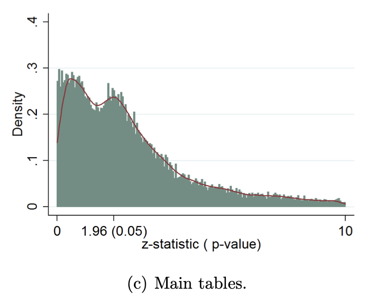
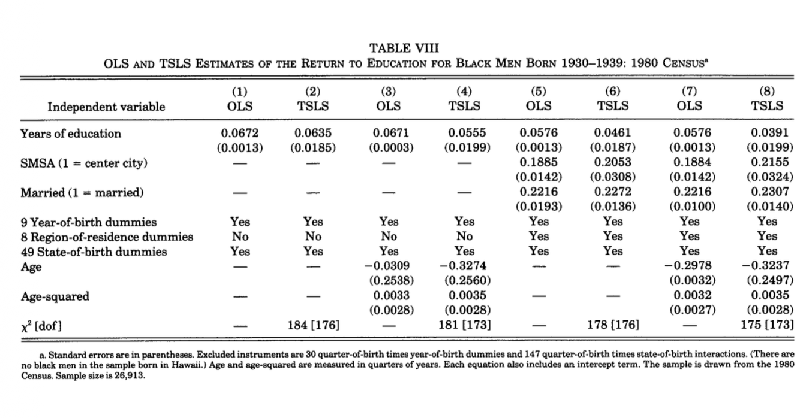

::: {.callout-important title="この講義で押さえたいこと"}
- **t 統計量・p 値・信頼区間**は、係数の不確実性を読むための道具である。
- 標準誤差が変われば、**同じ係数推定値でも結論が変わりうる**。
- **robust standard error** は、係数を変えるのではなく、推論のしかたを調整する。
:::

<div class="lead">
今回は、OLS を使った推論を学ぶ。まずは古典的仮定の下で仮説検定と信頼区間を整理し、そのあとで robust inference を導入する。最後に、論文でよく見る回帰表の読み方までつなげる。
</div>

::: {.callout-note title="この lecture の流れ"}
1. 仮説検定と信頼区間の考え方を、シミュレーションで直感的につかむ。  
2. 次に、同分散が崩れたときに **何が壊れるのか** を見る。  
3. 最後に、回帰表をどう読むかを具体例で確認する。
:::

# 仮説検定：係数が「ゼロではない」と言えるか？

- $E[u_i \mid x_i] = 0$
- $\mathrm{Var}(u_i\mid x_i)=\sigma^2$（同分散）
- $\mathrm{Cov}(u_i,u_j\mid x)=0 \ (i\neq j)$（相関なし）

を仮定する。

::: {.callout-note title="まずはここから"}
この節では、まず **外生性・同分散・誤差の無相関** が成り立つ標準的な世界から話を始める。  
robust inference は、このうち後ろ2つが崩れたときの修正だと考えると位置づけやすい。
:::

単回帰で

$$
y_i=\beta_0+\beta_1 x_i+u_i
$$

を推定し、係数の推定値 $\hat\beta_1$ が得られたとする。

ここで一番よくやる問いはこれだ：

> **$x$ の効果は本当にあるのか？**  
> つまり、真の係数 $\beta_1$ はゼロではないと言えるのか？

これを統計的に言い換えると、**仮説検定**になる。


## 帰無仮説と対立仮説

典型的には**両側検定**といい、次を検定する

- 帰無仮説（効果なし）：$$H_0:\beta_1=0$$
- 対立仮説（効果あり）：$$H_1:\beta_1\neq 0$$

「効果が正だと主張したい」など方向がある場合は**片側検定**

- $$H_1:\beta_1>0$$

も使う。


## t統計量：推定値を“標準化”する

推定値 $\hat\beta_1$ はサンプルによってブレる。そのブレの大きさを標準誤差で表す：

$$
\mathrm{se}(\hat\beta_1)
=\sqrt{\widehat{\mathrm{Var}}(\hat\beta_1)}.
$$

この標準誤差はOLSのケースでは簡単に計算できることは前回見た。

そこで、推定値が「ゼロから何標準誤差ぶん離れているか」を測るために

$$
t
=\frac{\hat\beta_1-0}{\mathrm{se}(\hat\beta_1)}
$$

を作る。これが **t統計量** である。

直感はシンプルで、

- $|t|$ が大きいほど、「偶然でこうなった」とは言いにくい  
- $|t|$ が小さいほど、「たまたまこう見えただけかも」が残る

となる。


::: {.callout-tip title="p 値の読み違いに注意"}
p 値は、**「帰無仮説が正しい確率」**ではない。  
あくまで、**帰無仮説の下で今みたいな結果がどれくらい珍しいか** を表している。
:::

## p値の意味

p値とは、帰無仮説 $H_0$ が正しいと仮定したときに、

> **今観測された $t$ 統計量と同じくらい（またはそれ以上に）極端な値が出る確率**

のこと。

- p値が小さい  
  → 「$H_0$ が正しいなら、こんな結果は起きにくい」  
  → $H_0$ を棄却しやすい
- p値が大きい  
  → 「$H_0$ が正しくても、これくらいは起きそう」  
  → $H_0$ を棄却しにくい

**注意**：p値は「$H_0$ が正しい確率」ではない。


## 信頼区間：効果の“ありそうな範囲”を出す

検定は0か1かの判断になりやすいので、実務では信頼区間が重要になる。

95%信頼区間は

$$
\hat\beta_1 \pm t_{0.975,\;n-2}\cdot \mathrm{se}(\hat\beta_1)
$$

で与えられる。

読み方は：

> 「同じ手順で何度もサンプルを取り直してこの区間を作ると、95%の割合で真の $\beta_1$ を含む」


## シミュレーションで実感しよう

ここでは、OLSの推論をRでのシミュレーションで目に見える形にする。 やることはシンプルで、次のデータ生成過程（DGP）を何度も繰り返す：

$$
y_i=\beta_0+\beta_1 x_i + u_i,\qquad
x_i\sim N(0,1),\quad u_i\sim N(0,\sigma^2),\quad x_i\perp u_i.
$$


### 実験A：帰無仮説が真のとき、t統計量はどう分布するか？

帰無仮説 $H_0:\beta_1=0$ が本当に正しい世界で、サンプルを何度も取り直してOLSを回す。  
そのたびに t統計量

$$
t=\frac{\hat\beta_1-0}{\mathrm{se}(\hat\beta_1)}
$$

を計算し、ヒストグラムにする。

さらに、両側5%検定の臨界値 $\pm t_{0.975,\;n-2}$ で線を引き、
「帰無仮説が本当でも、5%くらいは棄却される」という現象を確認する。

```{r}
set.seed(7)

# ---- settings ----
R     <- 5000
n     <- 50
beta0 <- 0
beta1 <- 0     # H0 true
sigma <- 1

# ---- simulate t-stats ----
tvals <- numeric(R)

for (r in 1:R) {
  x <- rnorm(n)
  u <- rnorm(n, sd = sigma)
  y <- beta0 + beta1 * x + u
  fit <- lm(y ~ x)
  tvals[r] <- summary(fit)$coefficients["x", "t value"]
}

df   <- n - 2
crit <- qt(0.975, df)

hist(tvals, breaks = 60,
     main = paste0("t-stat under H0: beta1=0 (n=", n, ", R=", R, ")\n",
                   "critical values ±t(0.975, df=", df, ") ≈ ±", round(crit, 2)),
     xlab = "t-statistic")
abline(v = c(-crit, crit), lty = 2)

# rejection rate
rej_rate <- mean(abs(tvals) > crit)
rej_rate
```

上の `rej_rate` が、両側5%検定の棄却率（シミュレーション平均）である。
帰無仮説が真なら、これは理論上おおむね 0.05 になる。


### 実験B：95%信頼区間は本当に95%の確率で真値を含むか？

次に、$\beta_1$ がゼロではない世界（例：$\beta_1=2$）で、95%信頼区間

$$
\hat\beta_1 \pm t_{0.975,\;n-2}\cdot \mathrm{se}(\hat\beta_1)
$$

を毎回作り、「真の $\beta_1$ を含む割合（coverage）」を数える。
これがだいたい 0.95 になるのが、信頼区間の基本的な性質である。

さらに、信頼区間をたくさん並べて描くと、「含む／含まない」が視覚的に分かる。

```{r}
set.seed(11)

R     <- 2000
n     <- 50
beta0 <- 0
beta1 <- 2     # true effect
sigma <- 1

df   <- n - 2
crit <- qt(0.975, df)

b1hat <- numeric(R)
se1   <- numeric(R)
lo    <- numeric(R)
hi    <- numeric(R)
cover <- logical(R)

for (r in 1:R) {
  x <- rnorm(n)
  u <- rnorm(n, sd = sigma)
  y <- beta0 + beta1 * x + u
  fit <- lm(y ~ x)
  summ <- summary(fit)$coefficients
  b1hat[r] <- summ["x", "Estimate"]
  se1[r]   <- summ["x", "Std. Error"]
  lo[r]    <- b1hat[r] - crit * se1[r]
  hi[r]    <- b1hat[r] + crit * se1[r]
  cover[r] <- (lo[r] <= beta1) & (beta1 <= hi[r])
}

coverage_rate <- mean(cover)
coverage_rate
```

```{r}
# Visualize first m confidence intervals as horizontal segments
m <- 120
plot(NULL, xlim = range(c(lo[1:m], hi[1:m], beta1)),
     ylim = c(1, m),
     xlab = expression(beta[1]),
     ylab = "simulation draw (index)",
     main = paste0("95% confidence intervals (first ", m, " of R=", R, "), n=", n,
                   "\nvertical line = true beta1 = ", beta1))
abline(v = beta1, lty = 2)

for (j in 1:m) {
  segments(lo[j], j, hi[j], j)
}
```


### 実験C：サンプルサイズ $n$ を変えると、推論はどう変わるか？

直感は：

* $n$ が大きいほど標準誤差が小さくなる
* その結果、信頼区間が狭くなり、同じ効果でも「検出」しやすくなる

ここでは $n=30$ と $n=300$ を比べ、$\hat\beta_1$ と t統計量のばらつきを見てみる。

```{r}
simulate_summary <- function(R, n, beta0, beta1, sigma, seed) {
  set.seed(seed)
  b1hat <- numeric(R)
  se1   <- numeric(R)
  tval  <- numeric(R)
  
  for (r in 1:R) {
    x <- rnorm(n)
    u <- rnorm(n, sd = sigma)
    y <- beta0 + beta1 * x + u
    fit <- lm(y ~ x)
    summ <- summary(fit)$coefficients
    b1hat[r] <- summ["x", "Estimate"]
    se1[r]   <- summ["x", "Std. Error"]
    tval[r]  <- summ["x", "t value"]
  }
  
  list(b1hat = b1hat, se = se1, t = tval)
}

R     <- 4000
beta0 <- 0
beta1 <- 0.5
sigma <- 2

out30  <- simulate_summary(R, 30,  beta0, beta1, sigma, seed = 21)
out300 <- simulate_summary(R, 300, beta0, beta1, sigma, seed = 22)

old_par <- par(no.readonly = TRUE)
par(mfrow = c(1, 2))

# -----------------------------
# 1. beta1_hat のヒストグラムを重ねる
# -----------------------------
breaks_b1 <- seq(
  min(c(out30$b1hat, out300$b1hat)),
  max(c(out30$b1hat, out300$b1hat)),
  length.out = 50
)

hist(out30$b1hat,
     breaks = breaks_b1,
     freq = TRUE,
     col = rgb(1, 0, 0, 0.4),
     border = "white",
     main = expression("Distribution of " * hat(beta)[1]),
     xlab = expression(hat(beta)[1]),
     xlim = range(breaks_b1))

hist(out300$b1hat,
     breaks = breaks_b1,
     freq = TRUE,
     col = rgb(0, 0, 1, 0.4),
     border = "white",
     add = TRUE)

abline(v = beta1, lwd = 2, lty = 2)

legend("topright",
       legend = c("n = 30", "n = 300", "true beta1"),
       fill = c(rgb(1, 0, 0, 0.4), rgb(0, 0, 1, 0.4), NA),
       border = c("white", "white", NA),
       lty = c(NA, NA, 2),
       lwd = c(NA, NA, 2),
       bty = "n")

# -----------------------------
# 2. t-stat のヒストグラムを重ねる
# -----------------------------
breaks_t <- seq(
  min(c(out30$t, out300$t)),
  max(c(out30$t, out300$t)),
  length.out = 50
)

hist(out30$t,
     breaks = breaks_t,
     freq = TRUE,
     col = rgb(1, 0, 0, 0.4),
     border = "white",
     main = "Distribution of t-statistic",
     xlab = "t-statistic",
     xlim = range(breaks_t))

hist(out300$t,
     breaks = breaks_t,
     freq = TRUE,
     col = rgb(0, 0, 1, 0.4),
     border = "white",
     add = TRUE)

legend("topright",
       legend = c("n = 30", "n = 300"),
       fill = c(rgb(1, 0, 0, 0.4), rgb(0, 0, 1, 0.4)),
       border = "white",
       bty = "n")

par(old_par)

c(mean(out30$se), mean(out300$se))
```

$n$ を増やすと何が起きているのか？

このコードは、同じ真のモデル（$\beta_1=0.5$、ノイズの大きさ $\sigma=2$）のもとで、

- サンプルサイズが小さい場合（$n=30$）
- サンプルサイズが大きい場合（$n=300$）

を比べている。

---

#### 1) $\hat\beta_1$ のヒストグラム：推定値のブレが小さくなる

`hist(out30$b1hat)` と `hist(out300$b1hat)` を比べると、

- $n=30$：$\hat\beta_1$ がかなり広い範囲に散らばる（ブレが大きい）
- $n=300$：$\hat\beta_1$ が真の値 $0.5$ の近くに集中する（ブレが小さい）

となるはずである。

これは「サンプルが増えると平均を取る力が強くなり、ノイズの影響が相殺されやすくなる」ためで、  
推定の精度が上がっている（= 一致性のイメージ）と考えてよい。

---

#### 2) 標準誤差：平均すると小さくなる

最後の行 `c(mean(out30$se), mean(out300$se))` は、

- $n=30$ のときの平均標準誤差
- $n=300$ のときの平均標準誤差

を返す。ここでは

> **$n=300$ のほうが標準誤差が明らかに小さい**

はずである。

直感は、単回帰の標準誤差の公式
$$
\mathrm{se}(\hat\beta_1)=\sqrt{\frac{\hat\sigma^2}{\sum_{i=1}^n (x_i-\bar x)^2}}
$$
から分かる：

- 分母の $\sum (x_i-\bar x)^2$ は、だいたい $n$ に比例して大きくなる  
  → だから標準誤差はだいたい **$1/\sqrt{n}$** のオーダーで小さくなる

---

#### 3) t統計量のヒストグラム：$n$ が大きいほど「検出しやすい」

`t = \hat\beta_1 / \mathrm{se}(\hat\beta_1)` なので、

- $\hat\beta_1$ が真値 $0.5$ 周りに集まる（分子が安定）
- 標準誤差が小さくなる（分母が小さくなる）

という2つが同時に起きると、結果として

> **t統計量の絶対値 $|t|$ が大きくなりやすい**

つまり、同じ真の効果 $\beta_1=0.5$ があったとしても、

- $n=30$ だと「たまたま」と区別しにくいことが多い（有意になりにくい）
- $n=300$ だと「偶然では説明しにくい」結果が出やすい（有意になりやすい）

という違いが生まれる。


この実験が示しているのは次の一文に尽きる：

> **データが増えると、推定値のブレが小さくなり（標準誤差↓）、同じ効果でも検出しやすくなる（|t|↑）。**

逆に言えば、

> **「有意じゃない」ことは、必ずしも「効果がゼロ」を意味しない。**  
> サンプルが小さくて検出力（power）が低いだけ、という場合も普通にある。

この点は、回帰表を読むときに一番大事な注意点のひとつである。


### 実験D：ノイズ $\sigma$ が大きいと、推論はどう変わるか？

同じ $n$ と同じ真の効果 $\beta_1$ でも、ノイズ（誤差の大きさ）$\sigma$ が大きいほど標準誤差が大きくなる。
その結果、信頼区間は広がり、t統計量は小さくなりやすい（＝有意になりにくい）。

```{r}
R     <- 4000
n     <- 80
beta0 <- 0
beta1 <- 0.5

out_s1 <- simulate_summary(R, n, beta0, beta1, sigma = 1, seed = 31)
out_s5 <- simulate_summary(R, n, beta0, beta1, sigma = 5, seed = 32)

breaks_t <- seq(
  min(c(out_s1$t, out_s5$t)),
  max(c(out_s1$t, out_s5$t)),
  length.out = 50
)

hist(out_s1$t,
     breaks = breaks_t,
     freq = TRUE,
     col = rgb(1, 0, 0, 0.4),
     border = "white",
     main = "Distribution of t-statistic",
     xlab = "t-statistic",
     xlim = range(breaks_t))

hist(out_s5$t,
     breaks = breaks_t,
     freq = TRUE,
     col = rgb(0, 0, 1, 0.4),
     border = "white",
     add = TRUE)

legend("topright",
       legend = c(expression(sigma == 1), expression(sigma == 5)),
       fill = c(rgb(1, 0, 0, 0.4), rgb(0, 0, 1, 0.4)),
       border = "white",
       bty = "n")

c(mean(out_s1$se), mean(out_s5$se))
```


含意として、**ノイズは小さい方がいい**という当たり前のことが挙げられる。

今は1変数のみを説明変数としているので、実際のデータでこのような1変数のOLSをやると、この一つの変数で捉えられない要因は全て**ノイズ**に押し込まれる。要するにノイズは大きくなりがちである。

これを抑えるために多変量回帰、すなわち複数の説明変数を一気に入れる回帰分析が有効である。これは次回以降見ていく。

## まとめ

* 帰無仮説が正しいとき、t統計量は「だいたいt分布っぽく」振る舞う
* その結果、5%検定は本当にだいたい5%の確率で（偶然に）棄却してしまう
* 95%信頼区間は、繰り返すとだいたい95%の頻度で真の値を含む
* $n$ が増えると推定は精密になり（標準誤差↓）、信頼区間は狭くなる
* ノイズ $\sigma$ が増えると推定は粗くなり（標準誤差↑）、信頼区間は広くなる


::: {.callout-warning title="ここから先で何が変わるのか"}
robust inference では **係数推定値は変わらない**。  
変わるのは、標準誤差・t 値・p 値・信頼区間である。
:::

# Robust Inference

ここまでの推論では、冒頭で置いた

* $E[u_i \mid x_i] = 0$
* $\mathrm{Var}(u_i\mid x_i)=\sigma^2$（同分散）
* $\mathrm{Cov}(u_i,u_j\mid x)=0 \ (i\neq j)$（相関なし）

という3つの仮定を使っていた。

このうち、いちばん上の

$$
E[u_i \mid x_i] = 0
$$

は、OLS が平均的に正しい係数を狙うための仮定であり、識別のために重要である。
これが崩れると、そもそも $\hat\beta_1$ が真の $\beta_1$ を狙わなくなる。

一方で、下の2つ

* 同分散
* 誤差どうしの無相関

は、**OLS の推定値そのもの**というより、**標準誤差の計算**に関わる仮定である。

したがって、これらが崩れても、外生性さえ保たれていれば OLS の係数推定値 $\hat\beta_1$ 自体は依然として意味を持つことが多い。

ただし、そのとき**いつもの標準誤差はもう正しくない**。

つまり問題は

> **係数の推定値ではなく、その不確実性の測り方が変わる**

ということである。

## 何が壊れるのか

これまで単回帰では、標準誤差を

$$
\mathrm{se}(\hat\beta_1)=\sqrt{
\frac{\hat\sigma^2}{\sum_{i=1}^n (x_i-\bar x)^2}
}
$$

の形で計算していた。
ここで $\hat\sigma^2$ は残差平方和から作る誤差分散の推定量である。

この公式は便利だが、

* 各観測の誤差分散が同じ
* 異なる観測の誤差が互いに相関しない

という仮定の上に乗っている。

したがって、もし現実には

* ある観測では誤差が大きく、別の観測では小さい
* 同じグループに属する観測どうしの誤差が似ている
* 時系列で前期のショックが今期にも残る

といったことが起きているなら、上の公式で出した標準誤差はずれる。

その結果、

* t統計量
* p値
* 信頼区間

もずれてしまう。

## 同分散が崩れるとはどういうことか

同分散とは、

$$
\mathrm{Var}(u_i \mid x_i)=\sigma^2
$$

がすべての $i$ で同じ、という仮定である。

これが崩れる状況は珍しくない。たとえば、

* 所得が大きい人ほど結果のばらつきも大きい
* 規模の大きい企業ほど成績の変動も大きい
* 学力の高い層ほどテスト結果の散らばり方が違う

といった状況では、誤差分散は観測によって違ってきそうである。

このように

$$
\mathrm{Var}(u_i \mid x_i)
$$

が $i$ ごとに異なる状況を、**heteroskedasticity**という。日本語はよくわからないので異分散と呼ぶ。

異分散があると、OLS の係数推定値はそのままでも、通常の標準誤差は信用できなくなる。

## 相関なしが崩れるとはどういうことか

次に、

$$
\mathrm{Cov}(u_i,u_j\mid x)=0 \qquad (i\neq j)
$$

という仮定が崩れる場合を考える。

これも現実にはよく起こる。たとえば、

* 同じ学校の生徒どうし
* 同じ企業の従業員どうし
* 同じ地域の観測どうし
* 同じ個人を何期にもわたって追うパネルデータ

では、誤差が互いに似ていることがある。

この場合も、OLS の係数推定値そのものが即座にダメになるとは限らないが、通常の標準誤差は過小評価されやすい。
すると、本当はそれほど確かでない効果を「有意だ」と言ってしまう危険がある。

## Robust standard error の考え方

そこで使うのが **robust standard error** である。
日本語では **頑健標準誤差** などと言う。

考え方はシンプルで、

> **同分散を仮定しない形で、標準誤差を計算し直す**

ということである。

重要なのは、robust standard error を使っても

* OLS の係数推定値 $\hat\beta_1$
* 回帰直線そのもの

は変わらないという点だ。

変わるのはあくまで

* 標準誤差
* t統計量
* p値
* 信頼区間

である。

つまり robust inference とは、

> **同じ回帰係数に対して、より現実的な不確実性評価を与える方法**

だと理解すればよい。

## robust な t 統計量

通常の t 統計量は

$$
t = \frac{\hat\beta_1-0}{\mathrm{se}(\hat\beta_1)}
$$

であった。

robust inference でも形は同じで、分母の標準誤差を robust 版に置き換えるだけである：

$$
t_{\mathrm{robust}} = \frac{\hat\beta_1-0}{\mathrm{se}_{\mathrm{robust}}(\hat\beta_1)}.
$$

したがって、係数の推定値 $\hat\beta_1$ は同じでも、標準誤差の出し方が変われば t 値も変わる。

よくあるのは、

* 通常の標準誤差では有意
* robust standard error では有意でない

というケースである。

これは「係数が変わった」のではなく、
**最初の推論が楽観的すぎた**ということである。

## 実務上どう考えるべきか

実務では、少なくとも異分散はかなり起こりやすい。
そのため、回帰では、まずは robust standard error を使うのがかなり一般的である。

つまり、

* 係数は OLS で推定する
* ただし標準誤差は robust にする

という形で結果を報告することが多い。

回帰表でも、脚注に

> robust standard errors in parentheses

のように書かれていることがよくある。

これは「かっこの中の標準誤差は、同分散を仮定しない頑健なものです」という意味である。

## ただし、robust なら何でも解決するわけではない

ここで大事な注意がある。
robust standard error は、**標準誤差の計算を頑健にする**だけであって、外生性の問題を直してくれるわけではない。

つまり先ほどの三つの仮定のうちで最初の仮定は常に満たされないといけない。

その場合、robust standard error を使っても、間違った係数に対して“丁寧に推論している”だけになってしまう。

したがって robust inference は重要だが、

> **「標準誤差の問題」と「識別の問題」は別である**

という点は必ず区別しなければならない。


## 単回帰での robust standard error を実際に計算

復習がてら、同分散のときのケースから見る。

単回帰モデル

$$
y_i = \beta_0 + \beta_1 x_i + u_i
$$

を考える。

OLS の傾き推定量は

$$
\hat{\beta}_1 = \frac{\sum_{i=1}^n (x_i-\bar{x})y_i}
{\sum_{i=1}^n (x_i-\bar{x})^2}
$$

であった。
ここで

$$
y_i = \beta_0 + \beta_1 x_i + u_i
$$

を代入すると、

$$
\hat{\beta}_1 - \beta_1 = \frac{\sum_{i=1}^n (x_i-\bar{x})u_i}
{\sum_{i=1}^n (x_i-\bar{x})^2}
$$

と書ける。

したがって、$x_1,\dots,x_n$ を与えたもとでの分散は

$$
\mathrm{Var}(\hat{\beta}_1 \mid x_1,\dots,x_n)
=
\mathrm{Var}\!\left(
\frac{\sum_{i=1}^n (x_i-\bar{x})u_i}
{\sum_{i=1}^n (x_i-\bar{x})^2}
\;\middle|\;
x_1,\dots,x_n
\right)
$$

となる。

分母は定数なので外に出せて、

$$
\mathrm{Var}(\hat{\beta}_1 \mid x_1,\dots,x_n) = \frac{
\mathrm{Var}\left(\sum_{i=1}^n (x_i-\bar{x})u_i \mid x_1,\dots,x_n\right)
}{
\left(\sum_{i=1}^n (x_i-\bar{x})^2\right)^2
}
$$

である。

### 同分散のとき

まず、これまで仮定していたように

* $\mathrm{Var}(u_i\mid x_i)=\sigma^2$
* $\mathrm{Cov}(u_i,u_j\mid x)=0 \ (i\neq j)$

が成り立つとしよう。

このとき、

$$
\mathrm{Var}\left(\sum_{i=1}^n (x_i-\bar{x})u_i \mid x_1,\dots,x_n\right) = \sum_{i=1}^n (x_i-\bar{x})^2 \sigma^2
$$

なので、

$$
\mathrm{Var}(\hat{\beta}_1 \mid x_1,\dots,x_n) = \frac{\sigma^2}{\sum_{i=1}^n (x_i-\bar{x})^2}
$$

となる。

したがって通常の標準誤差は

$$
\mathrm{se}(\hat{\beta}_1) = \sqrt{
\frac{\hat{\sigma}^2}{\sum_{i=1}^n (x_i-\bar{x})^2}
}
$$

で計算できる。


### 異分散のとき

しかし、もし誤差分散が観測ごとに違っていて

$$
\mathrm{Var}(u_i \mid x_i)=\sigma_i^2
$$

であるなら、先ほどの計算は変わる。

このとき、誤差どうしは相関しないとすると、

$$
\mathrm{Var}\left(\sum_{i=1}^n (x_i-\bar{x})u_i \mid x_1,\dots,x_n\right)= \sum_{i=1}^n (x_i-\bar{x})^2 \sigma_i^2
$$

となるので、

$$
\mathrm{Var}(\hat{\beta}_1 \mid x_1,\dots,x_n) = 
\frac{
\sum_{i=1}^n (x_i-\bar{x})^2 \sigma_i^2
}{
\left(\sum_{i=1}^n (x_i-\bar{x})^2\right)^2
}
$$

となる。

これが、異分散を許したときの単回帰の分散公式である。

重要なのは、同分散のときのように $\sigma^2$ を外に出して簡単な形にはもうならない、という点である。

### ではどう推定するのか

問題は、各 $\sigma_i^2$ は未知だということである。
そこで実際には、真の誤差 $u_i$ の代わりに OLS 残差

$$
\hat{u}_i = y_i - \hat{\beta}_0 - \hat{\beta}_1 x_i
$$

を使う。

つまり、

$$
\sigma_i^2
$$

の代わりに

$$
\hat{u}_i^2
$$

を入れて分散を推定する。

こうして得られるのが、単回帰での heteroskedasticity-robust variance estimator である：

$$
\widehat{\mathrm{Var}}_{\mathrm{robust}}(\hat{\beta}_1) = \frac{
\sum_{i=1}^n (x_i-\bar{x})^2 \hat{u}_i^2
}{
\left(\sum_{i=1}^n (x_i-\bar{x})^2\right)^2
}
$$

したがって、robust standard error は

$$
\mathrm{se}_{\mathrm{robust}}(\hat{\beta}_1) = \sqrt{
\frac{
\sum_{i=1}^n (x_i-\bar{x})^2 \hat{u}_i^2
}{
\left(\sum_{i=1}^n (x_i-\bar{x})^2\right)^2
}
}
$$

で与えられる。

これが、単回帰における基本的な robust standard error の式である。


## robust t 統計量

robust standard error を使うときも、t 統計量の形そのものは同じである。

帰無仮説

$$
H_0:\beta_1=0
$$

を検定するなら、

$$
t_{\mathrm{robust}} = \frac{\hat{\beta}_1}{\mathrm{se}_{\mathrm{robust}}(\hat{\beta}_1)}
$$

を使えばよい。

したがって、**係数推定値は同じでも、標準誤差の計算方法が変わることで、t 値や p 値や信頼区間が変わる**。


## 実験E：異分散があるとき、通常の標準誤差と robust standard error はどう違うか？

ここでは、誤差分散が $x_i$ に応じて変化するデータを作る。
たとえば

$$
y_i=\beta_0+\beta_1 x_i+u_i
$$

で、誤差を

$$
u_i \sim N(0,\sigma_i^2), \qquad \sigma_i = 0.5 + 1.5|x_i|
$$

のように発生させる。
すると、$|x_i|$ が大きい観測ほど誤差のばらつきも大きくなるので、同分散の仮定は崩れている。

この状況で毎回 OLS を回し、

* 通常の標準誤差
* robust standard error

をそれぞれ計算して比べる。

```{r}
# install.packages(c("sandwich", "lmtest"))  # 必要なら最初に実行
library(sandwich)
library(lmtest)

set.seed(123)

R     <- 3000
n     <- 100
beta0 <- 0
beta1 <- 1

b1hat      <- numeric(R)
se_usual   <- numeric(R)
se_robust  <- numeric(R)
t_usual    <- numeric(R)
t_robust   <- numeric(R)
cover_usual  <- logical(R)
cover_robust <- logical(R)

for (r in 1:R) {
  x <- rnorm(n)
  
  # 異分散: x の絶対値が大きいほど誤差分散が大きい
  sigma_i <- 0.5 + 1.5 * abs(x)
  u <- rnorm(n, mean = 0, sd = sigma_i)
  
  y <- beta0 + beta1 * x + u
  
  fit <- lm(y ~ x)
  
  # usual SE
  summ <- summary(fit)$coefficients
  b1hat[r]    <- summ["x", "Estimate"]
  se_usual[r] <- summ["x", "Std. Error"]
  t_usual[r]  <- summ["x", "t value"]
  
  # robust SE (HC1)
  rob <- coeftest(fit, vcov. = vcovHC(fit, type = "HC1"))
  se_robust[r] <- rob["x", "Std. Error"]
  t_robust[r]  <- rob["x", "t value"]
  
  # 95% CI coverage
  cover_usual[r]  <- (b1hat[r] - 1.96 * se_usual[r]  <= beta1) & (beta1 <= b1hat[r] + 1.96 * se_usual[r])
  cover_robust[r] <- (b1hat[r] - 1.96 * se_robust[r] <= beta1) & (beta1 <= b1hat[r] + 1.96 * se_robust[r])
}

# 平均を確認
c(mean_b1hat = mean(b1hat),
  mean_se_usual = mean(se_usual),
  mean_se_robust = mean(se_robust),
  coverage_usual = mean(cover_usual),
  coverage_robust = mean(cover_robust))
```

この結果では、典型的には次のようなことが起きる。

* `mean_b1hat` は真の値 1 にかなり近い
  → OLS の係数推定値そのものは大きくは崩れていない
* `mean_se_usual` と `mean_se_robust` は違う
  → 標準誤差の評価が変わる
* `coverage_usual` は 0.95 からずれやすい
  → 通常の信頼区間は正しい被覆率を持たなくなる
* `coverage_robust` は 0.95 により近いことが多い
  → robust standard error の方が推論として信頼しやすい


### 標準誤差の分布を比べる

次に、通常の標準誤差と robust standard error の分布を重ねて見てみる。

```{r}
breaks_se <- seq(
  min(c(se_usual, se_robust)),
  max(c(se_usual, se_robust)),
  length.out = 50
)

hist(se_usual,
     breaks = breaks_se,
     freq = TRUE,
     col = rgb(1, 0, 0, 0.4),
     border = "white",
     main = "Standard errors under heteroskedasticity",
     xlab = "standard error",
     xlim = range(breaks_se))

hist(se_robust,
     breaks = breaks_se,
     freq = TRUE,
     col = rgb(0, 0, 1, 0.4),
     border = "white",
     add = TRUE)

legend("topright",
       legend = c("usual SE", "robust SE"),
       fill = c(rgb(1, 0, 0, 0.4), rgb(0, 0, 1, 0.4)),
       border = "white",
       bty = "n")
```

この図では、

* 赤：同分散を仮定した通常の標準誤差
* 青：heteroskedasticity-robust standard error

を表している。

異分散がある世界では、通常の標準誤差は正しくないので、青の robust standard error の方を信用すべきである。


### t統計量の分布を比べる

標準誤差が違えば、t 統計量の分布も変わる。

```{r}
breaks_t <- seq(
  min(c(t_usual, t_robust)),
  max(c(t_usual, t_robust)),
  length.out = 50
)

hist(t_usual,
     breaks = breaks_t,
     freq = TRUE,
     col = rgb(1, 0, 0, 0.4),
     border = "white",
     main = "t-statistics under heteroskedasticity",
     xlab = "t-statistic",
     xlim = range(breaks_t))

hist(t_robust,
     breaks = breaks_t,
     freq = TRUE,
     col = rgb(0, 0, 1, 0.4),
     border = "white",
     add = TRUE)

legend("topright",
       legend = c("usual t", "robust t"),
       fill = c(rgb(1, 0, 0, 0.4), rgb(0, 0, 1, 0.4)),
       border = "white",
       bty = "n")
```

通常の標準誤差が過小評価されていると、通常の t 値は過大になりやすい。
すると、本当はそれほど確かでない効果を「有意だ」と言ってしまう危険がある。


### 帰無仮説が真のときのサイズを比べる

さらに、真の係数を $\beta_1=0$ にして、5% 検定の棄却率を比べるともっとはっきりする。
異分散があるのに通常の標準誤差を使うと、**本来 5% のはずの検定が 5% を大きく上回ってしまう**ことがある。

```{r}
set.seed(456)

R     <- 5000
n     <- 100
beta0 <- 0
beta1 <- 0   # H0 is true

rej_usual  <- logical(R)
rej_robust <- logical(R)

for (r in 1:R) {
  x <- rnorm(n)
  sigma_i <- 0.5 + 1.5 * abs(x)
  u <- rnorm(n, mean = 0, sd = sigma_i)
  y <- beta0 + beta1 * x + u
  
  fit <- lm(y ~ x)
  
  # usual p-value
  p_usual <- summary(fit)$coefficients["x", "Pr(>|t|)"]
  
  # robust p-value
  rob <- coeftest(fit, vcov. = vcovHC(fit, type = "HC1"))
  p_robust <- rob["x", "Pr(>|t|)"]
  
  rej_usual[r]  <- (p_usual < 0.05)
  rej_robust[r] <- (p_robust < 0.05)
}

c(rejection_rate_usual = mean(rej_usual),
  rejection_rate_robust = mean(rej_robust))
```

ここでは、

* `rejection_rate_usual`
  → 通常の標準誤差を使った 5% 検定の実際の棄却率
* `rejection_rate_robust`
  → robust standard error を使った 5% 検定の実際の棄却率

を見ている。

理想的にはどちらも 0.05 に近いべきだが、異分散があると通常の方は 0.05 からずれやすい。
一方で robust の方は 0.05 に比較的近づきやすい。


### この実験から何を学ぶか

この実験のポイントは次の通りである。

* 異分散があっても、OLS の係数推定値そのものは大きくは変わらないことがある
* しかし、**通常の標準誤差は正しくなくなる**
* その結果、通常の t 値・p 値・信頼区間も信用できなくなる
* heteroskedasticity-robust standard error を使うと、こうした問題により適切に対応できる

要するに、

> **robust inference の役割は、係数を変えることではなく、推論をまともにすること**

である。

::: {.callout-note title="余談：推論の現場ではこんな問題もある"}
計量経済学は大人気なので、それにまつわる俳句が英語でたくさん作られている。[こちら](https://keihirano.github.io/haiku.html) にまとまっている。

その中に、こんなものがある。

> T-stat looks too good.  
> Use robust standard errors—  
> significance gone.

実証屋さんの悲哀がよく出ている。robust standard error を使うと、ちょっと有意っぽいぐらいの結果は大体消えてしまう。そして、有意な結果しか論文にならないと、**publication bias** という深刻な問題が生じる。



これは **Star Wars: The Empirics Strike Back**（スターウォーズ：実証の逆襲）という、かなり攻めたタイトルの論文に出てくる有名なグラフである。  
経済学の実証論文に出てくる回帰結果が、どの程度「有意」だったのかをヒストグラムにしたものだ。

明らかに、**|t| = 1.96** 付近に不自然な山がある。1.96 は、5% 水準の両側検定で有意と判断されるための一つの目安である。  
そのため、研究者が「5% 水準で有意でない結果はどうせみんな面白がってくれないから論文にしない」と行動している可能性を示唆している。
:::

::: {.callout-tip title="回帰表を見るときの基本姿勢"}
まず **係数が何を表しているか** を確認し、そのあとで **標準誤差・t 値・p 値** を読む。  
「有意かどうか」だけを見ると読み違えやすい。
:::

# 回帰表の読み方

論文に出てくる回帰分析の結果をそのまま鵜呑みにするわけにはいかないが、議論のツールとしては依然として重要である。ここでは、回帰の結果をまとめた回帰表の読み方を解説する。

回帰表にはだいたい次が載る：

- 係数推定値（Estimate）：$\hat\beta_1$
- 標準誤差（Std. Error）：$\mathrm{se}(\hat\beta_1)$
- t値（t value）：$t=\hat\beta_1/\mathrm{se}(\hat\beta_1)$
- p値（Pr(>|t|)）：p-value
- （ときどき）信頼区間

そして「星（$*, **, ***$）」はたいてい

- $*$ : p < 0.10
- ** : p < 0.05
- *** : p < 0.01

のような有意水準を表している

## 具体例

実際の回帰表を見てみる。

また Angrist and Krueger (1991) に登場してもらう。今度は論文中のTable VIII。これは基本的には賃金に対する教育年数の効果を見るための回帰の結果をまとめた表である。




列は大体において別の設定で回帰を回すごとに追加される。この設定のことを英語で**specification**と呼ぶ。つまりこのテーブルには8つの specificationについての結果がまとまっている。

OLSと書いてある列が回帰分析で、TSLSと書いてある部分が以前に見たWald統計量と同値の2SLS 推定量を用いた結果である。

一番左の列を見てみよう

これはOLSで、賃金を教育年数（years of education）に回帰した結果である。**0.0672**がくっついている係数の推定値でありその下の**(0.013)**がstandard errorである。

この表では$*$はついていない。これも良くある。先ほど述べた通り、人類は$*$の有無で結果の重要性を判断してしまう愚かな生き物なので、だったら最初から付けなけりゃいいじゃんという流派である

ただ、一番左の列では推定値がstandard errorの$60$倍ぐらいあるので、かなり有意っぽい結果である

---

さて、この表の3列目以降を見てみよう。

**Age**と書かれた行や、**Age-squared**、**SMSA**, **Married**などの行にも同様に推定値とstandard errorが書かれている。

つまりこれらの変数についてもOLSやらTSLSでその係数が推定されていて、その結果がレポートされているということのようである。

これはどういうモデルを想定しているのだろうか。

一列目は大体
$$
\mathrm{wage}_i = \beta_0 + \beta_1 \mathrm{Education}_i + u_i
$$

のはず。これと同じように、

$$
\mathrm{wage}_i = \beta_0 + \beta_1 \mathrm{Age}_i + u_i
$$

とかやっているのか？

**違う**

実は、列3では以下のようなモデルに対して回帰分析を行っている。

$$
\mathrm{wage}_i = \beta_0 + \beta_1 \mathrm{Education}_i + \beta_2 \mathrm{Age}_i + \beta_3 \mathrm{Age}_i^2 + u_i
$$

つまり説明変数が複数あるようなモデルである。

表で報告されているのはこの中の$\beta_1,\beta_2,\beta_3$の推定値とstandard errorである。

これを**重回帰**と呼ぶ。

次回以降この重回帰の話をしていく。


# 宿題
- 仮説検定も結構複雑な処理だと思うので、忘れてた人は基礎統計の復習をしよう
- p-valueの解釈については100年ぐらい論争が続いていて、今も続いている。気になる人はp-valueの解釈についてどのような論争が繰り広げられているのかをchat gptに聞いてみよう
- 今回もsimulationのコードを一行ずつよんでみよう